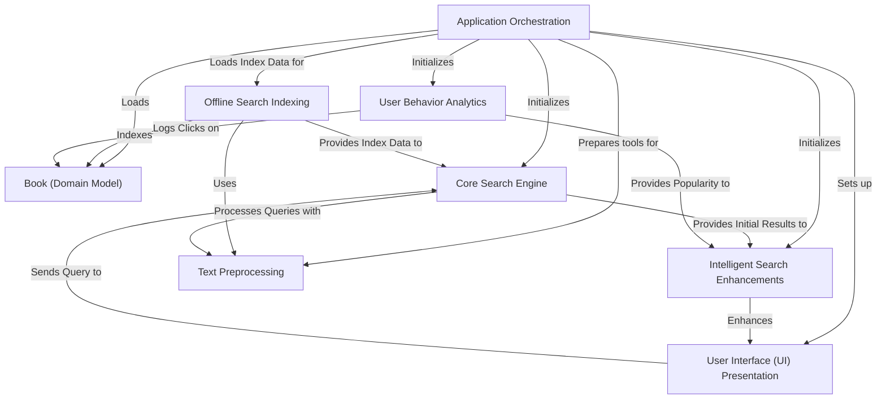

# Tutorial: DevShelf

DevShelf is a **digital library search engine** that helps users *discover and read programming books*.
It intelligently **searches for books** using a pre-built index, provides "Did you mean?" suggestions, and offers
*personalized recommendations* based on book details and user popularity. The system also tracks user clicks
to continuously improve its search results and recommendations, presenting information through both command-line
and graphical interfaces.

## Visual Overview

## Chapters

1. [User Interface (UI) Presentation
](01_user_interface__ui__presentation_.md)
2. [Book (Domain Model)
](02_book__domain_model__.md)
3. [Application Orchestration
](03_application_orchestration_.md)
4. [Core Search Engine
](04_core_search_engine_.md)
5. [Text Preprocessing
](05_text_preprocessing_.md)
6. [Offline Search Indexing
](06_offline_search_indexing_.md)
7. [Intelligent Search Enhancements
](07_intelligent_search_enhancements_.md)
8. [User Behavior Analytics
](08_user_behavior_analytics_.md)
