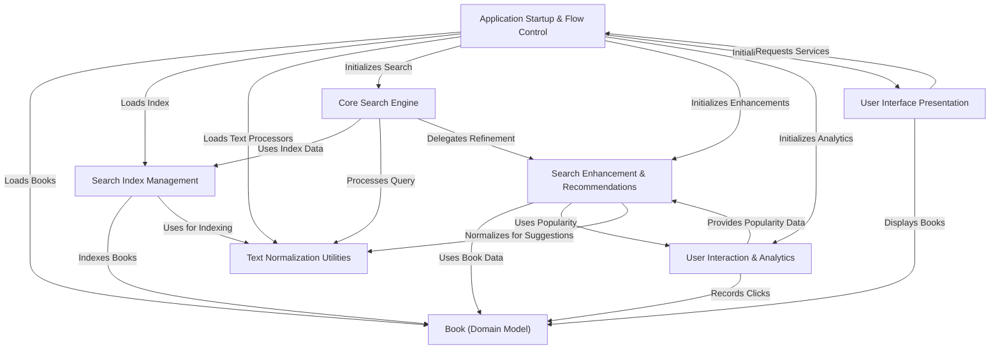

# Tutorial: DevShelfGUI

DevShelfGUI is a **digital library search engine** that helps users *discover and read programming books*.
It offers an intuitive interface (both command-line and graphical) to **search for books**, provides *intelligent recommendations*,
and allows users to *view book details and read PDFs*. The system also tracks user interactions to improve recommendations.

## Visual Overview

## Chapters

1. [Application Startup & Flow Control](01_application_startup_flow_control.md)
2. [Book (Domain Model)](02_book_domain_model.md)
3. [User Interface Presentation](03_user_interface_presentation.md)
4. [Search Index Management](04_search_index_management.md)
5. [Core Search Engine](05_core_search_engine.md)
6. [User Interaction & Analytics](06_user_interaction_analytics.md)
7. [Search Enhancement & Recommendations](07_search_enhancement_recommendations.md)
8. [Text Normalization Utilities](08_text_normalization_utilities.md)

	