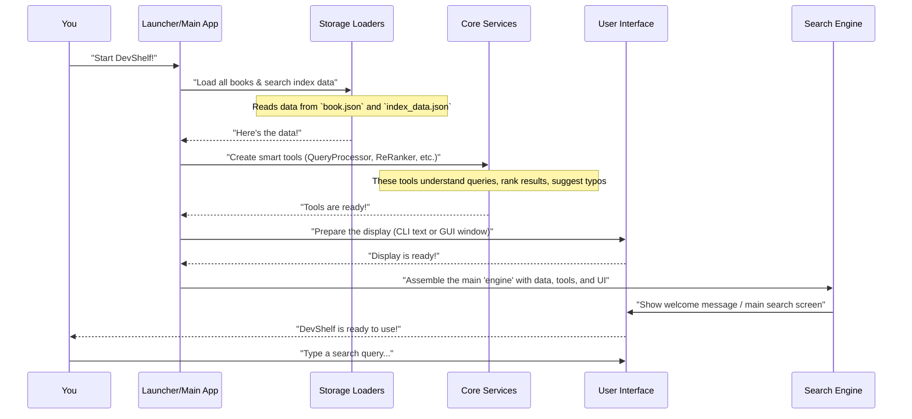

Welcome to DevShelf! This tutorial will guide you through how our digital library application works, starting from the very beginning: how it wakes up and gets ready to serve you.

### The Application's "Main Director"

Imagine our DevShelf application as a grand play. For any play to begin, you need a **Main Director**. This director doesn't act in the play, but they are crucial for making sure everything is in place before the curtain rises. They:

1.  **Gather the Props:** Load all the books and the special "search index" (a magical guide that helps find books quickly).
2.  **Assemble the Actors:** Bring together all the specialized "services" or "smart tools" like the `QueryProcessor` (who understands your search), the `ReRanker` (who makes sure the best books appear first), and the `Suggester` (who helps with typos).
3.  **Set the Stage:** Prepare the user interface, whether it's a simple text-based command line (CLI) or a fancy graphical window (GUI).
4.  **Signal the Start:** Once everything is ready, they tell the play to begin, allowing you, the user, to interact with the application.

This "Main Director" role is exactly what "Application Startup & Flow Control" is all about in DevShelf. It's the brain that orchestrates the entire application, making sure it initializes correctly and manages the overall sequence of operations.

### Your First Interaction: Starting DevShelf

Before you can search for your favorite book, DevShelf needs to start. We offer two ways to use DevShelf: a Command Line Interface (CLI) where you type commands, and a Graphical User Interface (GUI) with buttons and windows.

Let's see how you'd typically start each version:

#### Starting the CLI Version

To start the CLI version, you would run the `Main` class.

**`src/main/java/core/Main.java` (Simplified)**
```java
package core;

import storage.BookLoader;
import storage.IndexLoader;
import ui.cli.CliView;
// ... other imports

public class Main {
    public static void main(String[] args) {
        System.out.println("📖 Assembling DevShelf Engine...");

        // 1. Load All Data (e.g., books and search index)
        // BookLoader bookLoader = new BookLoader(...);
        // List<Book> allBooks = bookLoader.loadBooks();
        // IndexLoader indexLoader = new IndexLoader(...);
        // SearchIndexData loadedData = indexLoader.loadIndex();

        // 2. Build All Services (our smart tools)
        // QueryProcessor queryProcessor = new QueryProcessor(...);
        // ReRanker reRanker = new ReRanker(...);
        // Suggester suggester = new Suggester(...);
        // ... and other services

        // 3. Build The UI (the CLI view)
        CliView view = new CliView();

        // 4. Assemble the Controller & Start
        // BookSearchEngine engine = new BookSearchEngine(bookMap, queryProcessor, ...);
        // engine.run(); // This starts the main loop!
        System.out.println("...Assembly complete. Starting application.");
    }
}
```
When you run `Main.java`, it prints messages like "📖 Assembling DevShelf Engine..." as it prepares everything. Then, it will present you with the command-line interface, ready for your search queries.

#### Starting the GUI Version

For the GUI version, we use a special `Launcher` class to make sure JavaFX (the GUI technology) starts correctly.

**`src/main/java/core/Launcher.java`**
```java
package core;

public class Launcher {
    public static void main(String[] args) {
        // We delegate to the real JavaFX class.
        // This tricks the JVM into loading the classpath correctly first.
        GuiMain.main(args);
    }
}
```
This `Launcher` simply calls `GuiMain.main(args)`. The `GuiMain` class then does the actual work of setting up the graphical window:

**`src/main/java/core/GuiMain.java` (Simplified)**
```java
package core;

import javafx.application.Application;
import javafx.fxml.FXMLLoader;
import javafx.scene.Scene;
import javafx.stage.Stage;
import ui.gui.controllers.MainViewController;
import ui.gui.services.DevShelfService;
// ... other imports

public class GuiMain extends Application { // Extends Application for JavaFX

    @Override
    public void start(Stage stage) throws Exception {
        System.out.println("🚀 Starting DevShelf GUI...");

        // 1. Load Backend Services (Same idea as CLI: books, index, etc.)
        // BookLoader bookLoader = new BookLoader(...);
        // Map<Integer, Book> bookMap = ...;
        // QueryProcessor queryProcessor = ...;
        // ... and other services

        // 2. Create the App Brain (a special service for the GUI)
        // DevShelfService service = new DevShelfService(bookMap, queryProcessor, ...);

        // 3. Load the UI (from an FXML file, which describes the window layout)
        // FXMLLoader loader = new FXMLLoader(getClass().getResource("/ui/gui/fxml/MainView.fxml"));
        // Parent root = loader.load();

        // 4. Inject the Brain into the Controller (connects UI to logic)
        // MainViewController controller = loader.getController();
        // controller.setService(service);

        // 5. Show Window
        // Scene scene = new Scene(root);
        // stage.setScene(scene);
        // stage.setTitle("DevShelf - Library Search Engine");
        // stage.show();

        System.out.println("✅ GUI Started successfully.");
    }

    public static void main(String[] args) {
        launch(args); // This calls the start method above
    }
}
```
When `GuiMain` runs, you'll see messages like "🚀 Starting DevShelf GUI..." and then a beautiful DevShelf window will pop up on your screen, ready for you to type in the search bar.

### Under the Hood: The Startup Sequence

Whether you launch the CLI or GUI, the core steps for getting DevShelf ready are very similar. Let's visualize this process like a coordinated dance:



This sequence shows how the "Application Startup & Flow Control" layer (`Launcher/Main App` and `Search Engine` in the diagram) brings together different parts of the system.

### Comparing CLI and GUI Startup

While the core steps are similar, there are some differences in how the CLI and GUI versions set things up:

| Feature                   | CLI Version (`core/Main.java`)                                    | GUI Version (`core/GuiMain.java`)                                |
| :------------------------ | :---------------------------------------------------------------- | :--------------------------------------------------------------- |
| **Main Entry Point**      | `public static void main(String[] args)` directly in `Main.java`  | `main` in `Launcher.java` calls `GuiMain.main(args)`, which uses `start()` method |
| **User Interface Class**  | `CliView` ([User Interface Presentation](03_user_interface_presentation_.md))                                 | JavaFX FXML (`MainView.fxml`), managed by `MainViewController` ([User Interface Presentation](03_user_interface_presentation_.md)) |
| **Core Logic Controller** | `BookSearchEngine` ([Core Search Engine](05_core_search_engine_.md))                                      | `DevShelfService` (a dedicated service for the GUI)              |
| **Interaction Flow**      | `BookSearchEngine.run()` contains a `while(true)` loop for user input | UI events (e.g., button clicks) call methods in `DevShelfService` |

Notice how both versions load the same underlying data (books, search index) and create the same smart tools (like `QueryProcessor` and `ReRanker`). The main difference is how they connect these tools to their specific user interface.

#### The CLI's Main Loop

Once the CLI version starts, its `BookSearchEngine` takes over. It enters a continuous loop, waiting for your commands:

**`src/main/java/core/BookSearchEngine.java` (Simplified `run` method)**
```java
package core;

import ui.cli.CliView;
// ... other imports

public class BookSearchEngine {
    private final CliView view; // Our CLI display tool
    // ... other services and state

    public BookSearchEngine( /* ... services, CliView view */ ) {
        this.view = view;
        // ... initialize state
    }

    public void run() {
        view.showWelcomeMessage(bookMap.size()); // Greet the user
        while (true) { // This loop keeps the application running
            String query = view.getSearchQuery(); // Ask the user for a search
            if (query.equalsIgnoreCase("exit")) { // User wants to quit
                view.showExitMessage();
                break; // Exit the loop
            }
            if (query.isEmpty()) continue; // Skip empty queries

            processQuery(query); // Handle the search request
        }
    }
    // ... other methods like processQuery, applyFilters, handleFilterMenu etc.
}
```
This `run()` method is the heart of the CLI application's "flow control." It continuously:
1.  **Gets Input:** `view.getSearchQuery()` asks you what you want to search for.
2.  **Processes:** Calls `processQuery(query)` to handle the actual search.
3.  **Repeats:** Goes back to step 1 until you type "exit."

The `processQuery` method then orchestrates the search:

**`src/main/java/core/BookSearchEngine.java` (Simplified `processQuery` method)**
```java
// Inside BookSearchEngine class
private void processQuery(String query) {
    // 1. Search! Ask the QueryProcessor (our smart search tool)
    // List<SearchResult> tfIdfResults = queryProcessor.search(query);

    // 2. Re-rank results (make sure the best ones are on top)
    // List<SearchResult> rankedResults = reRanker.reRank(tfIdfResults, query);

    // 3. Prepare books for display
    // final List<Book> initialBooks = rankedResults.stream()...;

    // This nested loop lets you filter/sort results for the *current* query
    while (true) {
        // A. Apply any filters or sorting you've set
        // List<Book> filteredBooks = applyFilters(initialBooks);
        // applySort(filteredBooks);

        // B. Display the results
        // view.showResults(query, filteredBooks);

        // C. Get your next action (filter, sort, new search, etc.)
        // String choice = view.getActionPrompt();
        // switch (choice) {
        //     case "f": handleFilterMenu(); break;
        //     case "n": return; // Go back to the main search loop
        //     // ... other actions
        // }
    }
}
```
Inside `processQuery`, there's another loop that allows you to refine your search results (filter, sort) before going back to the main `run()` loop for a brand new search. This shows a clear flow of control, moving from getting a query to processing it, displaying results, and then asking for the next action.

#### The GUI's Service Approach

The GUI works a bit differently. Instead of a `while(true)` loop, the `DevShelfService` handles specific requests from the user interface. When you type in the search bar and press Enter, the GUI controller calls the `search` method of `DevShelfService`:

**`src/main/java/ui/gui/services/DevShelfService.java` (Simplified `search` method)**
```java
package ui.gui.services;

import domain.Book;
import domain.SearchResult;
import features.search.QueryProcessor;
import features.search.ReRanker;
import features.search.Suggester;
// ... other imports

public class DevShelfService {
    private final QueryProcessor queryProcessor;
    private final ReRanker reRanker;
    private final Suggester suggester;
    // ... other services and bookMap

    public DevShelfService( /* ... services and bookMap */ ) {
        this.queryProcessor = queryProcessor;
        this.reRanker = reRanker;
        this.suggester = suggester;
        // ... initialize other services
    }

    public SearchResponse search(String query) {
        System.out.println("🔍 GUI Processing Query: [" + query + "]");

        // 1. Raw Search (using our smart QueryProcessor tool)
        // List<SearchResult> results = queryProcessor.search(query);

        // 2. Handle No Results / Typos (ask the Suggester if needed)
        // if (results.isEmpty()) {
        //     String suggestion = suggester.suggestSimilar(query);
        //     if (suggestion != null) { /* ... search with suggestion ... */ }
        // }

        // 3. Re-Rank (using our ReRanker tool to sort by popularity/relevance)
        // List<SearchResult> rankedResults = reRanker.reRank(results, usedQuery);

        // 4. Convert to Books (so the UI can display them nicely)
        // List<Book> books = new ArrayList<>();
        // for (SearchResult res : rankedResults) { /* ... add book to list ... */ }

        // return new SearchResponse(books, isSuggestion, usedQuery);
        return null; // Simplified return
    }
    // ... other methods like getRecommendationsFor, logClick etc.
}
```
This `search` method is called each time you submit a query in the GUI. It performs the same core steps as `processQuery` in the CLI: search, re-rank, and handle suggestions. However, instead of looping for more actions, it returns a `SearchResponse` object containing the results directly to the GUI controller, which then updates the display.

### Conclusion

In this chapter, we learned that "Application Startup & Flow Control" is like the main director of our DevShelf application. It handles the critical tasks of:
*   **Initialization:** Loading all essential data like books and the search index.
*   **Service Assembly:** Creating and preparing all the specialized tools (like `QueryProcessor`, `ReRanker`, `Suggester`) that make DevShelf smart.
*   **User Interface Setup:** Getting either the Command Line Interface (CLI) or the Graphical User Interface (GUI) ready for you.
*   **Orchestration:** Managing the overall flow, whether it's a continuous command loop in the CLI or handling specific requests from the GUI.

This entire process ensures that when you finally see DevShelf, everything is perfectly set up and ready for your search adventure!

Next, we'll dive into the most important "prop" in our play: the `Book` itself, which is our core piece of data.

[Next Chapter: Book (Domain Model)](02_book__domain_model__.md)