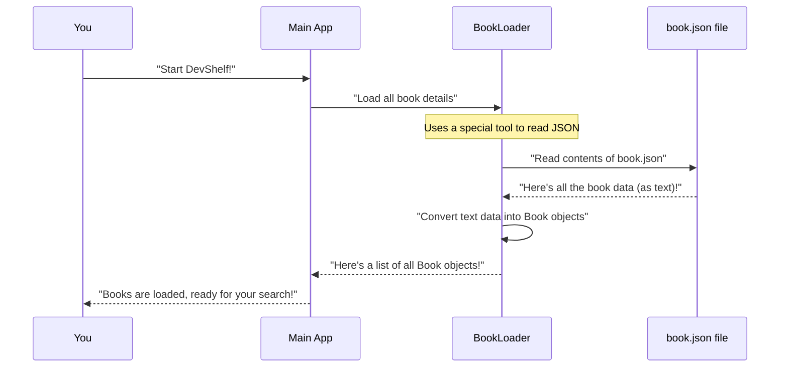

Welcome back! In our last chapter, [Application Startup & Flow Control](01_application_startup___flow_control_.md), we learned how DevShelf wakes up and gets all its "actors" and "props" ready. Now, it's time to meet the most important "prop" of our entire digital library: the `Book` itself!

### What is a "Book" in DevShelf?

Imagine DevShelf as a digital library. What's the main thing a library stores? Books, of course! But in a computer program, a "book" isn't a physical object you can touch. Instead, it's a collection of information, a "data unit," that tells us everything important about one particular book.

Think of it like a **detailed index card** for each book in a physical library. Each card has spaces for the title, author, a short summary, and so on. In DevShelf, each `Book` object is one of these digital index cards. It holds all the essential details about a single book, making it easy for the application to display and search for them.

#### The Problem Our `Book` Solves

If you search for "Python" in DevShelf, the application needs to find specific books and show you their details. Without a clear way to represent *what* a book is and *what information it contains*, this would be impossible! The `Book` object gives us a standard way to store and share all that information throughout the application.

Let's look at an example use case: **Displaying book details after a search.**
When you type "Clean Code" and press Enter, DevShelf needs to:
1.  Find the "Clean Code" book.
2.  Grab all its details (title, author, description, rating, etc.).
3.  Show those details to you on the screen.

The `Book` domain model is the key to step 2!

### What Information Does a `Book` Hold?

Our `Book` "index card" has several important slots for information. These are called "properties" in programming. Here are the main properties of a `Book` in DevShelf:

*   **`bookId`**: A unique number for each book. Like a library's unique call number.
*   **`title`**: The name of the book (e.g., "Clean Code").
*   **`author`**: Who wrote the book (e.g., "Robert C. Martin").
*   **`description`**: A short summary of what the book is about.
*   **`progLang`**: The main programming language discussed in the book (e.g., "Java", "Python").
*   **`category`**: The general topic of the book (e.g., "Software Engineering", "Algorithms").
*   **`tag`**: Keywords or topics associated with the book (e.g., ["clean-code", "refactoring"]). These help with more specific searches.
*   **`rating`**: How highly the book is rated (e.g., 4.6 out of 5).
*   **`coverUrl`**: A link to an image of the book's cover.
*   **`downLink`**: A link to download the book (if available).

### Getting Our Hands on `Book` Objects

Before DevShelf can display a book, it first needs to load the book's information into memory. This happens right when the application starts up, as we briefly saw in Chapter 1.

The `BookLoader` is like the library assistant who takes all the physical books (or, in our case, a digital list of book details) and meticulously creates one index card (a `Book` object) for each.

Let's see how DevShelf gets these `Book` objects:



This diagram shows the journey from starting the app to having all `Book` objects ready. The `BookLoader` does the heavy lifting of reading from a file named `book.json` and turning that raw text into usable `Book` objects.

#### The `Book` Class: Our Digital Index Card

In Java, we define what a `Book` looks like using a `class`. This `Book` class acts like a blueprint for all our individual book objects.

**`src/main/java/domain/Book.java` (Simplified)**
```java
package domain;

import lombok.Getter; // A helper tool that automatically adds 'get' methods
import lombok.Setter; // A helper tool that automatically adds 'set' methods

@Getter // Automatically creates methods like getBookId(), getTitle(), etc.
@Setter // Automatically creates methods like setBookId(id), setTitle(title), etc.
public class Book {
    private int bookId;
    private String title;
    private String author;
    private String description;
    private String progLang;
    private String category;
    private String[] tag; // An array for multiple tags
    private float rating;
    private String coverUrl;
    private String downLink;

    // A special method to create a new empty Book object
    public Book() {}

    // A special method to create a new Book object with all details at once
    public Book(int bookId, String title, String author, String description, String progLang,
                String category, String[] tag, float rating, String coverUrl, String downLink) {
        this.bookId = bookId;
        this.title = title;
        this.author = author;
        this.description = description;
        this.progLang = progLang;
        this.category = category;
        this.tag = tag;
        this.rating = rating;
        this.coverUrl = coverUrl;
        this.downLink = downLink;
    }
}
```
In this code:
*   `@Getter` and `@Setter` are special tools (from a library called Lombok) that automatically create the "get" and "set" methods for each property. For example, you can say `book.getTitle()` to get the title or `book.setRating(4.5f)` to change the rating. This keeps our code cleaner.
*   Each `private` line defines one of the properties we discussed (like `bookId`, `title`, `author`).
*   The `Book()` and `Book(...)` parts are "constructors," which are like initial setup instructions for creating new `Book` objects.

#### Loading Books from a File

All the book information for DevShelf is stored in a file called `book.json`. This is a special type of text file that stores data in a structured way that computers can easily understand.

Here's a tiny peek at what `book.json` looks like:

**`src/main/resources/data/book.json` (Snippet)**
```json
[
  {
    "bookId": 1,
    "title": "Introduction to Algorithms",
    "author": "Thomas H. Cormen, Charles E. Leiserson, Ronald L. Rivest, Clifford Stein",
    "description": "Comprehensive algorithms textbook...",
    "progLang": "Pseudo-code",
    "category": "Algorithms",
    "tag": [ "algorithms", "data-structures" ],
    "rating": 4.7,
    "coverUrl": "...",
    "downLink": "..."
  },
  {
    "bookId": 2,
    "title": "The Pragmatic Programmer",
    "author": "Andrew Hunt, David Thomas",
    "description": "Practical advice and philosophies...",
    "progLang": "Multiple",
    "category": "Software Engineering",
    "tag": [ "best-practices", "career" ],
    "rating": 4.6,
    "coverUrl": "...",
    "downLink": "..."
  }
]
```
As you can see, it's a list of book details, where each book's details match the properties we defined in our `Book.java` class.

The `BookLoader` class's job is to read this `book.json` file and turn its text into actual `Book` objects that our Java program can use.

**`src/main/java/storage/BookLoader.java` (Simplified)**
```java
package storage;

import com.fasterxml.jackson.core.type.TypeReference; // Helps read lists of objects
import com.fasterxml.jackson.databind.ObjectMapper; // The "magic tool" for JSON
import domain.Book; // Our Book blueprint

import java.io.File; // To work with files on the computer
import java.io.IOException; // To handle errors when reading files
import java.util.Collections; // To return an empty list if something goes wrong
import java.util.List; // To store a list of Book objects

public class BookLoader {

    private final ObjectMapper mapper = new ObjectMapper(); // Our JSON reading tool
    private final String jsonFilePath; // Where the book.json file is located

    // When we create a BookLoader, we tell it where to find the book.json file
    public BookLoader(String jsonFilePath) {
        this.jsonFilePath = jsonFilePath;
    }

    // This method does the actual work of loading books
    public List<Book> loadBooks() {
        try {
            File jsonBooks = new File(jsonFilePath); // Find the book.json file
            // Use the 'mapper' to read the file and turn it into a List of Book objects
            return mapper.readValue(jsonBooks, new TypeReference<List<Book>>() {});
        } catch (IOException e) {
            // If something goes wrong (e.g., file not found), print an error
            System.err.println("Failed to Load Books from JSON file: " + e.getMessage());
            return Collections.emptyList(); // Return an empty list to avoid crashing
        }
    }
}
```
Here's what happens in `BookLoader.loadBooks()`:
1.  It creates an `ObjectMapper`, which is a powerful "translator" that knows how to convert between Java objects and JSON text.
2.  It points to the `book.json` file.
3.  The `mapper.readValue(...)` line is the key! It reads all the text from `book.json` and, because we tell it to expect a `List<Book>`, it magically creates a Java `List` filled with `Book` objects, each populated with the data from the JSON.
4.  If there's any problem (like the file not being there), it catches the error and prints a message.

#### Using Loaded Books

Once the `BookLoader` has done its job, the `Main` or `GuiMain` application stores these `Book` objects, typically in a `Map` where each book's unique `bookId` is used to quickly find it. This `Map` is then passed to important parts of the application, like the `BookSearchEngine` (for CLI) or `DevShelfService` (for GUI), so they can access book details when needed.

For example, when the search engine finds a `bookId` that matches your query, it can then easily fetch the full `Book` object from this map and display its details:

```java
// Simplified code snippet from BookSearchEngine or DevShelfService
// Imagine 'bookMap' is a Map<Integer, Book> containing all our loaded books

// ... after a search, we get a list of relevant book IDs ...
// List<Integer> foundBookIds = /* ... results from search logic ... */ ;

// Let's say we found Book with ID 3
int foundBookId = 3;

// Retrieve the actual Book object using its ID
Book foundBook = bookMap.get(foundBookId);

if (foundBook != null) {
    // Now we can easily access its details!
    System.out.println("Title: " + foundBook.getTitle());
    System.out.println("Author: " + foundBook.getAuthor());
    System.out.println("Rating: " + foundBook.getRating());
    System.out.println("Download: " + foundBook.getDownLink());
    // The UI will then take these details and show them nicely to the user
}
```
The output of this snippet would be:
```
Title: Clean Code
Author: Robert C. Martin
Rating: 4.6
Download: https://ptgmedia.pearsoncmg.com/images/9780132350884/samplepages/9780132350884.pdf
```
This is how a `Book` object, acting as our digital index card, helps DevShelf organize and present information effectively.

### Conclusion

In this chapter, we unpacked the `Book` domain model, which is the core unit of data in our DevShelf library. We learned that:
*   Each `Book` object is like a detailed digital index card, holding all the essential information about a single book.
*   It has properties like `bookId`, `title`, `author`, `description`, `rating`, `coverUrl`, and more.
*   The `BookLoader` is responsible for reading book data from a `book.json` file and transforming it into usable `Book` objects when the application starts.
*   These `Book` objects are then stored in a way that allows other parts of the application, like the search engine, to easily find and retrieve their details.

Understanding the `Book` object is fundamental because it's what our users are ultimately searching for and interacting with. In the next chapter, we'll explore how DevShelf actually displays these `Book` objects to you, the user, through its interface.

[Next Chapter: User Interface Presentation](03_user_interface_presentation_.md)
