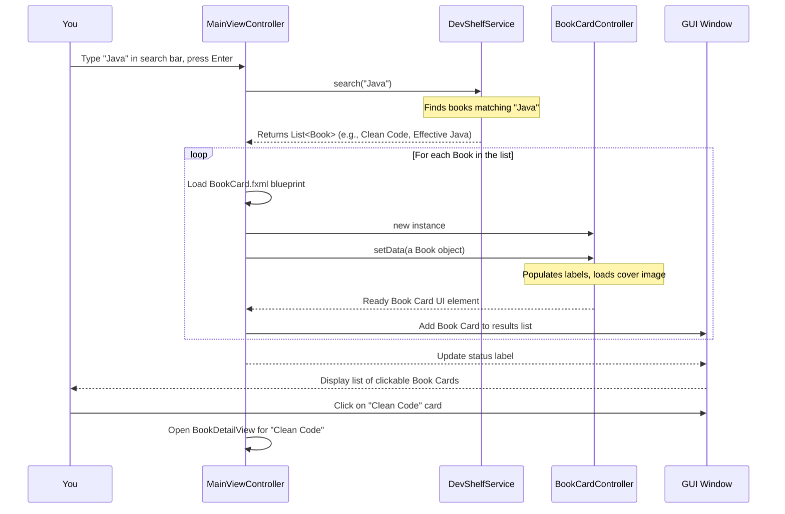

Welcome back to DevShelf! In our last chapter, [Book (Domain Model)](02_book__domain_model_.md), we got to know the most important "prop" in our digital library: the `Book` itself, a digital index card holding all its details. Now, imagine you've found the perfect book – how does DevShelf actually *show* you that book? And how do you tell DevShelf what you're looking for?

That's where **User Interface Presentation** comes in!

### The "Face" of DevShelf

Think of the "User Interface Presentation" as the **face** of our DevShelf application. It's everything you see and interact with on your screen. Just like your face shows your expressions and allows you to speak and listen, DevShelf's UI (User Interface) is how it displays information (like search results or welcome messages) and how it gathers your input (like your search queries or clicks).

It takes all the internal data and clever logic (like finding books) and translates it into something you can easily understand and use. A good "face" makes the digital library feel friendly and easy to navigate!

#### The Problem Our UI Solves

Imagine you've searched for "Python" in DevShelf. The application's core logic has found many Python books. But how do you *see* them? How do you type "Python" in the first place? Without a UI, DevShelf would be a powerful brain with no way to communicate with you!

Our User Interface Presentation solves this by providing:
1.  **Display:** Ways to show books, messages, and options.
2.  **Input:** Ways for you to type, click, and interact.

Let's focus on a central use case: **Displaying search results and letting the user type a new search query.** We want to see the books and then easily search again.

### Two Ways DevShelf Shows Its Face: CLI vs. GUI

As we briefly touched on in Chapter 1, DevShelf has two different "faces":

*   **CLI (Command Line Interface):** A simple text-based interface where you type commands and read text responses.
*   **GUI (Graphical User Interface):** A visual interface with windows, buttons, text fields, and images that you interact with using your mouse and keyboard.

Both serve the same purpose – showing information and getting input – but they do it in very different ways.

#### 1. The CLI's Face: `CliView`

In the CLI version, the `CliView` class is the master of displaying text and reading what you type. It's like a helpful librarian who only communicates by talking and listening, without any fancy visuals.

**`src/main/java/ui/cli/CliView.java` (Simplified)**
```java
package ui.cli;

import domain.Book;
import java.util.List;
import java.util.Scanner;

public class CliView {

    private final Scanner scanner; // A tool to read your keyboard input

    public CliView() {
        this.scanner = new Scanner(System.in); // Prepare the input reader
    }

    public void showResults(String query, List<Book> books) {
        if (books.isEmpty()) {
            System.out.println("\n❌ No results found for \"" + query + "\"");
            return;
        }
        System.out.println("\n✅ Showing Top results for \"" + query + "\":");
        for (int i = 0; i < books.size() && i < 7; i++) { // Show up to 7 books
            Book book = books.get(i);
            System.out.printf("  [%d] %s by %s (Rating: %.1f)\n",
                    i + 1, book.getTitle(), book.getAuthor(), book.getRating());
        }
    }

    public String getSearchQuery() {
        System.out.print("\n🔍 Enter search query (or 'exit'): ");
        return scanner.nextLine().trim(); // Read the entire line you type
    }

    // ... other methods for showing messages or getting choices ...
}
```
*   The `showResults` method takes a list of `Book` objects (our digital index cards from Chapter 2) and prints their details one by one to the console.
*   The `getSearchQuery` method prints a message asking for your input and then waits for you to type something and press Enter, returning your typed text.

**Example CLI Interaction:**

```
🔍 Enter search query (or 'exit'): Java

✅ Showing Top results for "Java":
  [1] Clean Code by Robert C. Martin (Rating: 4.6)
  [2] Effective Java by Joshua Bloch (Rating: 4.8)
  ...

--- Actions ---
[F]ilter  [S]ort  [R]elated  [L]og Click  [C]lear Filters  [N]ew Search  [E]xit
Enter command:
```
Here, `showResults` displays the books, and `getSearchQuery` (and `getActionPrompt` not shown here) are waiting for your next input.

#### 2. The GUI's Face: JavaFX, FXML, and Controllers

The GUI version of DevShelf uses a technology called **JavaFX** to create beautiful windows, buttons, and other visual elements. Instead of just printing text, it draws everything.

Building a GUI involves two main parts:

1.  **FXML Files (The Blueprints):** These are special text files (like `.fxml` files) that describe *what* visual elements are on the screen and *how* they are arranged. Think of them as blueprints for a house, defining where the walls, windows, and doors go.
    *   `MainView.fxml`: The blueprint for the main search window.
    *   `BookCard.fxml`: The blueprint for how a single book entry looks in the search results list.
    *   `BookDetailView.fxml`: The blueprint for a separate window showing full book details.

2.  **Controller Classes (The Workers):** These are Java classes (like `.java` files in the `ui.gui.controllers` package) that act as the "brains" behind the FXML blueprints. They handle *what happens* when you click a button, *how to fill* a text field with data, and *how to respond* to your actions. Each FXML file typically has a corresponding controller.
    *   `MainViewController.java`: Manages the main search window's behavior.
    *   `BookCardController.java`: Manages how data from a `Book` object is displayed on a single book card.
    *   `BookDetailController.java`: Manages the detailed view of a specific book.

Let's see how these pieces work together to display search results.



This diagram shows that when you type a query in the GUI, the `MainViewController` (the brain of the main screen) asks the `DevShelfService` (our application's "brain" that knows how to search, introduced in Chapter 1) for results. Once it gets the `Book` objects back, it dynamically creates a visual "card" for each book using `BookCard.fxml` and `BookCardController`, and then displays these cards in the results area.

### Displaying Search Results and Handling New Search (Code Examples)

Let's look at how the GUI specifically implements the use case of displaying results and preparing for a new search.

#### The Main Search Screen (`MainView.fxml` & `MainViewController.java`)

The `MainView.fxml` file defines the layout of our main search window, including the search bar, buttons, and the area where book results will appear.

**`src/main/resources/ui/gui/fxml/MainView.fxml` (Snippet)**
```xml
<!-- ... other layout definitions ... -->
<HBox alignment="CENTER" spacing="10.0">
    <!-- The text field where you type your search -->
    <TextField fx:id="searchField" onAction="#handleSearch" promptText="Search for books..." />
    <!-- The search button you can click -->
    <Button fx:id="searchButton" onAction="#handleSearch" text=" Search 🔍" />
</HBox>

<!-- This is where our book cards will be displayed -->
<ScrollPane fitToWidth="true">
    <VBox fx:id="resultsContainer" spacing="10.0" style="-fx-padding: 20;">
    </VBox>
</ScrollPane>
<!-- ... other layout definitions ... -->
```
*   `fx:id="searchField"` gives the search box a name so our Java code can refer to it.
*   `onAction="#handleSearch"` means "when the user presses Enter in this text field or clicks the search button, call the `handleSearch` method in the `MainViewController`."
*   `fx:id="resultsContainer"` is a special vertical box (`VBox`) where we will programmatically add all the individual `BookCard` elements.

Now, let's look at the `MainViewController` which brings this FXML blueprint to life.

**`src/main/java/ui/gui/controllers/MainViewController.java` (Simplified `handleSearch` and `displayBooks`)**
```java
package ui.gui.controllers;

import domain.Book;
import javafx.fxml.FXML;
import javafx.fxml.FXMLLoader; // Essential for loading FXML blueprints
import javafx.scene.Node;     // A general UI element
import javafx.scene.layout.VBox;
import ui.gui.services.DevShelfService;
import ui.gui.services.DevShelfService.SearchResponse;

import java.io.IOException;
import java.util.List;

public class MainViewController {

    @FXML private TextField searchField; // Connected to fx:id="searchField" in FXML
    @FXML private VBox resultsContainer; // Connected to fx:id="resultsContainer"

    private DevShelfService service; // Our application "brain" from Chapter 1

    public void setService(DevShelfService service) { this.service = service; }

    @FXML
    private void handleSearch() {
        String query = searchField.getText(); // Get text from the search field
        if (query == null || query.trim().isEmpty()) return;

        // 1. Ask the backend service (DevShelfService) for search results
        SearchResponse response = service.search(query);

        // 2. Clear old results and display the new ones
        displayBooks(response.books);
    }

    private void displayBooks(List<Book> books) {
        resultsContainer.getChildren().clear(); // Remove all previously displayed books

        // Loop through the books we got back
        for (Book book : books) {
            try {
                // 3. Load the blueprint for a single book card
                FXMLLoader loader = new FXMLLoader(getClass().getResource("/ui/gui/fxml/BookCard.fxml"));
                Node card = loader.load(); // Create the visual card element

                // 4. Get the controller for this new card
                BookCardController cardController = loader.getController();

                // 5. Tell the card controller to display this specific Book's data
                cardController.setData(book);

                // 6. Make the card clickable to show more details
                card.setOnMouseClicked(e -> openDetailsView(book));

                // 7. Add the finished card to our results area
                resultsContainer.getChildren().add(card);
            } catch (IOException e) {
                e.printStackTrace(); // Handle errors if the FXML can't be loaded
            }
        }
    }

    // ... other methods like openDetailsView ...
}
```
*   When you type in `searchField` and press Enter, `handleSearch()` is called.
*   It gets your `query` from the `searchField` and asks our `service` (the app's brain) to `search`.
*   Then, `displayBooks` takes the list of `Book` objects.
*   For each `Book`, it uses `FXMLLoader` to create a new "Book Card" based on the `BookCard.fxml` blueprint.
*   It then finds the `BookCardController` for *that specific card* and calls its `setData` method to fill it with the `Book`'s details.
*   Finally, it adds this newly created and populated card to the `resultsContainer`, making it visible on the screen.

#### The Single Book Card (`BookCard.fxml` & `BookCardController.java`)

Each book displayed in the search results is represented by a `BookCard`.

**`src/main/resources/ui/gui/fxml/BookCard.fxml` (Snippet)**
```xml
<HBox alignment="CENTER_LEFT" spacing="15.0" style="...styling for a nice card effect..."
      xmlns="http://javafx.com/javafx/17" xmlns:fx="http://javafx.com/fxml/1"
      fx:controller="ui.gui.controllers.BookCardController">

    <ImageView fx:id="coverImage" fitHeight="100.0" fitWidth="70.0" />

    <VBox spacing="5.0" HBox.hgrow="ALWAYS">
        <Label fx:id="titleLabel" text="Book Title" />
        <HBox spacing="10.0" alignment="CENTER_LEFT">
            <Label fx:id="authorLabel" text="Author Name" />
            <Label fx:id="ratingLabel" text="4.7 ★" />
        </HBox>
        <Label fx:id="tagsLabel" text="tags: algorithms, java" />
    </VBox>
</HBox>
```
*   This FXML describes a horizontal box (`HBox`) containing an image (`ImageView`) for the cover and a vertical box (`VBox`) holding labels for the title, author, rating, and tags.
*   `fx:id` attributes are used to connect these visual elements to the `BookCardController`.

**`src/main/java/ui/gui/controllers/BookCardController.java` (Simplified `setData`)**
```java
package ui.gui.controllers;

import domain.Book;
import javafx.fxml.FXML;
import javafx.scene.control.Label;
import javafx.scene.image.Image;
import javafx.scene.image.ImageView;
import java.util.List;

public class BookCardController {

    @FXML private Label titleLabel;   // Linked to fx:id="titleLabel"
    @FXML private Label authorLabel;  // Linked to fx:id="authorLabel"
    @FXML private Label ratingLabel;  // Linked to fx:id="ratingLabel"
    @FXML private Label tagsLabel;    // Linked to fx:id="tagsLabel"
    @FXML private ImageView coverImage; // Linked to fx:id="coverImage"

    private static final String DEFAULT_IMG = "https://via.placeholder.com/150x200?text=No+Cover";

    // This method is called by MainViewController to fill the card with data
    public void setData(Book book) {
        titleLabel.setText(book.getTitle());
        authorLabel.setText(book.getAuthor() != null ? book.getAuthor() : "Unknown");
        ratingLabel.setText(String.format("%.1f ★", book.getRating()));

        List<String> tags = List.of(book.getTag());
        if (!tags.isEmpty()) {
            tagsLabel.setText("tags: " + String.join(", ", tags));
        } else {
            tagsLabel.setText("");
        }

        // Load the book's cover image from its URL
        String url = (book.getCoverUrl() != null && !book.getCoverUrl().isEmpty())
                ? book.getCoverUrl() : DEFAULT_IMG;
        try {
            coverImage.setImage(new Image(url, true)); // Load image from URL
        } catch (Exception e) {
            // If image loading fails, it will just show no image
        }
    }
}
```
*   The `setData` method receives a `Book` object (our digital index card).
*   It then takes the information from that `Book` (like its title, author, rating, and cover image URL) and uses it to update the corresponding `Label` and `ImageView` elements on the card.
*   This is how the raw `Book` data is transformed into a visually appealing search result entry.

#### The Book Detail View (`BookDetailView.fxml` & `BookDetailController.java`)

When you click on a `BookCard`, DevShelf opens a new window (`BookDetailView.fxml`) to show all the details of that specific book.

**`src/main/java/ui/gui/controllers/BookDetailController.java` (Simplified `setBookData`)**
```java
package ui.gui.controllers;

import domain.Book;
import javafx.fxml.FXML;
import javafx.scene.control.Label;
import javafx.scene.image.ImageView;
import javafx.scene.text.Text;

public class BookDetailController {

    @FXML private ImageView largeCoverImage;
    @FXML private Label fullTitle;
    @FXML private Label authors;
    // ... other labels for category, rating, progLang ...
    @FXML private Text descriptionText;

    private Book book;

    // This method is called when the details window opens
    public void setBookData(Book book, /* ... other context ... */) {
        this.book = book;
        fullTitle.setText(book.getTitle());
        authors.setText(book.getAuthor());
        descriptionText.setText(book.getDescription());
        // ... set other labels ...

        String url = (book.getCoverUrl() != null && !book.getCoverUrl().isEmpty())
                     ? book.getCoverUrl()
                     : "https://via.placeholder.com/150x200?text=No+Cover";
        largeCoverImage.setImage(new Image(url, true)); // Set larger cover image
    }

    @FXML
    private void handleBack() {
        // Code to close this window and go back to the previous screen
    }

    @FXML
    private void handleRead() {
        // Code to open the book's download link in a web viewer
    }
}
```
*   Similar to `BookCardController`, `BookDetailController.setBookData` takes a `Book` object and populates all the labels and the large cover image on the detailed view.
*   This provides a richer view of the book information that you saw briefly in the search results.

### Comparing CLI and GUI for User Interface Presentation

Here’s a quick comparison of how the two interfaces handle showing information and getting input:

| Feature                     | CLI Version (`CliView.java`)                          | GUI Version (JavaFX FXML & Controllers)                                   |
| :-------------------------- | :---------------------------------------------------- | :------------------------------------------------------------------------ |
| **How information is shown** | `System.out.println()` for plain text output          | Graphical elements: `Label`, `ImageView`, `VBox` in FXML files, controlled by Java classes |
| **How input is gathered**   | `Scanner.nextLine()` reads typed text                 | `TextField` for typing, `Button` for clicking (all defined in FXML, handled by controllers) |
| **Styling/Appearance**      | Limited to text formatting (bold, color if supported) | Rich visual styling using CSS (Cascading Style Sheets) and FXML attributes |
| **Core Components**         | `CliView` class                                       | FXML files (blueprints) and Controller classes (brains)                 |
| **Interaction Flow**        | Sequential: read input, print output, repeat          | Event-driven: user actions (clicks, types) trigger specific methods in controllers |

### Conclusion

In this chapter, we explored "User Interface Presentation," which is the "face" of our DevShelf application. We learned that:
*   The UI is how DevShelf **shows** information (like search results) and **gathers** input (like your search queries).
*   DevShelf offers two types of interfaces: the **CLI** (Command Line Interface) for text-based interaction, and the **GUI** (Graphical User Interface) for visual interaction.
*   In the CLI, the `CliView` class uses `System.out.println()` to display and `Scanner` to read input.
*   In the GUI, JavaFX uses **FXML files** as "blueprints" to define the layout and **Controller classes** (like `MainViewController`, `BookCardController`, `BookDetailController`) as "workers" to manage behavior and display [Book (Domain Model)](02_book__domain_model_.md) data visually.
*   We saw how the GUI dynamically loads individual `BookCard` elements to present search results, linking the `Book` data to visual components.

Understanding the UI is crucial because it's your primary point of contact with DevShelf. Now that we know how books are presented to you, let's dive into how DevShelf efficiently finds those books in the first place!

[Next Chapter: Search Index Management](04_search_index_management_.md)
