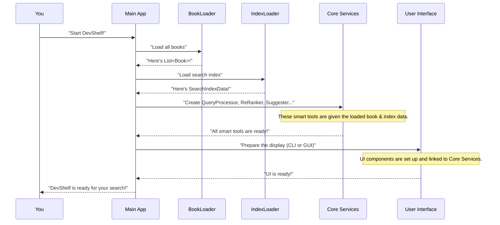

# Chapter 3: Application Orchestration

Welcome back, digital librarian! In our journey through DevShelf, we've already explored the "face" of our application, the [User Interface (UI) Presentation](01_user_interface__ui__presentation_.md), and the core data it displays, the [Book (Domain Model)](02_book__domain_model__.md). You know *what* a book is in DevShelf and *how* it's shown to you.

But how do all these pieces come together? Who tells the UI to show books, and where do the books come from? Who ensures that the powerful search engine is ready when you type your query? This is where our "Main Director" comes in – the **Application Orchestration**.

### What is Application Orchestration? The Main Director

Imagine DevShelf as a grand orchestra. You, the user, are the audience, and the UI is the beautiful music they play. But behind the scenes, there's a **conductor** – someone who makes sure all the musicians (different parts of DevShelf) are on stage, have their instruments tuned, and play their parts at the right time.

In DevShelf, the Application Orchestration is this conductor. It's the "Main Director" that handles all the critical setup tasks to get the application running smoothly. Without it, DevShelf would be just a collection of smart pieces that don't know how to work together.

#### The Problem Our "Director" Solves

Consider our central use case: **Starting DevShelf and making it ready for a search.**

When you launch DevShelf, a lot needs to happen *before* you can even type your first search query:
1.  **Load Books**: All the book data (our [Book (Domain Model)](02_book__domain_model__.md) objects) needs to be read from its storage.
2.  **Load Search Index**: A special "index" (like a super-fast book catalog, which we'll cover later) needs to be loaded.
3.  **Assemble Services**: Smart tools like the search engine, recommender, and text processors need to be created and given the data they need.
4.  **Set Up UI**: The visual (GUI) or text-based (CLI) interface needs to be prepared.

The "Application Orchestration" part of DevShelf solves the problem of coordinating all these setup steps. It ensures that every component is initialized correctly and connected to where it needs to go, making DevShelf ready to perform.

### How DevShelf Starts: Bringing Everything to Life

Let's look at how this "Main Director" brings DevShelf to life. Whether you're using the simple text-based Command Line Interface (CLI) or the visual Graphical User Interface (GUI), the core steps of orchestration are similar.

#### Starting the CLI Version

To start the CLI version of DevShelf, a special `Main` class (the "director's main office") is run. This class is responsible for loading all the necessary data and setting up all the smart tools.

**`src/main/java/core/Main.java` (Simplified Startup)**
```java
package core;

import domain.Book; // Our Book blueprint from Chapter 2
import storage.BookLoader; // Tool to load books
import storage.IndexLoader; // Tool to load search index
import ui.cli.CliView; // Our CLI face from Chapter 1
// ... other imports for smart tools

import java.util.HashMap;
import java.util.List;
import java.util.Map;

public class Main {
    public static void main(String[] args) {
        System.out.println("📖 Assembling DevShelf Engine...");

        // 1. Load All Books (from Chapter 2)
        BookLoader bookLoader = new BookLoader("/data/book.json");
        List<Book> allBooks = bookLoader.loadBooks();
        Map<Integer, Book> bookMap = new HashMap<>();
        for (Book b : allBooks) { bookMap.put(b.getBookId(), b); }

        // 2. Load Search Index (more on this in Chapter 6)
        IndexLoader indexLoader = new IndexLoader("/data/index_data.json");
        var loadedData = indexLoader.loadIndex();

        // 3. Create Smart Tools (like search engine components)
        // Set<String> stopWords = StopWordLoader.loadStopWords("/data/stopword.txt");
        // TextProcessor textProcessor = new TextProcessor(stopWords);
        // QueryProcessor queryProcessor = new QueryProcessor(textProcessor, ...);
        // ReRanker reRanker = new ReRanker(bookMap, ...);
        // Suggester suggester = new Suggester(allTitles, stopWords);
        // Graph graph = new Graph(); graph.buildGraph(allBooks);
        // LoggingService loggingService = new LoggingService(...);

        // 4. Set Up the User Interface (Our CLI View from Chapter 1)
        CliView view = new CliView();

        // 5. Assemble the "Engine" and Start It
        // BookSearchEngine engine = new BookSearchEngine(
        //         bookMap, queryProcessor, reRanker, suggester,
        //         graph, loggingService, view
        // );
        // engine.run(); // This starts the main loop of the CLI!

        System.out.println("...Assembly complete. Starting application.");
    }
}
```
When you run `Main.java`, it first prints messages as it prepares everything. The commented-out lines show where various "smart tools" and the main search `engine` would be created. Finally, the `engine.run()` method would take over, presenting you with the CLI and waiting for your search.

#### Starting the GUI Version

For the GUI version, we use a `Launcher` class which then calls `GuiMain`. This is a standard way to start JavaFX applications. `GuiMain` then performs the orchestration for the graphical interface.

**`src/main/java/core/GuiMain.java` (Simplified `start` method)**
```java
package core;

import domain.Book; // Our Book blueprint from Chapter 2
import storage.BookLoader; // Tool to load books
import storage.IndexLoader; // Tool to load search index
import ui.gui.controllers.MainViewController; // Main GUI screen from Chapter 1
import ui.gui.services.DevShelfService; // GUI's dedicated service
import javafx.application.Application;
import javafx.fxml.FXMLLoader;
import javafx.scene.Scene;
import javafx.stage.Stage;

import java.util.HashMap;
import java.util.List;
import java.util.Map;

public class GuiMain extends Application { // Extends Application for JavaFX

    @Override
    public void start(Stage stage) throws Exception {
        System.out.println("🚀 Starting DevShelf GUI...");

        // 1. Load All Books & Search Index (Same as CLI)
        BookLoader bookLoader = new BookLoader("/data/book.json");
        List<Book> books = bookLoader.loadBooks();
        Map<Integer, Book> bookMap = new HashMap<>();
        for(Book b : books) bookMap.put(b.getBookId(), b);
        // IndexLoader indexLoader = new IndexLoader("/data/index_data.json");
        // var indexData = indexLoader.loadIndex();

        // 2. Create Smart Tools (Same idea as CLI)
        // ... QueryProcessor, ReRanker, Suggester, Graph, LoggingService ...

        // 3. Create the GUI's "Brain" (a dedicated service for the UI)
        // DevShelfService service = new DevShelfService(bookMap, queryProcessor, ...);

        // 4. Load the GUI Layout (FXML blueprint from Chapter 1)
        FXMLLoader loader = new FXMLLoader(getClass().getResource("/ui/gui/fxml/MainView.fxml"));
        var root = loader.load();

        // 5. Connect GUI Layout to its Controller (Chapter 1) and Inject the Brain
        MainViewController controller = loader.getController();
        // controller.setService(service);

        // 6. Show the Window
        Scene scene = new Scene(root);
        stage.setScene(scene);
        stage.setTitle("DevShelf");
        stage.show();

        System.out.println("✅ GUI Started successfully.");
    }
    public static void main(String[] args) { launch(args); }
}
```
Just like the CLI, `GuiMain` prints startup messages. It performs similar loading and setup tasks, but instead of creating a `BookSearchEngine`, it sets up a `DevShelfService` specifically for the GUI. It then loads the visual interface from an FXML blueprint and connects it to its `MainViewController`, finally displaying the graphical window to you.

### Under the Hood: The Orchestration Flow

Let's trace the journey of starting DevShelf from a high-level perspective. Think of it as the conductor preparing for a concert.


This diagram shows the main "orchestration" steps: the `Main App` (which is `core.Main` for CLI or `core.GuiMain` for GUI) is in charge. It delegates tasks to specialized loaders and then assembles all the core services and the user interface.

### The Detailed Orchestration in Code

Let's delve a bit deeper into the `core/Main.java` and `core/GuiMain.java` files to see exactly how the "Main Director" organizes everything.

#### 1. Loading Data

Both the CLI and GUI versions start by loading fundamental data: our [Book (Domain Model)](02_book__domain_model__.md) objects and the search index.

**Snippet from `src/main/java/core/Main.java` (CLI) and `src/main/java/core/GuiMain.java` (GUI)**
```java
// Common to both CLI and GUI startup
String appDataPath = utils.StorageUtils.getAppDataDir();
// ... define paths for logs and popularity ...

// Load all book data (from Chapter 2)
BookLoader bookLoader = new BookLoader("/data/book.json");
List<Book> allBooks = bookLoader.loadBooks();
Map<Integer, Book> bookMap = new HashMap<>(); // Create a map for quick access
for (Book b : allBooks) {
    if (b != null) bookMap.put(b.getBookId(), b);
}

// Load the pre-built search index (we'll cover this in Chapter 6)
IndexLoader indexLoader = new IndexLoader("/data/index_data.json");
var loadedData = indexLoader.loadIndex();
```
Here, the `BookLoader` (as seen in [Book (Domain Model)](02_book__domain_model__.md)) reads our `book.json` file. The `IndexLoader` does something similar for the search index data. The `bookMap` is especially important as it allows other services to quickly get a `Book` object by its `bookId`.

#### 2. Assembling Core Services (The Smart Tools)

After loading the data, the orchestration process creates all the specialized "smart tools" (services) that DevShelf uses. Each tool is given the data it needs to function.

**Snippet from `src/main/java/core/Main.java` (CLI) and `src/main/java/core/GuiMain.java` (GUI)**
```java
// These tools are created for both CLI and GUI
Set<String> stopWords = StopWordLoader.loadStopWords("/data/stopword.txt");
TextProcessor textProcessor = new TextProcessor(stopWords);

// The QueryProcessor needs the text processor and search index data
QueryProcessor queryProcessor = new QueryProcessor(
        textProcessor,
        loadedData.getInvertedIndex(),
        loadedData.getTfIdfVectors(),
        loadedData.getIdfScores()
);

// LoggingService for tracking user actions
LoggingService loggingService = new LoggingService(logsPath);

// ReRanker needs the book map and a way to track popularity
ReRanker reRanker = new ReRanker(bookMap, popularityPath);

// Graph for recommendations needs all books to build its connections
Graph graph = new Graph();
graph.buildGraph(allBooks);

// Suggester for typos needs all book titles and stopwords
List<String> allTitles = new ArrayList<>();
for (Book b : allBooks) if (b.getTitle() != null) allTitles.add(b.getTitle());
Suggester suggester = new Suggester(allTitles, stopWords);
```
Each of these lines creates a new instance of a service (like `QueryProcessor`, `ReRanker`, `Suggester`). Notice how the constructor of each service receives the necessary data (`bookMap`, `loadedData`, `stopWords`, etc.). This is a key part of orchestration: ensuring each component has its required "ingredients" to work correctly.

#### 3. Setting Up the User Interface and Starting the Application

The final step is to set up the user interface and pass all the assembled services to the main application controller.

**CLI Version (`src/main/java/core/Main.java`)**
```java
// CLI: Create the CliView (Chapter 1)
CliView view = new CliView();

// CLI: Assemble the main BookSearchEngine (the CLI's brain)
BookSearchEngine engine = new BookSearchEngine(
        bookMap, queryProcessor, reRanker, suggester,
        graph, loggingService, view // The engine gets ALL the services and the UI!
);

System.out.println("...Assembly complete. Starting application.");
engine.run(); // Start the CLI's main loop (wait for user input)
```
In the CLI, the `CliView` (our user interface from [User Interface (UI) Presentation](01_user_interface__ui__presentation_.md)) is created. Then, an instance of `BookSearchEngine` is created, and it receives *all* the loaded data, the smart services, and the `CliView` itself. Finally, `engine.run()` is called, which starts the command-line interaction loop.

**GUI Version (`src/main/java/core/GuiMain.java`)**
```java
// GUI: Create a dedicated service for the GUI
DevShelfService service = new DevShelfService(
        bookMap, queryProcessor, reRanker, suggester, graph, loggingService
);

// GUI: Load the FXML blueprint for the main screen (Chapter 1)
FXMLLoader loader = new FXMLLoader(getClass().getResource("/ui/gui/fxml/MainView.fxml"));
var root = loader.load();

// GUI: Get the controller for the main screen (Chapter 1)
MainViewController controller = loader.getController();
// GUI: Inject the DevShelfService into the controller
controller.setService(service);

// GUI: Create and show the window
Scene scene = new Scene(root);
// ... set icon and title ...
stage.setScene(scene);
stage.show();
System.out.println("✅ GUI Started successfully.");
```
For the GUI, a `DevShelfService` is created first. This service acts as a single point of contact for the GUI, encapsulating all the core logic and other services. The `FXMLLoader` loads the `MainView.fxml` blueprint (from [User Interface (UI) Presentation](01_user_interface__ui__presentation_.md)), and its `MainViewController` then gets a reference to the `DevShelfService`. This connects the visual elements to the underlying logic. Finally, the window is displayed.

### Comparing CLI and GUI Orchestration

While the goal is the same (getting DevShelf ready), the specific components used for orchestration differ:

| Feature                   | CLI Orchestration (`core/Main.java`)                                    | GUI Orchestration (`core/GuiMain.java`)                                |
| :------------------------ | :---------------------------------------------------------------------- | :--------------------------------------------------------------------- |
| **Main Orchestrator**     | `core.Main.main()` method                                               | `core.GuiMain.start()` method                                          |
| **Core Application Logic**| `BookSearchEngine` (holds all services and manages CLI flow)            | `DevShelfService` (provides core logic methods to GUI controllers)     |
| **UI Integration**        | `CliView` object is passed directly to `BookSearchEngine`               | `FXMLLoader` loads FXML, `DevShelfService` is injected into `MainViewController` |
| **Application Start**     | `engine.run()` initiates a `while(true)` loop for continuous CLI interaction | `stage.show()` displays the JavaFX window, events drive interaction      |

### Conclusion

In this chapter, we uncovered the vital role of "Application Orchestration." It's the "Main Director" that meticulously prepares DevShelf for action by:
*   Loading all essential data like [Book (Domain Model)](02_book__domain_model__.md) objects and the search index.
*   Assembling and configuring all the "smart tools" or services (like search and recommendations).
*   Setting up the chosen user interface (CLI or GUI) and connecting it to the underlying logic.

This orchestration ensures that when DevShelf finally appears on your screen, every piece is in its place, perfectly tuned, and ready to respond to your commands or clicks. Now that our books are loaded and our application is ready, let's explore the magic that finds the right books for you!

[Next Chapter: Core Search Engine](04_core_search_engine_.md)
