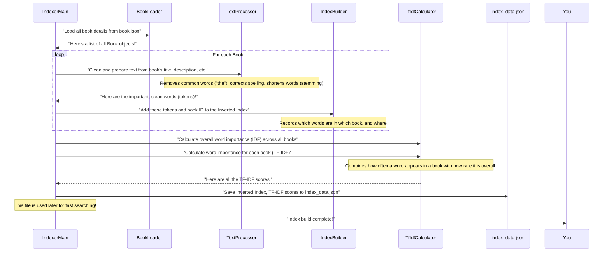

Welcome back to DevShelf! In our last chapter, [User Interface Presentation](03_user_interface_presentation_.md), we explored how DevShelf shows you information and takes your input. You learned how `Book` objects (our digital index cards) are displayed. But before those books can appear, DevShelf needs to *find* them, and find them *quickly*.

Imagine you walk into a massive library and ask the librarian, "Find me all books about 'Python'!" If the librarian had to physically open and read every single book in the entire library each time someone asked a question, they'd be incredibly slow! You'd be waiting forever for your search results.

This is exactly the problem that **Search Index Management** solves for DevShelf.

### The "Librarian's Secret Catalog"

Search index management is like the librarian's secret, highly organized system that helps them find books in a flash. It's an **offline process**, meaning it happens *before* DevShelf is ready to answer your search queries. It involves meticulously preparing all the book data so that when you search, DevShelf doesn't have to read all the books again.

**Our central use case:** To provide *instant* search results when a user types a query. Without this pre-computation, every search would feel like DevShelf was reading every book from scratch.

### The `IndexerMain`: Our Master Cataloger

The `IndexerMain` is a special, separate part of our application that's solely responsible for building this "secret catalog." You don't run it every time you start DevShelf. Instead, you run it **once**, or whenever our collection of [Book (Domain Model)](02_book__domain_model__.md) data changes (e.g., new books are added or old ones are removed).

It reads all the [Book (Domain Model)](02_book__domain_model__.md) information and creates two super-efficient lookup tables:

1.  **Inverted Index:** This is like the index at the back of a textbook. You look up a specific word (term), and it tells you exactly *which books* contain that word.
2.  **TF-IDF Scores:** This helps DevShelf understand *how important* a word is to a specific book, compared to its importance across *all* books. It's how we know if "Java" is a key topic in a book, or just mentioned briefly.

After `IndexerMain` finishes its job, it saves all this prepared data into a special file called `index_data.json`. Later, when DevShelf starts up (as we saw in [Application Startup & Flow Control](01_application_startup___flow_control_.md)), it simply *loads* this `index_data.json` file, and `boom!`, it's ready for fast searches.

### How to Build the Search Index

You would run the `IndexerMain` program directly. It doesn't have a user interface; it just does its work and tells you what it's doing on the console.

**`src/main/java/core/IndexerMain.java` (Simplified)**
```java
package core;

import domain.Book;
import domain.SearchIndexData;
import features.search.IndexBuilder;
import storage.BookLoader;
import utils.TfIdfCalculator;
// ... other imports

public class IndexerMain {
    private static final String INDEX_FILE_PATH = ("src/main/resources/data/index_data.json");

    public static void main(String[] args) {
        System.out.println("--- Starting Offline Indexer ---");
        try {
            // 1. Load the raw book data
            BookLoader loader = new BookLoader("src/main/resources/data/book.json");
            List<Book> allBooks = loader.loadBooks();
            System.out.println("Loading and indexing books...");

            // 2. Build the Inverted Index
            IndexBuilder indexer = new IndexBuilder(/* ... */);
            for(Book book : allBooks) {
                indexer.indexDocument(book); // Add each book to the index
            }

            // 3. Calculate TF-IDF scores
            TfIdfCalculator tfIdfCalculator = new TfIdfCalculator();
            tfIdfCalculator.calculateIdf(indexer.getInvertedIndex(), allBooks.size());
            tfIdfCalculator.calculateTfIdf(indexer.getInvertedIndex());
            System.out.println("TF-IDF calculation complete.");

            // 4. Save everything to a JSON file
            SearchIndexData indexData = new SearchIndexData(
                indexer.getInvertedIndex(),
                tfIdfCalculator.getTfIdfVectors(),
                tfIdfCalculator.getIdfScores()
            );
            // ... (Use ObjectMapper to write indexData to INDEX_FILE_PATH)
            System.out.println("--- Indexer Finished Successfully! --- ");
        } catch (Exception e) {
            System.err.println(" --- Indexer failed with an error. --- ");
            e.printStackTrace();
        }
    }
}
```
When you run this `IndexerMain` class, it will print messages like "Loading and indexing books..." and "Indexer Finished Successfully!", then it creates or updates the `index_data.json` file. This file contains all the pre-computed magic for fast searching!

#### What the `index_data.json` File Looks Like (Snippet)

This is a small part of the generated `index_data.json`. It looks complicated, but it's just a structured way of storing our "secret catalog":

**`src/main/resources/data/index_data.json` (Snippet)**
```json
{
  "invertedIndex" : {
    "don't" : [ { "docId" : 24, "freq" : 1, "positions" : [ 1 ] } ],
    "analysi" : [ { "docId" : 1, "freq" : 1, "positions" : [ 19 ] } ],
    "python" : [
      { "docId" : 13, "freq" : 1, "positions" : [ 18 ] },
      { "docId" : 26, "freq" : 4, "positions" : [ 0, 11, 16, 17 ] }
    ]
  },
  "tfIdfVectors" : {
    "1" : { "rivest" : 2.31, "stein" : 2.31, "code" : 1.01 },
    "2" : { "profession" : 1.83, "engin" : 0.95, "practic" : 0.45 },
    "3" : { "engin" : 0.95, "c" : 0.84, "code" : 1.49 }
  },
  "idfScores" : {
    "don't" : 1.834, "straub" : 2.311, "opus" : 2.311, "analysi" : 1.357
  }
}
```
*   `invertedIndex`: Maps a word (like "python") to a list of "postings". Each "posting" tells us which book (`docId`), how many times (`freq`), and where (`positions`) the word appears in that book.
*   `tfIdfVectors`: For each book (`docId`), it lists all the important words (`term`) in that book and their "importance score" (`tfIdf`).
*   `idfScores`: For each word (`term`), it lists its overall rarity/importance score across *all* books.

### Under the Hood: Building the Search Index Step-by-Step

Let's visualize the `IndexerMain` at work as it builds this powerful index:



### The Tools for Building the Index

Let's look at the key components that `IndexerMain` uses to create the search index.

#### Storing the Index Data: `SearchIndexData`

This class is like a digital container that holds all the different parts of our pre-computed index.

**`src/main/java/domain/SearchIndexData.java` (Simplified)**
```java
package domain;

import lombok.Getter;
import java.util.List;
import java.util.Map;

public class SearchIndexData {
    @Getter
    private Map<String, List<Posting>> invertedIndex; // Our word-to-book map
    @Getter
    private Map<Integer, Map<String, Double>> tfIdfVectors; // Book-to-word-importance map
    @Getter
    private Map<String, Double> idfScores; // Overall word importance scores

    // ... constructors (methods to create a SearchIndexData object) ...
}
```
This simple class acts as a blueprint for the entire search index data that gets saved to `index_data.json`. It clearly shows the three main pieces of information that make up our index.

#### Loading the Index for the Application: `IndexLoader`

Once `IndexerMain` has created `index_data.json`, the main DevShelf application needs to load it. This is done by the `IndexLoader`.

**`src/main/java/storage/IndexLoader.java` (Simplified)**
```java
package storage;

import com.fasterxml.jackson.databind.ObjectMapper;
import domain.SearchIndexData;
import java.io.File;
import java.io.IOException;

public class IndexLoader {

    private final String indexFilePath;
    private final ObjectMapper mapper;

    public IndexLoader(String indexFilePath) {
        this.indexFilePath = indexFilePath;
        this.mapper = new ObjectMapper();
    }

    public SearchIndexData loadIndex() {
        System.out.println("Loading pre-compiled index from: " + indexFilePath);
        try {
            File indexFile = new File(indexFilePath);
            if (!indexFile.exists()) {
                throw new IOException("Index file not found! Please run IndexerMain first.");
            }
            // This single line reads the JSON file and converts it into a SearchIndexData object!
            SearchIndexData indexData = mapper.readValue(indexFile, SearchIndexData.class);
            System.out.println("Index loaded successfully.");
            return indexData;
        } catch (IOException e) {
            // If the index file is missing, the app can't run correctly.
            System.err.println("FATAL ERROR: Could not load index file.");
            throw new RuntimeException("Failed to load search index", e);
        }
    }
}
```
The `IndexLoader` reads the `index_data.json` file. If the file is missing, it stops the application because DevShelf cannot function without its "secret catalog." If it's there, it uses a powerful tool called `ObjectMapper` (from the Jackson library) to quickly turn the JSON text into a `SearchIndexData` object that our Java program can use. This is where the magic of instant search begins when the app starts!

#### Building the Inverted Index: `IndexBuilder`

This is where the actual "indexing" of books happens. For each book, the `IndexBuilder` extracts important words and records where they appear.

**`src/main/java/features/search/IndexBuilder.java` (Simplified `indexDocument` method)**
```java
package features.search;

import domain.Book;
import domain.Posting;
import utils.TextProcessor; // Our tool to clean up text
import java.util.ArrayList;
import java.util.HashMap;
import java.util.List;
import java.util.Map;

public class IndexBuilder {
    private final Map<String, List<Posting>> invertedIndex; // The main index: word -> list of book locations
    private final TextProcessor textProcessor;

    public IndexBuilder(TextProcessor textProcessor) {
        this.textProcessor = textProcessor;
        this.invertedIndex = new HashMap<>();
    }

    public void indexDocument(Book book) {
        // Combine all relevant text from the book
        String bookData = book.getTitle() + " " + book.getAuthor() + " " + book.getDescription() + " " +
                          book.getCategory() + " " + book.getProgLang() + " " + String.join(" ", book.getTag());

        // 1. Clean and normalize the text (e.g., "Python" -> "python", remove "the", shorten "running" -> "run")
        List<String> stemmedTokens = textProcessor.process(bookData);

        // 2. Record term positions and frequencies within THIS book
        Map<String, List<Integer>> termPositions = new HashMap<>();
        for (int pos = 0; pos < stemmedTokens.size(); pos++) {
            String term = stemmedTokens.get(pos);
            termPositions.computeIfAbsent(term, k -> new ArrayList<>()).add(pos);
        }

        // 3. Add this book's data to the main inverted index
        for (Map.Entry<String, List<Integer>> entry : termPositions.entrySet()) {
            String term = entry.getKey();
            List<Integer> positions = entry.getValue();
            Posting posting = new Posting(book.getBookId(), positions.size(), positions); // Store book ID, frequency, positions
            invertedIndex.computeIfAbsent(term, k -> new ArrayList<>()).add(posting); // Add to global index
        }
    }
    // ... getter for invertedIndex
}
```
The `indexDocument` method is called for every book.
1.  It gathers all important text about the book (title, author, description, etc.).
2.  It uses `TextProcessor` (which we'll explore in [Text Normalization Utilities](08_text_normalization_utilities_.md)) to clean up this text, making words lowercase, removing common "stop words" like "a" or "the", and reducing words to their root form (e.g., "running", "ran", "runs" all become "run").
3.  It then goes through each cleaned word (or "term") in the book, noting its `bookId`, how many times it appears (`freq`), and where (`positions`). This information is stored in a `Posting` object.
4.  Finally, it adds this `Posting` to our main `invertedIndex`. If a word is seen for the first time, it gets a new entry. If it's seen again in another book, that book's `Posting` is added to the word's existing list.

#### Calculating Word Importance: `TfIdfCalculator`

After the `InvertedIndex` is built, the `TfIdfCalculator` adds a layer of "smartness" by calculating TF-IDF scores.

**`src/main/java/utils/TfIdfCalculator.java` (Simplified `calculateIdf` and `calculateTfIdf` methods)**
```java
package utils;

import domain.Posting;
import lombok.Getter;
import java.util.HashMap;
import java.util.List;
import java.util.Map;

public class TfIdfCalculator {
    @Getter
    private Map<Integer, Map<String, Double>> tfIdfVectors = new HashMap<>(); // Book -> (Word -> Score)
    @Getter
    private Map<String, Double> idfScores = new HashMap<>(); // Word -> Overall Rarity Score

    public void calculateIdf(Map<String, List<Posting>> invertedIndex, int totalDocCount) {
        System.out.println("Calculating IDF scores for + " + invertedIndex.size() + " terms...");
        for(String term : invertedIndex.keySet()) {
            int docFrequency = invertedIndex.get(term).size(); // How many documents contain this term
            // IDF: Log (Total # of books / # of books containing this term)
            double idf = Math.log10( (double) totalDocCount / docFrequency );
            idfScores.put(term, idf); // Store the rarity score for each term
        }
    }

    public void calculateTfIdf(Map<String, List<Posting>> invertedIndex) {
        System.out.println("Calculating TF-IDF vectors for all documents...");
        for(String term : invertedIndex.keySet()) {
            double idf = idfScores.get(term); // Get the overall rarity score
            List<Posting> postings = invertedIndex.get(term);
            for(Posting posting : postings ) {
                int docId = posting.getDocId();
                int termFreq = posting.getFreq(); // How many times this term appears in THIS book
                // TF: 1 + Log (Term Frequency in this book)
                double tf = 1 + Math.log10(termFreq);
                double tfIdf = tf * idf; // Combine TF and IDF
                tfIdfVectors.computeIfAbsent(docId, k -> new HashMap<>()).put(term,tfIdf); // Store importance score
            }
        }
    }
}
```
1.  **`calculateIdf`**: This method first calculates the **Inverse Document Frequency (IDF)** for *every unique word* in our entire library. A word that appears in many books (like "the" or "programming") will have a low IDF score, meaning it's not very discriminating. A word that appears in few books (like "quantum entanglement") will have a high IDF score, meaning it's very specific.
2.  **`calculateTfIdf`**: Then, for each word in each book, it calculates the **Term Frequency-Inverse Document Frequency (TF-IDF)** score.
    *   **Term Frequency (TF)**: How often a word appears in a *specific book*. More occurrences mean more relevance to *that book*.
    *   **TF-IDF = TF \* IDF**: This final score tells us how important a word is to a specific book, taking into account how often it appears *in that book* and how rare it is *across the entire library*. High TF-IDF means a word is very relevant and unique to a document.

This entire process makes DevShelf incredibly efficient. When you search, it doesn't have to re-read and calculate all this information. It just looks up words and their scores in the pre-built `SearchIndexData`!

### Conclusion

In this chapter, we delved into **Search Index Management**, the behind-the-scenes magic that makes DevShelf's search incredibly fast. We learned that:
*   It's an **offline process** performed by `IndexerMain` to prepare book data for quick searching.
*   The core components are the **Inverted Index** (mapping words to books) and **TF-IDF scores** (measuring word importance).
*   The `IndexBuilder` populates the inverted index by processing book text and recording word locations.
*   The `TfIdfCalculator` then assigns importance scores to words within books based on their frequency and rarity.
*   All this prepared data is saved into `index_data.json` and loaded by the `IndexLoader` when DevShelf starts, turning our digital library into an instant search powerhouse.

This efficient preparation of data is crucial for the "brain" of DevShelf, our search engine. In the next chapter, we'll explore how this pre-computed index is actually used to answer your search queries!

[Next Chapter: Core Search Engine](05_core_search_engine_.md)