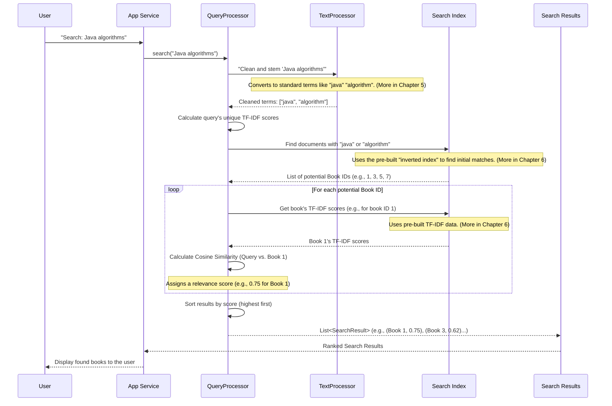

# Chapter 4: Core Search Engine

Welcome back, digital librarian! In our last chapter, [Application Orchestration](03_application_orchestration_.md), we saw how DevShelf's "Main Director" brings all the pieces together. It loads our precious [Book (Domain Model)](02_book__domain_model__.md) objects, prepares the user interface, and sets up all the "smart tools" needed to make DevShelf work.

Now, it's time to reveal one of the most exciting "smart tools": the **Core Search Engine**. This is the real magic behind finding books. You know *what* a book is and *how* the application starts, but how does DevShelf actually understand your search request and pick out the perfect books from thousands? That's what this chapter is all about!

### The "Finder" of Our Digital Library

The Core Search Engine is like the super-smart librarian in our digital library who, when you ask a question, instantly knows where to find the best books. It's the "finder" in DevShelf, responsible for answering your search queries.

**The problem it solves:** Imagine you type "Java programming" into DevShelf. There are hundreds of books! How does DevShelf instantly know which ones are most relevant, and why does "Effective Java" appear before a book that just *mentions* Java once? The Core Search Engine's job is to figure this out and present the best matches.

**Our central use case:** A user types a search query like "Python machine learning" into DevShelf, and the Core Search Engine needs to identify, score, and rank the most relevant books on that topic.

Let's break down how this "finder" works its magic!

### How the Core Search Engine Works: A Quick Overview

The Core Search Engine, primarily handled by a component called the `QueryProcessor`, performs these key steps:

1.  **Understand Your Query:** It first cleans up your search terms and breaks them into important words (we'll learn more about this in [Text Preprocessing](05_text_preprocessing_.md)).
2.  **Find Potential Books:** It quickly consults a special "pre-built index" (like a super-fast catalog, explained in [Offline Search Indexing](06_offline_search_indexing_.md)) to find *all* books that contain *any* of your important search words.
3.  **Score for Relevance:** Not all matching books are equally good! It then calculates a "relevance score" for each potential book based on how well it matches your query.
4.  **Rank and Present:** Finally, it sorts the books from the highest score (most relevant) to the lowest, making sure the best matches always appear at the top of your search results.

### Using the Core Search Engine

You, as the user, don't directly talk to the `QueryProcessor`. Instead, when you type something into the search bar (in the GUI) or enter a command (in the CLI), our main application logic (like the `DevShelfService` for the GUI or `BookSearchEngine` for the CLI) acts as an intermediary. It takes your query and hands it over to the `QueryProcessor`.

Let's look at how the `DevShelfService` (used by the GUI, as seen in [User Interface (UI) Presentation](01_user_interface__ui__presentation_.md)) calls the `QueryProcessor`'s `search` method:

**`src/main/java/ui/gui/services/DevShelfService.java` (Simplified `search` method)**
```java
package ui.gui.services;

import domain.Book;
import domain.SearchResult;
import features.search.QueryProcessor; // Our search engine!
import java.util.List;

public class DevShelfService {
    private final QueryProcessor queryProcessor; // The brain of our search

    public DevShelfService( /* ... QueryProcessor queryProcessor ... */ ) {
        this.queryProcessor = queryProcessor; // Get the search engine ready
    }

    public SearchResponse search(String query) {
        System.out.println("🔍 GUI Processing Query: [" + query + "]");

        // 1. Raw Search: Hand the query to our QueryProcessor
        List<SearchResult> results = queryProcessor.search(query);

        // ... further steps like re-ranking, converting to Book objects ...
        // (These steps are covered in later chapters)

        // The DevShelfService then takes these results and gives them to the UI
        // to display the actual Book objects.
        return null; // Simplified return
    }
}
```
When you type "Python" and hit Enter, the `search` method in `DevShelfService` receives `"Python"`. It then simply passes this `query` to `queryProcessor.search(query)`. The `QueryProcessor` goes to work and returns a list of `SearchResult` objects.

A `SearchResult` object is a simple container that holds two pieces of information for each book found:
*   `docId`: The unique ID of the book that matched (which we learned about in [Book (Domain Model)](02_book__domain_model__.md)).
*   `score`: How relevant that book is to your query. A higher score means it's a better match.

**`src/main/java/domain/SearchResult.java` (Simplified)**
```java
package domain;

import lombok.Getter; // A helper to automatically create 'get' methods

public class SearchResult implements Comparable<SearchResult> {

    @Getter private final int docId;   // The ID of the matching book
    @Getter private final double score; // How relevant it is to the query

    public SearchResult(int docId, double score) {
        this.docId = docId;
        this.score = score;
    }

    // This special method helps us sort results from highest score to lowest
    @Override
    public int compareTo(SearchResult other) {
        // We want to sort in descending order (highest score first)
        return Double.compare(other.score, this.score);
    }
}
```
After the `QueryProcessor` returns this list of `SearchResult`s, `DevShelfService` (or `BookSearchEngine` in CLI) takes these `docId`s, retrieves the full [Book (Domain Model)](02_book__domain_model__.md) objects from its `bookMap` (remember this from [Application Orchestration](03_application_orchestration_.md)?), and then hands them over to the [User Interface (UI) Presentation](01_user_interface__ui__presentation_.md) to be displayed on your screen.

### Under the Hood: The `QueryProcessor` in Action

Let's visualize what happens *inside* the `QueryProcessor` when you submit a search for "Java algorithms":



#### The `QueryProcessor` Class: The Search Mastermind

The `QueryProcessor` is the class that orchestrates the entire search process. It needs access to some powerful tools that were prepared during application startup (remember [Application Orchestration](03_application_orchestration_.md)?):
*   `TextProcessor`: For cleaning up your search query. We'll explore this in [Text Preprocessing](05_text_preprocessing_.md).
*   `invertedIndex`, `tfIdfVectors`, `idfScores`: These are the core components of our pre-built search index, which we'll delve into in [Offline Search Indexing](06_offline_search_indexing_.md).

**`src/main/java/features/search/QueryProcessor.java` (Simplified Constructor)**
```java
package features.search;

import domain.Posting; // Represents a word's location in a book
import domain.SearchResult;
import utils.TextProcessor; // Our text cleaning tool
import java.util.*;

public class QueryProcessor {
    private final TextProcessor textProcessor;
    private final Map<String, List<Posting>> invertedIndex;     // Word -> Books containing it
    private final Map<Integer, Map<String, Double>> tfIdfVectors; // Book ID -> (Word -> Score)
    private final Map<String, Double> idfScores;                // Word -> Overall Rarity Score

    public QueryProcessor(TextProcessor textProcessor,
                          Map<String, List<Posting>> invertedIndex,
                          Map<Integer, Map<String, Double>> tfIdfVectors,
                          Map<String, Double> idfScores) {
        this.textProcessor = textProcessor;
        this.invertedIndex = invertedIndex;
        this.tfIdfVectors = tfIdfVectors;
        this.idfScores = idfScores;
    }
    // ... search method and other helper methods
}
```
The constructor simply takes all these pre-built index components and the `TextProcessor` as "ingredients" so it has everything it needs to perform a search.

#### The `search` Method: The Core Logic

This is the main method that runs when you submit a search query.

**`src/main/java/features/search/QueryProcessor.java` (Simplified `search` method)**
```java
// Inside QueryProcessor class
public List<SearchResult> search(String rawQuery) {
    // 1. Process the query (clean words, stem them)
    List<String> queryTerms = textProcessor.process(rawQuery);
    if (queryTerms.isEmpty()) {
        return Collections.emptyList(); // No valid terms left to search
    }

    // 2. Calculate the query's own TF-IDF vector
    Map<String, Double> queryVector = calculateQueryVector(queryTerms);

    // 3. Find all documents that match *any* query term using the inverted index
    Set<Integer> matchingDocIds = findMatchingDocuments(queryTerms);

    // 4. Score each matching document using Cosine Similarity
    List<SearchResult> results = new ArrayList<>();
    for (int docId : matchingDocIds) {
        Map<String, Double> docVector = tfIdfVectors.get(docId); // Get book's TF-IDF scores
        double score = cosineSimilarity(queryVector, docVector); // Calculate relevance!
        if (score > 0) { // Only add if there's some relevance
            results.add(new SearchResult(docId, score));
        }
    }

    // 5. Rank (sort) the results by score (highest first)
    Collections.sort(results);

    return results;
}
```
Here's a breakdown of the steps in this `search()` method:
1.  **`textProcessor.process(rawQuery)`**: Just like our indexing process, the `QueryProcessor` uses the `TextProcessor` to clean and standardize your search query (e.g., "Programming Books" becomes ["program", "book"]).
2.  **`calculateQueryVector(queryTerms)`**: It then creates a special numeric representation (a "vector") of your query. This is similar to how books are represented and helps us compare your query to books.
3.  **`findMatchingDocuments(queryTerms)`**: This step is incredibly fast! It uses the `invertedIndex` we learned about in [Offline Search Indexing](06_offline_search_indexing_.md) to quickly gather a list of all `bookId`s that contain any of your processed query terms.
4.  **`cosineSimilarity(queryVector, docVector)`**: This is the core of relevance scoring. For each potential book, it compares the query's vector to the book's pre-computed `tfIdfVectors` using a mathematical technique called Cosine Similarity.
5.  **`Collections.sort(results)`**: Finally, all the `SearchResult`s are sorted from highest relevance score to lowest, putting the best matches at the top of your results.

Let's look at some of these helper methods in more detail!

#### `findMatchingDocuments`: Rapid Document Retrieval

This method uses the `invertedIndex` to quickly gather all the `docId`s (book IDs) that contain at least one of your query words.

**`src/main/java/features/search/QueryProcessor.java` (Simplified `findMatchingDocuments` method)**
```java
// Inside QueryProcessor class
private Set<Integer> findMatchingDocuments(List<String> queryTerms) {
    Set<Integer> docIds = new HashSet<>(); // Use a Set to store unique book IDs
    for(String term : queryTerms) {
        List<Posting> postings = invertedIndex.get(term); // Look up term in the index!
        if(postings != null){
            for(Posting p : postings) {
                docIds.add(p.getDocId()); // Add all unique book IDs found
            }
        }
    }
    return docIds;
}
```
For each word in your query (e.g., "java"), it looks it up in the `invertedIndex`. The index tells it exactly which `Posting` objects (representing occurrences of the word in a book) are associated with "java". It then collects all the `docId`s from these `Posting`s. This is why the inverted index is so powerful for quick lookups!

#### `calculateQueryVector`: Understanding the Query's Importance

This method creates a TF-IDF vector for *your search query itself*. This allows us to treat your query like a small "document" and compare it mathematically to our books.

**`src/main/java/features/search/QueryProcessor.java` (Simplified `calculateQueryVector` method)**
```java
// Inside QueryProcessor class
private Map<String, Double> calculateQueryVector(List<String> queryTerms) {
    Map<String, Double> queryVector = new HashMap<>();
    Map<String, Integer> termCounts = new HashMap<>(); // Count term occurrences in YOUR query

    // Count how many times each term appears in your query
    for(String term : queryTerms) {
        termCounts.put(term, termCounts.getOrDefault(term, 0) + 1);
    }

    // For each unique term in your query, calculate its TF-IDF score
    for(String term : termCounts.keySet()) {
        double tf = 1 + Math.log10(termCounts.get(term)); // Term Frequency for query term
        double idf = idfScores.getOrDefault(term, 0.0);    // Inverse Document Frequency from our index

        queryVector.put(term, tf * idf); // Store TF-IDF score for query term
    }
    return queryVector;
}
```
This method essentially does the same TF-IDF calculation we briefly mentioned for books, but for the query. It counts how many times each word appears in *your query* (Term Frequency, TF) and then multiplies it by the overall rarity of that word (`idfScores`) from our pre-built index.

#### `cosineSimilarity`: Measuring How Alike Things Are

This is the clever math part that gives us the relevance score! Cosine Similarity measures how "similar" two things are by looking at the "angle" between their "vectors" (our lists of TF-IDF scores).

**Analogy:** Imagine your search query and a book are like two arrows (vectors) in a giant space.
*   If they point in exactly the same direction, they are very similar (Cosine Similarity = 1.0).
*   If they point in completely different directions (at a 90-degree angle), they are not similar at all (Cosine Similarity = 0.0).
*   Anything in between means a partial match, with a score between 0 and 1.

**`src/main/java/features/search/QueryProcessor.java` (Simplified `cosineSimilarity` method)**
```java
// Inside QueryProcessor class
private double cosineSimilarity(Map<String, Double> vec1, Map<String, Double> vec2) {
    if (vec2 == null) return 0.0; // If book has no TF-IDF data, it can't be similar

    double dotProduct = 0.0;
    double norm1 = 0.0; // "Length" of the first vector (query)
    double norm2 = 0.0; // "Length" of the second vector (book)

    // Calculate how much the two vectors overlap (dot product)
    // and the "length" of the first vector (norm1)
    for (String term : vec1.keySet()) {
        double queryTermScore = vec1.get(term);
        double bookTermScore = vec2.getOrDefault(term, 0.0);

        dotProduct += queryTermScore * bookTermScore;
        norm1 += queryTermScore * queryTermScore; // Sum of squares for norm1
    }

    // Calculate the "length" of the second vector (norm2)
    for (double score : vec2.values()) {
        norm2 += score * score; // Sum of squares for norm2
    }

    // Avoid division by zero in case of empty vectors
    if (norm1 == 0.0 || norm2 == 0.0) {
        return 0.0;
    }

    // The final formula: (Overlap) / (Length of Query * Length of Book)
    return dotProduct / (Math.sqrt(norm1) * Math.sqrt(norm2));
}
```
This method takes two maps (the query's TF-IDF vector and a book's TF-IDF vector) and computes a score between 0 and 1. A score closer to 1 means the book is highly relevant to the query, while a score closer to 0 means it's not. This score is precisely what determines the book's ranking in your search results!

### Conclusion

In this chapter, we explored the **Core Search Engine**, which is the "finder" of our DevShelf application. We learned that:
*   The `QueryProcessor` is the main component responsible for taking your search query and finding relevant books.
*   It first **processes** your query (cleaning and standardizing words) using the `TextProcessor` (which we'll explore in [Text Preprocessing](05_text_preprocessing_.md)).
*   Then, it uses the pre-built `invertedIndex` from [Offline Search Indexing](06_offline_search_indexing_.md) to quickly **identify matching documents**.
*   Crucially, it **scores** these books for relevance using techniques like Cosine Similarity, comparing the query's TF-IDF vector to each book's TF-IDF vector (also from [Offline Search Indexing](06_offline_search_indexing_.md)).
*   Finally, it **ranks** the results, ensuring the most pertinent books are shown first.

This entire process allows DevShelf to quickly transform your simple search query into a prioritized list of highly relevant books. Now that we understand *how* the search engine finds and ranks books, let's dive into one of the fundamental building blocks it uses: cleaning and preparing text.

[Next Chapter: Text Preprocessing](05_text_preprocessing_.md)
