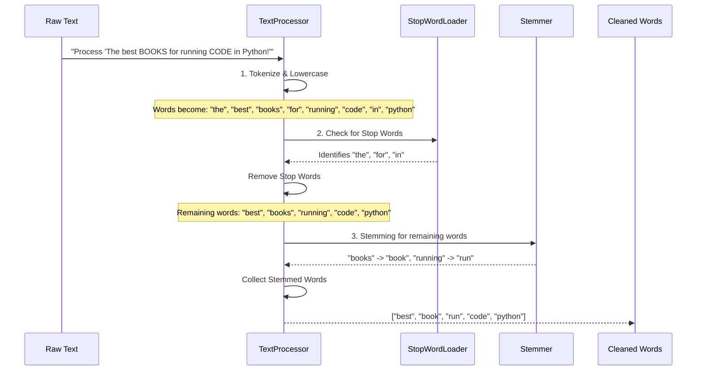

# Chapter 5: Text Preprocessing

Welcome back, digital librarian! In our last chapter, [Core Search Engine](04_core_search_engine_.md), we unveiled the powerful "finder" of DevShelf. We learned how the `QueryProcessor` intelligently takes your search terms, compares them to books, and ranks the most relevant results.

But have you ever thought about how the search engine truly *understands* your words? What if you search for "programming books" and a book's description says "This guide is for **programmers**"? Or what if you type "JAVA" (all caps) but the book's title is "Effective **Java**"? Without some clever preparation, these wouldn't match perfectly, and you might miss great books!

This is where **Text Preprocessing** comes in. Think of it as DevShelf's very own "digital editor." Its job is to ensure all text – whether from book descriptions or your search queries – is clean, consistent, and easy for the search engine to understand. It's the silent hero that makes accurate search matching possible.

### What Problem Does Our Digital Editor Solve?

Text from the real world is messy! It has:
*   **Different spellings/forms**: "run", "running", "runs"
*   **Capitalization**: "Java", "java", "JAVA"
*   **Punctuation**: "code!", "code."
*   **Common, uninformative words**: "the", "a", "is", "of"

If DevShelf tried to match words exactly as they are, it would miss many relevant books. Our "digital editor" solves this by transforming all text into a standard, simplified format.

**Our central use case:** You search for "How to write **Clean Code** in **Java**". DevShelf needs to understand that you're looking for books on "clean," "code," and "java," regardless of the casing, the presence of common words like "to" or "how," or even if a book says "java programs" instead of just "java." Text Preprocessing ensures your query intelligently matches the book's content.

### The `TextProcessor`: Our Digital Editor in Action

The main tool that performs text preprocessing in DevShelf is the `TextProcessor`. It takes any raw text and puts it through a structured "pipeline" of cleaning steps:

1.  **Tokenization**: Breaking text into individual words.
2.  **Lowercasing**: Converting all words to lowercase.
3.  **Stop Word Removal**: Filtering out common words that don't add much meaning.
4.  **Stemming**: Reducing words to their basic "root" form.

Let's see an example of how the `TextProcessor` works:

```java
// Imagine 'textProcessor' is our digital editor, ready to use
String rawText = "The best BOOKS for running CODE in Python!";

// We ask the text processor to clean this text
List<String> cleanedWords = textProcessor.process(rawText);

System.out.println(cleanedWords);
```

**Output:**
```
[best, book, run, code, python]
```

Notice how much cleaner and more focused the text is!
*   "The," "for," "in" are gone (stop words).
*   "BOOKS" became "book" (lowercasing, stemming).
*   "running" became "run" (stemming).
*   "CODE!" became "code" (lowercasing, punctuation removed).
*   "Python!" became "python" (lowercasing, punctuation removed).

This standardized list of words is what the [Core Search Engine](04_core_search_engine_.md) actually uses for matching and scoring!

### Under the Hood: The `TextProcessor`'s Workflow

Let's visualize the `TextProcessor` at work when it cleans a piece of text like `"The best BOOKS for running CODE in Python!"`:



#### The `TextProcessor` Class: The Orchestrator of Cleaning

The `TextProcessor` class (found in `src/main/java/utils/TextProcessor.java`) is the "brain" that combines all these cleaning steps. When it's created, it needs a list of "stop words" and uses a special `Stemmer` tool.

**`src/main/java/utils/TextProcessor.java` (Simplified Constructor)**
```java
package utils;

import org.tartarus.snowball.ext.englishStemmer; // A tool for finding root words
import java.util.Set; // To store our list of stop words

public class TextProcessor {

   private final Set<String> stopWords;           // Our list of uninformative words
   private final englishStemmer stemmer = new englishStemmer(); // Our root-word finder

   // When TextProcessor is created, we give it the list of stop words
   public TextProcessor(Set<String> stopWords) {
       this.stopWords = stopWords;
   }

   // ... process method will be here ...
}
```
This constructor makes sure our `TextProcessor` has all the necessary "ingredients" (`stopWords` and `stemmer`) to clean text properly.

#### The `process` Method: Step-by-Step Cleaning in Code

This is the main method that you call to clean any text. It implements the workflow we just saw.

**`src/main/java/utils/TextProcessor.java` (Simplified `process` method)**
```java
// Inside TextProcessor class
public List<String> process(String text) {

    if (text == null || text.isBlank()) {
        return Collections.emptyList(); // Safety check: return empty if no text
    }

    // 1. Tokenization and Lowercasing
    // text.toLowerCase() makes everything lowercase.
    // .split("[^a-zA-Z0-9']+") breaks the text into words by
    // anything that's NOT a letter, number, or apostrophe.
    String[] rawTokens = text.toLowerCase().split("[^a-zA-Z0-9']+");
    List<String> tokens = Arrays.asList(rawTokens);

    // 2. Stop Word Removal
    List<String> filteredTokens = new ArrayList<>();
    for(String token : tokens) {
        if (token.isEmpty()) continue; // Skip any empty strings from splitting
        if(!stopWords.contains(token)) { // If the word is NOT in our stopWords list
            filteredTokens.add(token);   // Keep it!
        }
    }

    // 3. Stemming
    List<String> stemmedTokens = new ArrayList<>();
    for (String token : filteredTokens) {
        stemmer.setCurrent(token); // Give the stemmer the word
        stemmer.stem();            // Ask it to find the root form
        stemmedTokens.add(stemmer.getCurrent()); // Get the root word (e.g., "running" -> "run")
    }

    return stemmedTokens; // Return our super clean list of words!
}
```

#### Loading Stop Words: The `StopWordLoader`

Where does the `stopWords` list come from? DevShelf has a file named `stopword.txt` (located in `src/main/resources/data/stopword.txt`) which contains a list of common English words like "the", "a", "is", etc. The `StopWordLoader` is responsible for reading this file and providing that list to the `TextProcessor`.

**`src/main/resources/data/stopword.txt` (Snippet)**
```
"a","an","the","and","or","but","if","then","else","on","in","at","by","for","with","about","against",
"between","into","through","during","before","after","above","below","to","from","up","down","of","is",
"are","was","were","be","been","being","as","that","this","these","those","it","its","I","you","he","she","they"
```
Each of these words will be removed by the `TextProcessor` because they don't help much with search relevance.

**`src/main/java/utils/StopWordLoader.java` (Simplified `loadStopWords` method)**
```java
package utils;

import java.io.BufferedReader;
import java.io.InputStream;
import java.io.InputStreamReader;
import java.util.HashSet;
import java.util.Set;

public class StopWordLoader {

    // This method can be called directly to get the stop words
    public static Set<String> loadStopWords(String resourcePath) {
       Set<String> stopWords = new HashSet<>();
       try (InputStream inputStream = StopWordLoader.class.getResourceAsStream(resourcePath);
            BufferedReader reader = new BufferedReader(new InputStreamReader(inputStream))) {

           if (inputStream == null) return stopWords; // If file not found, return empty set

           String line;
           while ((line = reader.readLine()) != null) {
               String word = line.trim().toLowerCase(); // Clean up word from file
               if (!word.isEmpty()) {
                   stopWords.add(word); // Add each word to our set
               }
           }
       } catch (Exception e) {
           System.err.println("❌ Error loading stopwords: " + e.getMessage());
       }
       return stopWords; // Return the set of all stop words
    }
}
```
The `loadStopWords` method reads each line from the `stopword.txt` file, removes any extra spaces, converts it to lowercase, and then adds it to a `HashSet`. A `HashSet` is like a super-fast list that allows us to quickly check if a word is a stop word or not.

#### The `Stemmer` Class: Finding Root Words

The `englishStemmer` used by `TextProcessor` is a special tool that knows the rules of English grammar to reduce words to their base or "root" form. For example:
*   "programming" becomes "program"
*   "developers" becomes "develop"
*   "configured" becomes "configur" (sometimes the root form isn't a perfect English word, but it's consistent!)
*   "algorithms" becomes "algorithm"

This ensures that whether a book mentions "programming," "programmer," or "programmed," the search engine only sees the root word "program," making the search much more flexible and accurate.

### Why Text Preprocessing is So Important

Text preprocessing might seem like a small detail, but it's absolutely fundamental for DevShelf to work effectively. Here’s why:

| Feature                   | WITHOUT Text Preprocessing                                   | WITH Text Preprocessing                                                |
| :------------------------ | :----------------------------------------------------------- | :--------------------------------------------------------------------- |
| **Search Accuracy**       | Misses many relevant matches due to different capitalization, punctuation, or word endings. | Finds far more relevant matches by standardizing all text.                 |
| **Search Efficiency**     | The search index would be much larger (e.g., storing "Run," "Runs," "Running" as separate terms). | Smaller and more efficient index (only stores "run"), leading to faster searches.         |
| **User Experience**       | Frustrating, as users expect a search for "Java" to match "java" and "develop" to match "developer." | Intuitive, forgiving search that "understands" the user's intent, even with typos or variations. |
| **Relevance Scoring**     | Scores might be inaccurate because common words or inconsistent spellings are treated equally. | Clearer, more precise relevance scores because only meaningful, standardized terms are compared. |

This table clearly shows that our "digital editor" is a crucial step that makes DevShelf intelligent, fast, and user-friendly.

### Conclusion

In this chapter, we explored **Text Preprocessing**, the essential behind-the-scenes process that makes all our text clean, consistent, and ready for search. We learned that:
*   The `TextProcessor` is our digital editor, performing **tokenization, lowercasing, stop word removal, and stemming** on all text inputs.
*   It relies on a `Set` of `stopWords` loaded by the `StopWordLoader` from `stopword.txt` to filter out uninformative words.
*   It uses a `Stemmer` to reduce words to their root form, allowing searches to match variations of words.
*   This consistency is vital for the [Core Search Engine](04_core_search_engine_.md) to accurately match queries with book content and generate relevant results.

By ensuring all text is perfectly prepared, DevShelf provides a much more accurate, efficient, and user-friendly search experience, forming the bedrock for all its intelligent features. Now that we know how text is cleaned, let's discover how DevShelf builds its super-fast search catalog!

[Next Chapter: Offline Search Indexing](06_offline_search_indexing_.md)
