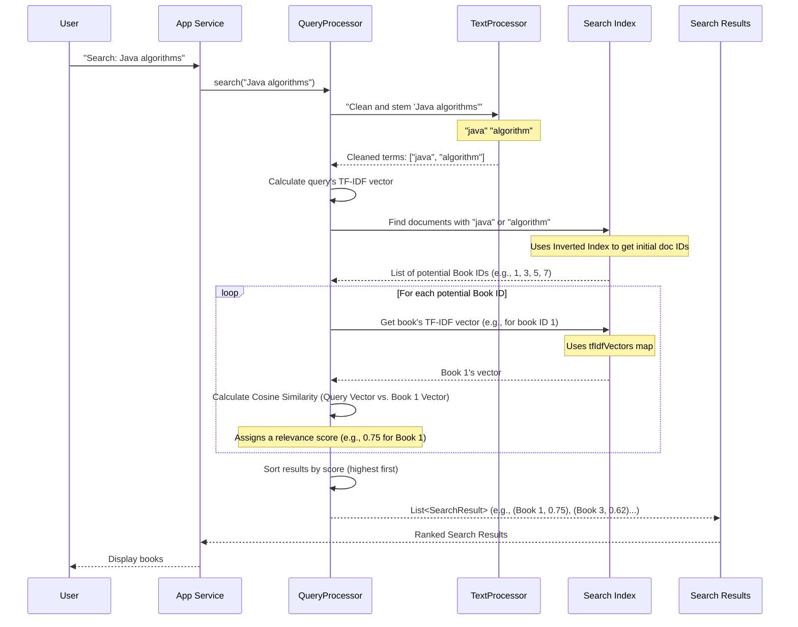

Welcome back to DevShelf! In our last chapter, [Search Index Management](04_search_index_management_.md), we learned how DevShelf meticulously prepares a "secret catalog" (our search index) of all its books *before* you even start searching. This pre-computed index makes our library incredibly fast.

Now, imagine you have this amazing, super-organized catalog. How do you actually *use* it to find the books you're looking for? If you ask a question like "Find me books about clean code in Java," what happens next?

That's where the **Core Search Engine** comes in!

### The "Finder" of Our Digital Library

The Core Search Engine is the primary brain of DevShelf that answers your search queries. It's the "finder" in our digital library. It takes your question (your search query), consults the "secret catalog" (the search index), and then quickly identifies and presents the initial set of books that are most relevant to what you asked.

**Our central use case:** A user types a search query like "Python machine learning" into DevShelf, and the Core Search Engine needs to find and list the most pertinent books on that topic.

Let's break down how it does this magic!

### How the Core Search Engine Works

The Core Search Engine, primarily handled by the `QueryProcessor` component, performs these key steps:

1.  **Understand Your Query:** It first cleans up your search query and breaks it into important words.
2.  **Find Potential Books:** It then uses the pre-built "inverted index" from [Search Index Management](04_search_index_management_.md) to quickly identify *all* books that contain *any* of your important search words.
3.  **Score for Relevance:** Not all matching books are equally good! It then calculates a "relevance score" for each potential book to your query. This score helps determine which books are the *most* pertinent.
4.  **Rank and Present:** Finally, it sorts the books from highest score to lowest, ensuring that the best matches rise to the top of your search results.

### Using the Core Search Engine

You don't directly tell the `QueryProcessor` what to do. Instead, when you type into the search bar (in the GUI) or enter a command (in the CLI), our main application logic (like `DevShelfService` for GUI or `BookSearchEngine` for CLI) calls the `QueryProcessor` to do the heavy lifting.

Let's look at how the `DevShelfService` (for the GUI) calls the `QueryProcessor`'s `search` method:

**`src/main/java/ui/gui/services/DevShelfService.java` (Simplified `search` method)**
```java
package ui.gui.services;

import domain.Book;
import domain.SearchResult;
import features.search.QueryProcessor; // Our search engine!
// ... other imports

public class DevShelfService {
    // ... other services and bookMap
    private final QueryProcessor queryProcessor; // The brain of our search

    public DevShelfService( /* ... other services, QueryProcessor queryProcessor ... */ ) {
        // ... initialize other services
        this.queryProcessor = queryProcessor; // Get the search engine ready
    }

    public SearchResponse search(String query) {
        System.out.println("🔍 GUI Processing Query: [" + query + "]");

        // 1. Raw Search: Hand the query to our QueryProcessor
        List<SearchResult> results = queryProcessor.search(query);

        // ... (further steps like handling no results, re-ranking, converting to Book objects) ...

        // Example output (after re-ranking and conversion):
        // return new SearchResponse(books, isSuggestion, usedQuery);
        return null; // Simplified
    }
    // ... other methods
}
```
When you type "Python" and hit Enter, the `search` method in `DevShelfService` gets `query = "Python"`. It then simply passes this `query` to `queryProcessor.search(query)`. The `QueryProcessor` then goes to work and returns a list of `SearchResult` objects.

A `SearchResult` object is a simple container that holds two things:
*   `docId`: The unique ID of the book that matched.
*   `score`: How relevant that book is to your query. A higher score means more relevant.

**`src/main/java/domain/SearchResult.java` (Simplified)**
```java
package domain;

import lombok.Getter;

public class SearchResult implements Comparable<SearchResult> {

    @Getter
    private final int docId;   // The ID of the matching book
    @Getter
    private final double score; // How relevant it is to the query

    public SearchResult(int docId, double score) {
        this.docId = docId;
        this.score = score;
    }

    // This helps us sort results from highest score to lowest
    @Override
    public int compareTo(SearchResult other) {
        return Double.compare(other.score, this.score);
    }
    // ... toString() method for debugging ...
}
```
After the `QueryProcessor` returns this list of `SearchResult`s, `DevShelfService` (or `BookSearchEngine` in CLI) takes these `docId`s, looks up the full [Book (Domain Model)](02_book__domain_model_.md) objects using our `bookMap` (from [Application Startup & Flow Control](01_application_startup___flow_control_.md) and [Book (Domain Model)](02_book__domain_model_.md)), and then passes them to the [User Interface Presentation](03_user_interface_presentation_.md) to be displayed.

### Under the Hood: The `QueryProcessor` in Action

Let's visualize what happens inside the `QueryProcessor` when you submit a search for "Java algorithms":



#### The `QueryProcessor` Class: The Search Mastermind

The `QueryProcessor` is the class that orchestrates the entire search process. It needs access to the tools we built in [Search Index Management](04_search_index_management_.md): the `invertedIndex`, `tfIdfVectors`, and `idfScores`. It also uses our `TextProcessor` (which we'll explore in [Text Normalization Utilities](08_text_normalization_utilities_.md)) to clean up the user's query.

**`src/main/java/features/search/QueryProcessor.java` (Simplified Constructor)**
```java
package features.search;

import domain.Posting;
import domain.SearchResult;
import utils.TextProcessor; // Our text cleaning tool
import java.util.*;

public class QueryProcessor {
    private final TextProcessor textProcessor;
    private final Map<String, List<Posting>> invertedIndex;     // Word -> Books containing it
    private final Map<Integer, Map<String, Double>> tfIdfVectors; // Book ID -> (Word -> Score)
    private final Map<String, Double> idfScores;                // Word -> Overall Rarity Score

    public QueryProcessor(TextProcessor textProcessor,
                          Map<String, List<Posting>> invertedIndex,
                          Map<Integer, Map<String, Double>> tfIdfVectors,
                          Map<String, Double> idfScores) {
        this.textProcessor = textProcessor;
        this.invertedIndex = invertedIndex;
        this.tfIdfVectors = tfIdfVectors;
        this.idfScores = idfScores;
    }
    // ... search method and other helper methods
}
```
The constructor simply takes all the pre-built index components and the `TextProcessor` as "ingredients" to do its job.

#### The `search` Method: The Core Logic

This is the main method that runs when you search.

**`src/main/java/features/search/QueryProcessor.java` (Simplified `search` method)**
```java
// Inside QueryProcessor class
public List<SearchResult> search(String rawQuery) {
    // 1. Process the query (clean words, stem them)
    List<String> queryTerms = textProcessor.process(rawQuery);
    if (queryTerms.isEmpty()) {
        return Collections.emptyList(); // No valid terms left to search
    }

    // 2. Calculate the query's own TF-IDF vector
    Map<String, Double> queryVector = calculateQueryVector(queryTerms);

    // 3. Find all documents that match *any* query term using the inverted index
    Set<Integer> matchingDocIds = findMatchingDocuments(queryTerms);

    // 4. Score each matching document using Cosine Similarity
    List<SearchResult> results = new ArrayList<>();
    for (int docId : matchingDocIds) {
        Map<String, Double> docVector = tfIdfVectors.get(docId); // Get book's TF-IDF vector
        double score = cosineSimilarity(queryVector, docVector); // Calculate relevance!
        if (score > 0) { // Only add if there's some relevance
            results.add(new SearchResult(docId, score));
        }
    }

    // 5. Rank (sort) the results by score (highest first)
    Collections.sort(results);

    return results;
}
```
Here's a breakdown of the steps in `search()`:
1.  **`textProcessor.process(rawQuery)`**: Just like `IndexerMain` processed book text, the `QueryProcessor` uses `TextProcessor` to clean and standardize your search query (e.g., "Programming Books" becomes ["program", "book"]).
2.  **`calculateQueryVector(queryTerms)`**: It then creates a special numeric representation (a "vector") of your query, using the same TF-IDF logic applied to books. This helps us compare your query to books.
3.  **`findMatchingDocuments(queryTerms)`**: This step is super fast because it uses the `invertedIndex` we built. It quickly gathers a list of all `bookId`s that contain any of the processed query terms.
4.  **`cosineSimilarity(queryVector, docVector)`**: This is the core of relevance scoring. For each potential book, it compares the query's vector to the book's pre-computed `tfIdfVectors` using a mathematical technique called Cosine Similarity.
5.  **`Collections.sort(results)`**: Finally, all the `SearchResult`s are sorted from highest relevance score to lowest, putting the best matches at the top.

#### `findMatchingDocuments`: Rapid Document Retrieval

This method uses the `invertedIndex` to get all books that contain at least one of your query words.

**`src/main/java/features/search/QueryProcessor.java` (Simplified `findMatchingDocuments` method)**
```java
// Inside QueryProcessor class
private Set<Integer> findMatchingDocuments(List<String> queryTerms) {
    Set<Integer> docIds = new HashSet<>();
    for(String term : queryTerms) {
        List<Posting> postings = invertedIndex.get(term); // Look up term in the index!
        if(postings != null){
            for(Posting p : postings) {
                docIds.add(p.getDocId()); // Add all unique book IDs found
            }
        }
    }
    return docIds;
}
```
For each word in your query (e.g., "java"), it goes to the `invertedIndex` and retrieves all the `Posting` objects associated with "java". Each `Posting` tells it which `docId` (book ID) contains that word. It collects all these `docId`s into a `Set` to avoid duplicates, giving us a list of all potential candidate books.

#### `calculateQueryVector`: Understanding the Query's Importance

This method creates a TF-IDF vector for *your search query itself*. This allows us to treat your query like a small "document" and compare it to our books.

**`src/main/java/features/search/QueryProcessor.java` (Simplified `calculateQueryVector` method)**
```java
// Inside QueryProcessor class
private Map<String, Double> calculateQueryVector(List<String> queryTerms) {
    Map<String, Double> queryVector = new HashMap<>();
    Map<String, Integer> termCounts = new HashMap<>(); // Count how many times each term appears in YOUR query

    for(String term : queryTerms) {
        termCounts.put(term, termCounts.getOrDefault(term, 0) + 1);
    }

    for(String term : termCounts.keySet()) {
        double tf = 1 + Math.log10(termCounts.get(term)); // Calculate Term Frequency for query term
        double idf = idfScores.getOrDefault(term, 0.0);    // Get Inverse Document Frequency from our index

        queryVector.put(term, tf * idf); // Store TF-IDF score for query term
    }
    return queryVector;
}
```
This method essentially does the same TF-IDF calculation we saw in [Search Index Management](04_search_index_management_.md), but for the query. It counts how many times each word appears in *your query* (TF) and then multiplies it by the overall rarity of that word (`idfScores`) from our pre-built index.

#### `cosineSimilarity`: Measuring How Alike Things Are

This is the clever math part! Cosine Similarity measures the "angle" between two "vectors" (our lists of TF-IDF scores for the query and a book).

**Analogy:** Imagine your query and a book are two arrows in a multi-dimensional space.
*   If they point in exactly the same direction, they are very similar (score = 1.0).
*   If they point in completely different directions, they are not similar at all (score = 0.0).
*   Anything in between is a partial match.

**`src/main/java/features/search/QueryProcessor.java` (Simplified `cosineSimilarity` method)**
```java
// Inside QueryProcessor class
private double cosineSimilarity(Map<String, Double> vec1, Map<String, Double> vec2) {
    if (vec2 == null) return 0.0; // If book has no TF-IDF data, it can't be similar

    double dotProduct = 0.0;
    double norm1 = 0.0; // "Length" of query vector
    double norm2 = 0.0; // "Length" of document vector

    // Calculate how much the two vectors overlap (dot product)
    // and the "length" of the query vector (norm1)
    for (String term : vec1.keySet()) {
        double queryTermScore = vec1.get(term);
        double bookTermScore = vec2.getOrDefault(term, 0.0);

        dotProduct += queryTermScore * bookTermScore;
        norm1 += queryTermScore * queryTermScore;
    }

    // Calculate the "length" of the document vector (norm2)
    for (double score : vec2.values()) {
        norm2 += score * score;
    }

    // Avoid division by zero
    if (norm1 == 0.0 || norm2 == 0.0) {
        return 0.0;
    }

    // The final formula: (Overlap) / (Length of Query * Length of Book)
    return dotProduct / (Math.sqrt(norm1) * Math.sqrt(norm2));
}
```
This method takes two maps (the query's TF-IDF vector and a book's TF-IDF vector) and computes a score between 0 and 1. A score closer to 1 means the book is highly relevant to the query, while a score closer to 0 means it's not. This score is precisely what determines the book's ranking in your search results!

### Conclusion

In this chapter, we explored the **Core Search Engine**, which is the "finder" of our DevShelf application. We learned that:
*   The `QueryProcessor` is the main component responsible for taking your search query and finding relevant books.
*   It first **processes** your query (cleaning and stemming words).
*   Then, it uses the pre-built `invertedIndex` from [Search Index Management](04_search_index_management_.md) to quickly **identify matching documents**.
*   Crucially, it **scores** these books for relevance using techniques like Cosine Similarity, comparing the query's TF-IDF vector to each book's TF-IDF vector (also from [Search Index Management](04_search_index_management_.md)).
*   Finally, it **ranks** the results, ensuring the most pertinent books are shown first.

This entire process allows DevShelf to quickly transform your simple search query into a prioritized list of highly relevant books. Now that we know how books are found, let's look at how DevShelf keeps track of what you click on and how you interact with the results!

[Next Chapter: User Interaction & Analytics](06_user_interaction___analytics_.md)