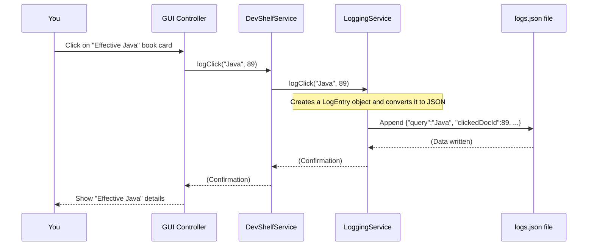

Welcome back to DevShelf! In our last chapter, [Core Search Engine](05_core_search_engine_.md), we learned how DevShelf's `QueryProcessor` is a brilliant "finder," quickly sifting through our book catalog to give you relevant results. But what happens *after* you get those results? Do you click on the first one? The fifth one? Do you *always* pick the book with the highest rating, or sometimes a less-known one catches your eye?

Knowing what users actually *do* with the search results is incredibly valuable! It's how DevShelf can become smarter and more adaptive over time, learning what's truly popular and trending. This is exactly what **User Interaction & Analytics** is all about.

### The "Hidden Assistant" of DevShelf

Imagine DevShelf has a **hidden assistant** who quietly watches over your shoulder (not in a creepy way!) whenever you use the app. This assistant doesn't just see the books DevShelf *suggests* to you; they carefully note down *which books you actually click on* after a search.

**The Problem It Solves:** If DevShelf only relies on things like word matching (TF-IDF scores) and static ratings, it might miss out on real-world trends. A book might have a great rating, but if no one ever clicks on it, maybe it's not as *relevant right now*. Conversely, a newer book might not have many ratings yet, but if everyone is suddenly clicking on it, DevShelf should recognize that it's *trending*!

**Our Central Use Case:** A user searches for "Java," sees a list of books, and then clicks on "Effective Java." DevShelf needs to **record this click**, and later, use these click records to figure out which "Java" books (or any books) are currently the most popular, influencing future search results and recommendations.

User Interaction & Analytics allows DevShelf to learn from real user behavior, making the system feel more dynamic and helpful.

### Part 1: Tracking User Clicks (The "Logger")

The first step in understanding user behavior is to record it. DevShelf has a special service dedicated to logging every time you click on a book.

#### The `LoggingService`: DevShelf's Notebook

The `LoggingService` is like the hidden assistant's notebook. Whenever you click a book in the search results (or open its details), the application tells the `LoggingService` to make an entry in its notebook. This entry includes what you searched for (`query`), which book you clicked on (`clickedDocId`), and `when` you clicked it.

All these notes are saved into a simple text file named `logs.json`.

#### The `LogEntry`: A Single Click Record

Before saving a click, DevShelf creates a `LogEntry` object. This is a small digital record, like a single line in our assistant's notebook.

**`src/main/java/domain/LogEntry.java` (Simplified)**
```java
package domain;

import lombok.Getter;
import java.time.Instant; // To record the exact time

@Getter
public class LogEntry {
    private String query;         // What the user searched for
    private int clickedDocId;     // The unique ID of the book they clicked
    private String timestamp;     // When the click happened

    // A special method to create a new LogEntry
    public LogEntry(String query, int clickedDocId) {
        this.query = query;
        this.clickedDocId = clickedDocId;
        this.timestamp = Instant.now().toString(); // Record the current time automatically
    }
}
```
Each `LogEntry` clearly captures the essential details of a user's interaction with a book.

#### How a Click Gets Logged

When you click a book (for instance, to see its full details in the GUI), here's the simplified flow:



The GUI Controller (like `MainViewController` or `BookDetailController` from [User Interface Presentation](03_user_interface_presentation_.md)) detects your click, tells `DevShelfService` (our main app brain, from [Application Startup & Flow Control](01_application_startup___flow_control_.md)), which then tells the `LoggingService` to record it.

Here's how `LoggingService` writes that entry:

**`src/main/java/utils/LoggingService.java` (Simplified `logClick` method)**
```java
package utils;

import com.fasterxml.jackson.databind.ObjectMapper; // Tool to convert to JSON
import domain.LogEntry;

import java.io.BufferedWriter;
import java.io.FileWriter;
import java.io.IOException;

public class LoggingService {

    private final String logFilePath;
    private final ObjectMapper mapper;

    public LoggingService(String logFilePath) {
        this.logFilePath = logFilePath;
        this.mapper = new ObjectMapper();
    }

    public void logClick(String query, int clickedDocId) {
        LogEntry entry = new LogEntry(query, clickedDocId); // Create the LogEntry

        // Convert the LogEntry object into a JSON text string
        String jsonLogLine;
        try {
            jsonLogLine = mapper.writeValueAsString(entry);
        } catch (IOException e) {
            System.err.println("Failed to convert LogEntry to JSON.");
            return;
        }

        // Write the JSON string to the logs.json file, adding it at the end
        try (BufferedWriter writer = new BufferedWriter(new FileWriter(logFilePath, true))) {
            writer.write(jsonLogLine);
            writer.newLine(); // Add a new line for the next log entry
            writer.flush();   // Make sure it's written to disk immediately
        } catch (IOException e) {
            System.err.println("Failed to write log line to file.");
            e.printStackTrace();
        }
    }
}
```
The `logClick` method creates a `LogEntry`, converts it into a JSON string, and then appends this string as a new line to the `logs.json` file. This means `logs.json` grows larger with every user click!

#### What the `logs.json` File Looks Like

`logs.json` is a file where each line is a separate click event:

**`src/main/resources/logs/logs.json` (Snippet)**
```json
{"query":"clean","clickedDocId":58,"timestamp":"2025-11-07T06:55:52.677729400Z"}
{"query":"clean","clickedDocId":58,"timestamp":"2025-11-07T06:55:56.033080Z"}
{"query":"develop","clickedDocId":108,"timestamp":"2025-11-07T18:59:05.735673500Z"}
{"query":"The Pragmatic Programmer","clickedDocId":2,"timestamp":"2025-11-14T14:09:05.605164500Z"}
{"query":"The Pragmatic Programmer","clickedDocId":2,"timestamp":"2025-11-14T14:09:08.471192900Z"}
```
You can see that book `ID 58` was clicked twice after a "clean" search, and book `ID 2` (The Pragmatic Programmer) was clicked several times. This raw data is exactly what our next component needs!

### Part 2: Understanding Popularity (The "Analyst")

Gathering raw click data is useful, but we need to *process* it to get meaningful insights. This is where the analytics part comes in.

#### The `LogAnalyzerMain`: Our Offline Popularity Calculator

Similar to `IndexerMain` (from [Search Index Management](04_search_index_management_.md)) which built our search index, `LogAnalyzerMain` is another **offline tool**. This means you run it separately, usually when the application isn't running, to process the accumulated `logs.json` file.

Its job is simple:
1.  Read every `LogEntry` from `logs.json`.
2.  Count how many times each unique book (`clickedDocId`) was clicked.
3.  Calculate a "popularity score" for each book based on its click count.
4.  Save these popularity scores into a new file: `popularity.json`.

This `popularity.json` file will then be loaded by the main DevShelf application (just like `index_data.json`) to influence search results and recommendations.

#### How to Run the `LogAnalyzerMain`

You would run `LogAnalyzerMain` directly, just like `IndexerMain`. It doesn't have a visual interface; it just prints messages as it processes the logs.

**`src/main/java/core/LogAnalyzerMain.java` (Simplified `main` method)**
```java
package core;

import com.fasterxml.jackson.databind.ObjectMapper;
import domain.LogEntry;
import java.io.BufferedReader;
import java.io.FileReader;
import java.io.IOException;
import java.util.HashMap;
import java.util.Map;

public class LogAnalyzerMain {

    private static final String LOGS_FILE_PATH = "src/main/resources/logs/logs.json";
    private static final String POPULARITY_OUT_PATH = "src/main/resources/logs/popularity.json";

    public static void main(String[] args) {
        System.out.println("--- Starting Log Analyzer ---");
        ObjectMapper mapper = new ObjectMapper(); // JSON helper

        Map<Integer, Integer> clickCounts = new HashMap<>(); // Store: <BookID, ClickCount>

        try (BufferedReader reader = new BufferedReader(new FileReader(LOGS_FILE_PATH))) {
            String line;
            while ((line = reader.readLine()) != null) {
                if (line.trim().isEmpty()) continue;
                LogEntry entry = mapper.readValue(line, LogEntry.class); // Read each click entry
                int docId = entry.getClickedDocId();
                clickCounts.put(docId, clickCounts.getOrDefault(docId, 0) + 1); // Count clicks
            }
        } catch (IOException e) {
            System.err.println("Error reading log file: " + e.getMessage());
            return;
        }

        // --- Calculate popularity scores (using a logarithm to soften high counts) ---
        Map<Integer, Double> popularityScores = new HashMap<>();
        double maxScore = 0.0;
        for (Integer docId : clickCounts.keySet()) {
            double score = Math.log10(1 + clickCounts.get(docId)); // E.g., 9 clicks -> log10(10) = 1.0
            popularityScores.put(docId, score);
            if (score > maxScore) maxScore = score; // Find the highest score
        }

        // --- Normalize all scores between 0 and 1 ---
        if (maxScore > 0) {
            for (Integer docId : popularityScores.keySet()) {
                double normalizedScore = popularityScores.get(docId) / maxScore;
                popularityScores.put(docId, normalizedScore);
            }
        }

        // --- Save the final popularity map to popularity.json ---
        try {
            mapper.writerWithDefaultPrettyPrinter().writeValue(new File(POPULARITY_OUT_PATH), popularityScores);
            System.out.println("--- Log Analyzer Finished ---");
        } catch (IOException e) {
            System.err.println("Error writing popularity file: " + e.getMessage());
        }
    }
}
```
This process:
1.  Reads each line from `logs.json`.
2.  Converts the JSON line back into a `LogEntry` object.
3.  Increments a counter for the `clickedDocId`.
4.  After reading all logs, it calculates a raw score using `Math.log10(1 + clicks)`. This "logarithm" helps to smooth out the scores; for example, 100 clicks isn't *100 times* better than 1 click, but still significantly better. This prevents super popular books from totally dominating everything else.
5.  Finally, it normalizes these scores so they all fall between `0.0` and `1.0`, making them easy to use in calculations later. The most popular book will have a score of `1.0`.
6.  The result is then saved to `popularity.json`.

#### What the `popularity.json` File Looks Like

`popularity.json` contains a map where each book ID is linked to its calculated popularity score:

**`src/main/resources/logs/popularity.json` (Snippet)**
```json
{
  "194" : 0.227670248696953,
  "2" : 1.0,           // This is the most popular book (score 1.0)
  "3" : 0.3608488067145302,
  "6" : 0.5286339468194481,
  "135" : 0.7876096569652562,
  "72" : 0.5286339468194481,
  "9" : 0.5286339468194481,
  "58" : 0.8668214419824227, // Second most popular book
  // ... many more books and their scores ...
}
```
Now, DevShelf has a clear, up-to-date understanding of which books are most frequently clicked by its users.

### Part 3: Using Popularity to Improve DevShelf (The "Enhancer")

The collected and analyzed popularity scores are not just for show! They are directly fed back into DevShelf to make your experience better.

#### 1. Boosting Search Results: The `ReRanker`

In [Core Search Engine](05_core_search_engine_.md), we learned that the `QueryProcessor` finds initial results. Then, the `ReRanker` (from [Search Enhancement & Recommendations](07_search_enhancement___recommendations_.md)) steps in to sort those results, ensuring the *best* ones are at the top. The `ReRanker` uses our freshly calculated popularity scores to give a boost to trending books.

When DevShelf starts, the `ReRanker` loads the `popularity.json` file:

**`src/main/java/features/search/ReRanker.java` (Simplified Constructor)**
```java
package features.search;

import com.fasterxml.jackson.core.type.TypeReference;
import com.fasterxml.jackson.databind.ObjectMapper;
import domain.Book;
import domain.SearchResult;
import java.io.File;
import java.io.IOException;
import java.util.HashMap;
import java.util.List;
import java.util.Map;

public class ReRanker {

    private final Map<Integer, Book> bookMap;
    private final Map<Integer, Double> popularityMap; // This will hold our popularity scores!

    // Weights to decide how much each factor contributes to the final score
    private static final double W_TFIDF = 0.7;      // Raw search score
    private static final double W_POPULARITY = 0.20; // NEW: How popular the book is!
    private static final double W_RATING = 0.10;     // Book's star rating

    public ReRanker(Map<Integer, Book> bookMap, String popularityFilePath) {
        this.bookMap = bookMap;
        this.popularityMap = loadPopularity(popularityFilePath); // Load the popularity scores!
    }

    private Map<Integer, Double> loadPopularity(String path) {
        // Reads popularity.json into the popularityMap
        try { /* ... file reading logic ... */ }
        catch (IOException e) { /* ... error handling ... */ }
        return new HashMap<>(); // Return empty if loading fails
    }

    // ... reRank method ...
}
```
When `ReRanker.reRank` is called, it combines the initial search score (`tfIdfScore`), the book's rating, and now also the `popularityScore` to calculate a `finalScore`:

**`src/main/java/features/search/ReRanker.java` (Snippet from `reRank` method)**
```java
// Inside ReRanker class
public List<SearchResult> reRank(List<SearchResult> tfIdfResults, String query) {
    List<SearchResult> reRankedResults = new ArrayList<>();

    for (SearchResult oldResult : tfIdfResults) {
        int docId = oldResult.getDocId();
        Book book = bookMap.get(docId); // Get the book details

        double tfIdfScore = oldResult.getScore();
        double normalizedRating = book.getRating() / 5.0; // Scale rating from 0 to 1
        double popularityScore = popularityMap.getOrDefault(docId, 0.0); // Get our popularity score!

        // --- The MASTER FORMULA now includes popularity! ---
        double finalScore = (W_TFIDF * tfIdfScore) +
                            (W_RATING * normalizedRating) +
                            (W_POPULARITY * popularityScore); // Add popularity weight

        // ... (title boosts and other re-ranking logic) ...

        reRankedResults.add(new SearchResult(docId, finalScore));
    }
    // ... (sorting by finalScore) ...
    return reRankedResults;
}
```
By adding `W_POPULARITY * popularityScore` to the `finalScore`, DevShelf now makes sure that books that are currently trending (have higher popularity scores) appear higher in the search results, even if their initial `tfIdfScore` wasn't the absolute highest.

#### 2. Providing Trending Recommendations: The `Graph`

The `Graph` component (from [Search Enhancement & Recommendations](07_search_enhancement___recommendations_.md)) uses this popularity data to provide smarter recommendations. When suggesting books related to a specific title, it can now prioritize those related books that are also highly popular.

**`src/main/java/features/recommendation/Graph.java` (Snippet from `recommendPopularBooks` method)**
```java
package features.recommendation;

import domain.Book;
import java.util.*;

public class Graph {

    // ... graph building logic ...

    public List<String> recommendPopularBooks(String bookTitle, int limit, Map<Integer, Double> popularityMap) {
        String key = normalize(bookTitle); // Clean the input book title
        Map<String, Double> relatedBooks = adjList.getOrDefault(key, Collections.emptyMap());
        List<String> result = new ArrayList<>(relatedBooks.keySet());

        final double ALPHA = 0.7; // How much emphasis on relevance vs. popularity (70% relevance, 30% popularity)

        // Sort the related books based on a combined score
        result.sort((a, b) -> {
            double relA = relatedBooks.getOrDefault(a, 0.0); // Relevance score for book A
            double relB = relatedBooks.getOrDefault(b, 0.0); // Relevance score for book B

            // Get popularity scores from the map
            double popA = popularityMap != null
                    ? popularityMap.getOrDefault(titleToId.getOrDefault(a, -1), 0.0)
                    : 0.0;
            double popB = popularityMap != null
                    ? popularityMap.getOrDefault(titleToId.getOrDefault(b, -1), 0.0)
                    : 0.0;

            // Combine relevance and popularity to get a final recommendation score
            double scoreA = ALPHA * relA + (1 - ALPHA) * popA;
            double scoreB = ALPHA * relB + (1 - ALPHA) * popB;

            return Double.compare(scoreB, scoreA); // Sort from highest score to lowest
        });

        return result.subList(0, Math.min(limit, result.size())); // Return top recommendations
    }
}
```
Here, the `recommendPopularBooks` method takes the `popularityMap` as an input. It calculates a `scoreA` and `scoreB` for two books `A` and `B` by blending their intrinsic "relevance" (how strongly they are related to the original book) with their `popularity` score. This means that if two books are equally related, the more popular one will be recommended first!

### Summary of User Interaction & Analytics Components

| Component           | Role                                              | When it runs                                   | Data Processed/Produced                 | Used by                                |
| :------------------ | :------------------------------------------------ | :--------------------------------------------- | :-------------------------------------- | :------------------------------------- |
| `LoggingService`    | Records user clicks on books.                     | **Real-time** (during application use)         | `LogEntry` objects -> `logs.json`       | `DevShelfService` (called by UI)       |
| `LogAnalyzerMain`   | Processes raw click logs to calculate popularity. | **Offline** (run separately, e.g., nightly)    | `logs.json` -> `popularity.json`        | No direct user, prepares data for others |
| `LogEntry`          | A single data record of a user's click.           | Created by `LoggingService`                    | Stores `query`, `clickedDocId`, `timestamp` | `LoggingService`, `LogAnalyzerMain`    |
| `popularity.json`   | Stores calculated popularity scores for each book. | Output of `LogAnalyzerMain`                    | Map of `BookID` to `PopularityScore`    | `ReRanker`, `Graph`                    |

### Conclusion

In this chapter, we explored "User Interaction & Analytics," the hidden assistant that helps DevShelf learn from your behavior. We discovered:
*   The `LoggingService` actively records your clicks on books, saving them as `LogEntry` objects in the `logs.json` file.
*   The `LogAnalyzerMain` is an offline tool that processes these raw `logs.json` files, counting clicks and calculating a normalized popularity score for each book, which is then saved to `popularity.json`.
*   These crucial `popularity.json` scores are then used by other parts of DevShelf, like the `ReRanker` to boost trending books in search results and the `Graph` to provide popularity-aware recommendations.

This dynamic feedback loop ensures that DevShelf isn't just a static library but an intelligent system that adapts to what users are actually interested in, making your next search even more relevant and exciting!

Next, we'll dive deeper into how DevShelf takes all these pieces—search results, popularity, and relationships between books—to enhance your overall search experience.

[Next Chapter: Search Enhancement & Recommendations](07_search_enhancement___recommendations_.md)