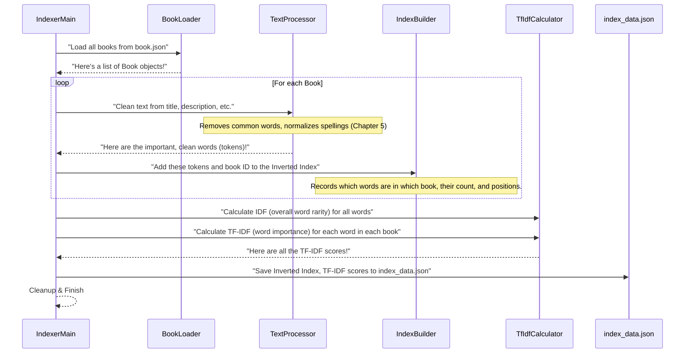

# Chapter 6: Offline Search Indexing

Welcome back, digital librarian! In our last chapter, [Text Preprocessing](05_text_preprocessing_.md), we became master digital editors. We learned how DevShelf cleans and standardizes all the text from our books and your search queries, turning messy words like "running" or "JAVA" into neat, consistent "run" and "java." This cleaning is a super important step for accurate search!

But simply having clean words isn't enough. Imagine you've perfectly organized all the words on thousands of index cards. If you still have to read *every single one* of those cards every time someone asks for a book, it would be incredibly slow! We need a super-fast way to look up which books contain certain words.

This is exactly what **Offline Search Indexing** does for DevShelf. It's like the "librarian's secret catalog" that makes searching lightning-fast. It's an important step that happens *before* DevShelf is ready to answer your search queries.

### What Problem Does the "Secret Catalog" Solve?

Imagine DevShelf has hundreds or even thousands of books. If you search for "Python machine learning," DevShelf can't just scan every single book's title, author, and description in real-time. That would be too slow and would make your search results appear with a frustrating delay.

The problem Offline Search Indexing solves is this: **How can DevShelf provide instant search results for thousands of books without having to read them all every time you type a query?**

Our central use case: **When you start DevShelf, it should be ready to give you instant, relevant search results for any query, big or small.**

To achieve this, DevShelf does a lot of heavy lifting *once*, in advance. It builds special "lookup tables" that are super quick to check, like a meticulously organized index for the entire library.

### Key Concepts of Offline Search Indexing

Offline Search Indexing involves a special process that creates these fast lookup tables:

1.  **It's an Offline Process:** This means it's a separate program you run once, or whenever new books are added. It doesn't run every time DevShelf starts. Think of it as updating the library's main card catalog overnight, so it's ready for customers in the morning.

2.  **Building the Inverted Index:** This is like the index at the back of a textbook, but for our entire library!
    *   You look up a **word** (like "python").
    *   It quickly tells you **all the books** that contain that word, and even where it appears.
    *   It "inverts" the usual way of thinking (book -> words) to (word -> books).

3.  **Calculating TF-IDF Scores:** This helps DevShelf understand *how important* a word is to a specific book, compared to its importance across *all* books.
    *   **TF (Term Frequency):** How many times a word appears in *one book*. More occurrences mean more importance *to that book*.
    *   **IDF (Inverse Document Frequency):** How *rare* a word is across *all books*. A rare word (like "quantum entanglement") is more significant than a common word (like "programming").
    *   **TF-IDF = TF \* IDF:** This combined score tells us the overall "importance" of a word in a specific book, helping DevShelf rank results more intelligently.

These pre-computed data (the inverted index and all the TF-IDF scores) are then saved into a special file.

### How to Build the Search Index

You use a special program called `IndexerMain` (short for "Indexer Main Program") to do all this work. You usually run it directly from your computer's terminal, not through DevShelf's normal interface. It's like a dedicated librarian assistant who spends hours organizing the catalog.

**`src/main/java/core/IndexerMain.java` (Simplified)**
```java
package core;

import domain.Book;
import domain.SearchIndexData;
import features.search.IndexBuilder;
import storage.BookLoader;
import utils.TextProcessor;
import utils.TfIdfCalculator;
import com.fasterxml.jackson.databind.ObjectMapper; // Tool to save to JSON
import java.io.File;
import java.util.List;
import java.util.Set;

public class IndexerMain {
    // This is where our super-fast index will be saved
    private static final String INDEX_OUTPUT_PATH = "src/main/resources/data/index_data.json";

    public static void main(String[] args) {
        System.out.println("--- Starting Offline Indexer ---");
        try {
            // 1. Prepare our tools
            Set<String> stopWords = StopWordLoader.loadStopWords("/data/stopword.txt");
            TextProcessor textProcessor = new TextProcessor(stopWords);
            BookLoader bookLoader = new BookLoader("/data/book.json");
            IndexBuilder indexer = new IndexBuilder(textProcessor);
            TfIdfCalculator tfIdfCalculator = new TfIdfCalculator();

            // 2. Load all the books (from Chapter 2)
            List<Book> allBooks = bookLoader.loadBooks();
            System.out.println("Loading and indexing " + allBooks.size() + " books...");

            // 3. Build the Inverted Index for each book
            for(Book book : allBooks) {
                indexer.indexDocument(book); // This analyzes each book's text
            }
            System.out.println("Indexing Complete. Found " + indexer.getInvertedIndex().size() + " unique terms.");

            // 4. Calculate TF-IDF scores based on the inverted index
            tfIdfCalculator.calculateIdf(indexer.getInvertedIndex(), allBooks.size());
            tfIdfCalculator.calculateTfIdf(indexer.getInvertedIndex());
            System.out.println("TF-IDF calculation complete.");

            // 5. Gather all the index data into one object
            SearchIndexData indexData = new SearchIndexData(
                indexer.getInvertedIndex(),
                tfIdfCalculator.getTfIdfVectors(),
                tfIdfCalculator.getIdfScores()
            );

            // 6. Save this data to a file (index_data.json)
            ObjectMapper mapper = new ObjectMapper(); // Our JSON saving tool
            mapper.writeValue(new File(INDEX_OUTPUT_PATH), indexData); // Write the data
            System.out.println("--- ✅ Indexer Finished Successfully! --- ");
        } catch (Exception e) {
            System.err.println(" --- ❌ Indexer failed with an error. --- ");
            e.printStackTrace();
        }
    }
}
```
When you run `IndexerMain`, it does the following:
1.  **Gets Ready**: It loads the [Text Preprocessing](05_text_preprocessing_.md) tools and the [Book (Domain Model)](02_book__domain_model__.md) loader.
2.  **Loads Books**: It reads all the books from `book.json`.
3.  **Indexes Books**: For each book, it uses the `IndexBuilder` to create entries in the inverted index.
4.  **Calculates Scores**: It then uses the `TfIdfCalculator` to figure out the importance of each word in each book.
5.  **Saves Everything**: All this organized data is bundled into a `SearchIndexData` object and saved as a file named `index_data.json`.

After `IndexerMain` finishes, the `index_data.json` file is created. This file holds all the "secret catalog" information, ready for DevShelf to use when it starts.

#### What the `index_data.json` File Looks Like (Snippet)

Here's a peek at what's inside `index_data.json`. It's a structured way to store our pre-computed search data:

**`src/main/resources/data/index_data.json` (Snippet)**
```json
{
  "invertedIndex" : {
    "python" : [
      { "docId" : 13, "freq" : 1, "positions" : [ 18 ] },
      { "docId" : 26, "freq" : 4, "positions" : [ 0, 11, 16, 17 ] }
    ],
    "algorithm" : [
      { "docId" 1, "freq" : 5, "positions" : [ 2, 15, 25, 26, 29 ] },
      { "docId" : 13, "freq" : 4, "positions" : [ 1, 13, 17, 21 ] }
    ]
  },
  "tfIdfVectors" : {
    "1" : { "rivest" : 2.31, "stein" : 2.31, "code" : 1.01 },
    "2" : { "profession" : 1.83, "engin" : 0.95, "practic" : 0.45 }
  },
  "idfScores" : {
    "python" : 0.769, "algorithm" : 0.952, "java" : 0.952
  }
}
```
*   `invertedIndex`: Maps a word (like "python") to a list of "postings." A "posting" tells us a `docId` (book ID), how many times the word appears (`freq`), and its `positions` in that book.
*   `tfIdfVectors`: For each book's `docId` (like "1"), it lists the important `term`s (words) in that book and their "importance score" (`tfIdf`).
*   `idfScores`: For each `term` (word), it lists its `idf` (overall rarity/importance score) across *all* books.

### Under the Hood: Building the Search Index Step-by-Step

Let's visualize the entire process of how the `IndexerMain` builds this powerful index:



#### 1. Storing the Index Data: `SearchIndexData`

This class is a simple container to hold all the different parts of our pre-computed index together. It's the blueprint for how our `index_data.json` file is structured.

**`src/main/java/domain/SearchIndexData.java` (Simplified)**
```java
package domain;

import lombok.Getter; // Automatically creates 'get' methods
import java.util.List;
import java.util.Map;

public class SearchIndexData {
    @Getter
    private Map<String, List<Posting>> invertedIndex; // Maps word -> list of its locations
    @Getter
    private Map<Integer, Map<String, Double>> tfIdfVectors; // Maps book ID -> (word -> TF-IDF score)
    @Getter
    private Map<String, Double> idfScores; // Maps word -> its overall rarity score

    public SearchIndexData() {} // Constructor for JSON loading

    public SearchIndexData(Map<String, List<Posting>> invertedIndex,
                           Map<Integer, Map<String, Double>> tfIdfVectors,
                           Map<String, Double> idfScores) {
        this.invertedIndex = invertedIndex;
        this.tfIdfVectors = tfIdfVectors;
        this.idfScores = idfScores;
    }
}
```
This class makes it easy to save and load the entire complex index data as one unit using JSON.

#### 2. Loading the Index for the Application: `IndexLoader`

Once `IndexerMain` has created `index_data.json`, the main DevShelf application (as seen in [Application Orchestration](03_application_orchestration_.md)) needs to load this file when it starts up. This is the job of the `IndexLoader`.

**`src/main/java/storage/IndexLoader.java` (Simplified `loadIndex` method)**
```java
package storage;

import com.fasterxml.jackson.databind.ObjectMapper;
import domain.SearchIndexData;
import java.io.File;
import java.io.IOException;
import java.io.InputStream;

public class IndexLoader {
    private final String resourcePath;

    public IndexLoader(String resourcePath) {
        this.resourcePath = resourcePath;
    }

    public SearchIndexData loadIndex() {
        ObjectMapper mapper = new ObjectMapper(); // Our JSON reading tool
        System.out.println("📦 Loading pre-compiled index...");
        try (InputStream inputStream = getClass().getResourceAsStream(resourcePath)) {
            if (inputStream == null) {
                // If the default index is not found, something is wrong.
                throw new RuntimeException("Resource not found: " + resourcePath);
            }
            // This magical line reads the JSON file and converts it into a SearchIndexData object!
            SearchIndexData indexData = mapper.readValue(inputStream, SearchIndexData.class);
            System.out.println("Index loaded successfully.");
            return indexData;
        } catch (IOException e) {
            System.err.println("FATAL ERROR: Could not load index file. " + e.getMessage());
            throw new RuntimeException("Failed to load search index", e); // Crash if no index
        }
    }
}
```
The `IndexLoader` quickly reads the `index_data.json` file. If the file is missing or corrupted, DevShelf cannot function, so it will stop the application with an error. But if successful, it provides the entire `SearchIndexData` object to the core application logic, making it ready for instant searches.

#### 3. Building the Inverted Index: `IndexBuilder`

This is where the actual "indexing" of individual books happens. The `IndexBuilder` takes a [Book (Domain Model)](02_book__domain_model__.md) object, extracts and cleans its text, and then adds its words to the `invertedIndex`.

**`src/main/java/features/search/IndexBuilder.java` (Simplified `indexDocument` method)**
```java
package features.search;

import domain.Book;
import domain.Posting;
import utils.TextProcessor; // Our text cleaning tool from Chapter 5
import java.util.ArrayList;
import java.util.HashMap;
import java.util.List;
import java.util.Map;

public class IndexBuilder {
    @Getter
    private final Map<String, List<Posting>> invertedIndex; // The main index: word -> list of book locations
    private final TextProcessor textProcessor;

    public IndexBuilder(TextProcessor textProcessor) {
        this.textProcessor = textProcessor;
        this.invertedIndex = new HashMap<>();
    }

    public void indexDocument(Book book) {
        // 1. Combine all relevant text about the book
        String bookData = book.getTitle() + " " + book.getAuthor() + " " + book.getDescription() +
                          " " + book.getCategory() + " " + book.getProgLang() +
                          " " + String.join(" ", book.getTag());

        // 2. Clean and normalize the text (uses TextProcessor from Chapter 5)
        List<String> stemmedTokens = textProcessor.process(bookData);

        // 3. Record each term's positions and frequency within THIS book
        Map<String, List<Integer>> termPositionsInThisBook = new HashMap<>();
        for (int pos = 0; pos < stemmedTokens.size(); pos++) {
            String term = stemmedTokens.get(pos);
            termPositionsInThisBook.computeIfAbsent(term, k -> new ArrayList<>()).add(pos);
        }

        // 4. Add this book's data to the overall inverted index
        for (Map.Entry<String, List<Integer>> entry : termPositionsInThisBook.entrySet()) {
            String term = entry.getKey();
            List<Integer> positions = entry.getValue();
            // A Posting records a book ID, how many times the term appeared (frequency), and its positions
            Posting posting = new Posting(book.getBookId(), positions.size(), positions);
            // Add this posting to the list for this term in the inverted index
            invertedIndex.computeIfAbsent(term, k -> new ArrayList<>()).add(posting);
        }
    }
}
```
The `indexDocument` method is run for each book:
1.  It collects all descriptive text for the book.
2.  It uses the `textProcessor` (our "digital editor" from [Text Preprocessing](05_text_preprocessing_.md)) to clean and standardize the words.
3.  It then counts how often each word appears in *this specific book* and notes its positions.
4.  Finally, it creates a `Posting` object with this information (`bookId`, word count, positions) and adds it to the `invertedIndex` for that specific word.

#### 4. Calculating Word Importance: `TfIdfCalculator`

After the `invertedIndex` is built for all books, the `TfIdfCalculator` then goes through all the words and books to figure out their TF-IDF scores.

**`src/main/java/utils/TfIdfCalculator.java` (Simplified `calculateIdf` and `calculateTfIdf` methods)**
```java
package utils;

import domain.Posting;
import lombok.Getter;
import java.util.HashMap;
import java.util.List;
import java.util.Map;

public class TfIdfCalculator {
    @Getter
    private Map<Integer, Map<String, Double>> tfIdfVectors = new HashMap<>(); // Book ID -> (Word -> TF-IDF Score)
    @Getter
    private Map<String, Double> idfScores = new HashMap<>(); // Word -> Overall Rarity Score

    public void calculateIdf(Map<String, List<Posting>> invertedIndex, int totalDocCount) {
        System.out.println("Calculating IDF scores for " + invertedIndex.size() + " terms...");
        for(String term : invertedIndex.keySet()) {
            // How many documents (books) contain this term
            int docFrequency = invertedIndex.get(term).size();
            // IDF: The rarer the term (lower docFrequency), the higher its IDF score
            double idf = Math.log10( (double) totalDocCount / docFrequency );
            idfScores.put(term, idf); // Store overall rarity score for each term
        }
    }

    public void calculateTfIdf(Map<String, List<Posting>> invertedIndex) {
        System.out.println("Calculating TF-IDF vectors for all documents...");
        for(String term : invertedIndex.keySet()) {
            double idf = idfScores.get(term); // Get the term's overall rarity score
            List<Posting> postings = invertedIndex.get(term);
            for(Posting posting : postings ) {
                int docId = posting.getDocId();
                int termFreq = posting.getFreq(); // How many times this term appears in THIS book
                // TF: More frequent in this book means higher TF
                double tf = 1 + Math.log10(termFreq);
                double tfIdf = tf * idf; // Combine TF (local importance) and IDF (global rarity)

                // Store this word's TF-IDF score for this specific book
                tfIdfVectors.computeIfAbsent(docId, k -> new HashMap<>()).put(term, tfIdf);
            }
        }
        System.out.println("TF-IDF calculation complete.");
    }
}
```
*   `calculateIdf`: This method first calculates the **Inverse Document Frequency (IDF)** for *every unique word* across all books. Words that are very common (like "programming") will have a low IDF, while unique words will have a high IDF.
*   `calculateTfIdf`: Then, for each word in each book, it calculates the **Term Frequency-Inverse Document Frequency (TF-IDF)**. This score combines how often a word appears in a *specific book* (Term Frequency) with how *rare* that word is across the *entire library* (IDF). A high TF-IDF means a word is very important and unique to a document.

### Why Offline Search Indexing is So Important

This pre-computation step might seem like a lot of work, but it's absolutely vital for DevShelf's performance and user experience:

| Feature                   | WITHOUT Offline Search Indexing                             | WITH Offline Search Indexing                                          |
| :------------------------ | :---------------------------------------------------------- | :-------------------------------------------------------------------- |
| **Search Speed**          | Very slow, as each query requires re-scanning all books and recalculating scores. | **Instant!** DevShelf just looks up words and scores in pre-built tables. |
| **Efficiency**            | Wastes computer resources by repeating calculations for every search. | Calculations done once, data loaded quickly, saving resources during live use. |
| **Relevance**             | Harder to accurately rank results without pre-computed word importance scores. | Accurate ranking based on scientifically calculated TF-IDF scores.    |
| **Scalability**           | Slows down dramatically as more books are added.            | Stays fast even with thousands of books, as the heavy work is done beforehand. |

### Conclusion

In this chapter, we uncovered the essential process of **Offline Search Indexing**. We learned that:
*   It's an **offline process** performed by `IndexerMain` to prepare book data for lightning-fast searches.
*   It builds two crucial lookup tables: the **Inverted Index** (mapping words to books) and **TF-IDF scores** (measuring a word's importance to a book and its overall rarity).
*   The `IndexBuilder` meticulously processes each book's text (using our [Text Preprocessing](05_text_preprocessing_.md) tools) to populate the inverted index.
*   The `TfIdfCalculator` then assigns numerical importance scores to every word in every book.
*   All this prepared data is saved into a file (`index_data.json`) and efficiently loaded by the `IndexLoader` when DevShelf starts, turning our digital library into an instant search powerhouse.

This clever preparation is the foundation upon which DevShelf can provide quick and intelligent search results. Now that DevShelf knows how to find the right books, let's explore how it can make those search results even smarter and more helpful!

[Next Chapter: Intelligent Search Enhancements](07_intelligent_search_enhancements_.md)
