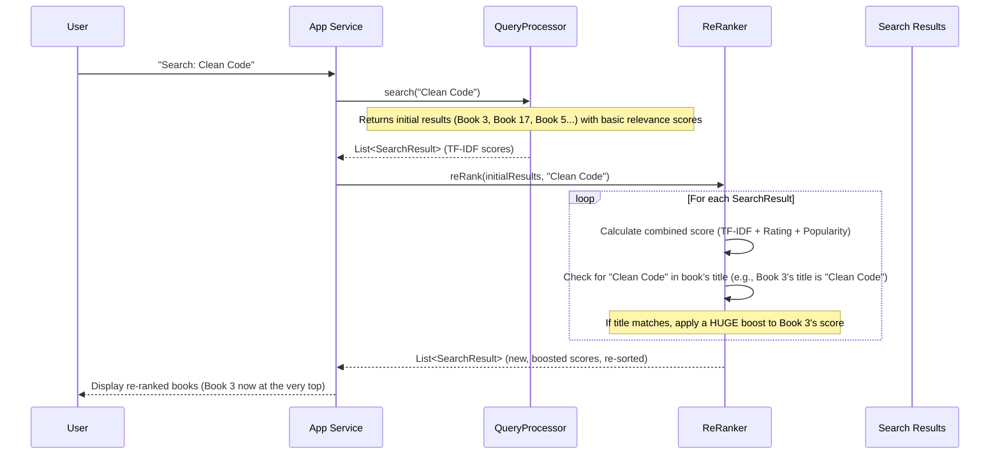
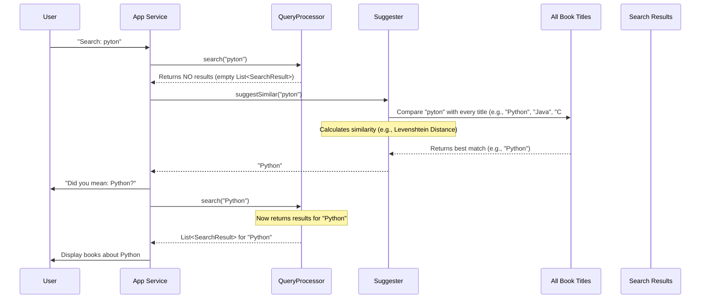
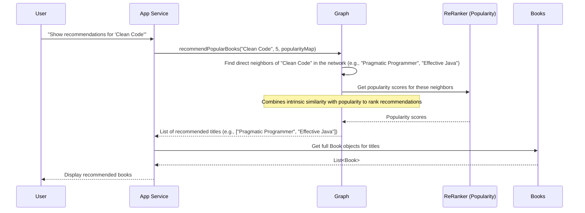

Welcome back to DevShelf! In our last chapter, [User Interaction & Analytics](06_user_interaction___analytics_.md), we learned how DevShelf quietly observes your clicks to understand which books are truly popular. We also saw how this popularity data can already start making search results smarter.

Now, imagine you walk into a library and ask for a book. A good librarian doesn't just point to the shelf. They might:
1.  **Lead you to the most popular version** if several exist.
2.  Say, "**Did you mean** 'Clean Code' instead of 'Clen Cod'?" if you misspelled.
3.  Suggest, "**If you liked** 'Effective Java', you might also enjoy 'Clean Code'!"

This is exactly what **Search Enhancement & Recommendations** is about in DevShelf. It's the "savvy librarian" intelligence that takes the raw search results and makes them more helpful, intuitive, and personalized.

### The Problem: Basic Search Isn't Enough

The [Core Search Engine](05_core_search_engine_.md) is excellent at finding books based on keywords, but it only gives us a basic list. What if:
*   You type a query like "pyton" (misspelled)? The basic search might find nothing.
*   You search for "Java," and there are 20 Java books. Which ones should appear at the very top? Just the ones with the most keyword matches, or also the ones people actually *click on* and highly rate?
*   You've found a great book, say "The Pragmatic Programmer." How can DevShelf tell you about *other similar great books* you might not have known to search for?

Our "Search Enhancement & Recommendations" abstraction solves these problems by adding layers of intelligence on top of the basic search.

**Our central use case:** You type "python maching learning" (misspelled "machine learning") into DevShelf. We want DevShelf to:
1.  **Suggest** "Python Machine Learning" if your original query yields poor results.
2.  **Re-rank** the suggested results to show the most popular and highly-rated "Python Machine Learning" books first, especially if their titles match perfectly.
3.  If you click on one of these books, **recommend** other related and popular machine learning books.

### Key Enhancements from Our Savvy Librarian

DevShelf's savvy librarian has three main tools to enhance your search experience:

1.  **Re-Ranker**: Makes initial search results smarter by blending multiple factors.
2.  **Suggester**: Offers "Did you mean?" suggestions for misspelled queries.
3.  **Graph**: Recommends related books based on similarities and popularity.

Let's look at each one.

### 1. Making Search Results Smarter: The `ReRanker`

Even after the [Core Search Engine](05_core_search_engine_.md) gives us initial results, the order might not be perfect. The `ReRanker` component is like a special filter that re-sorts the books based on a combination of factors, not just how many times your keywords appear.

It considers:
*   **Initial Relevance Score (TF-IDF)**: How well keywords match (from [Core Search Engine](05_core_search_engine_.md)).
*   **Book's Rating**: How good users rated the book (from [Book (Domain Model)](02_book__domain_model__.md)).
*   **Popularity**: How many times users have clicked this book (from [User Interaction & Analytics](06_user_interaction___analytics_.md)).
*   **Exact Title Match**: A special boost if the book's title exactly matches or closely relates to your search query.

#### How `ReRanker` Works (High-Level)

When you search, the `QueryProcessor` (our basic search engine) finds an initial list of books. The `ReRanker` then takes this list and for each book, calculates a new "final score" by combining all the factors above. Books with higher final scores move to the top!

#### Example: Boosting "Clean Code" for a "clean code" query

If you search for "clean code", a book titled "Clean Code" should definitely appear at the top. Even if another book has many mentions of "clean" and "code" in its description, an exact title match usually means it's what you're looking for. The `ReRanker` gives a big boost to exact title matches.

#### Under the Hood: The `ReRanker` in Action

The `ReRanker` is used by the `BookSearchEngine` (for CLI) or `DevShelfService` (for GUI) right after the `QueryProcessor` returns its initial results.



#### The `ReRanker` Class: Calculating the Master Score

The `ReRanker` takes the initial search results and adjusts their scores. Notice the `W_...` values, which are "weights" that determine how much each factor contributes, and the `EXACT_TITLE_BOOST`, `STARTS_WITH_BOOST`, `CONTAINS_BOOST` values for title matches.

**`src/main/java/features/search/ReRanker.java` (Simplified `reRank` method)**
```java
// Inside ReRanker class
public List<SearchResult> reRank(List<SearchResult> tfIdfResults, String query) {
    List<SearchResult> reRankedResults = new ArrayList<>();
    String cleanQuery = query.trim().toLowerCase(); // For title matching

    for (SearchResult oldResult : tfIdfResults) {
        Book book = bookMap.get(oldResult.getDocId()); // Get book details
        if (book == null) continue;

        double tfIdfScore = oldResult.getScore();
        double normalizedRating = book.getRating() / 5.0; // Scale rating 0-1
        double popularityScore = popularityMap.getOrDefault(book.getBookId(), 0.0);

        // 1. Calculate the base score
        double finalScore = (W_TFIDF * tfIdfScore) +
                            (W_RATING * normalizedRating) +
                            (W_POPULARITY * popularityScore);

        // 2. Apply tiered title boosts
        if (book.getTitle() != null) {
            String title = book.getTitle().toLowerCase();
            if (title.equals(cleanQuery)) { finalScore += EXACT_TITLE_BOOST; }
            else if (title.startsWith(cleanQuery)) { finalScore += STARTS_WITH_BOOST; }
            else if (title.contains(cleanQuery)) { finalScore += CONTAINS_BOOST; }
        }
        reRankedResults.add(new SearchResult(book.getBookId(), finalScore));
    }
    Collections.sort(reRankedResults); // Sort by this new finalScore
    return reRankedResults;
}
```
This code shows how the `ReRanker` cleverly combines different aspects of a book (relevance, rating, popularity) and then adds a significant boost if the book's title is a strong match to your query. The final list is then sorted by these new `finalScore`s.

### 2. "Did You Mean?" Suggestions: The `Suggester`

Ever type something quickly and make a typo, only for a search engine to helpfully suggest the correct spelling? That's what our `Suggester` does! It's like the librarian gently correcting your pronunciation or spelling.

#### How `Suggester` Works (High-Level)

If the [Core Search Engine](05_core_search_engine_.md) returns very few or no results for your original query, DevShelf will ask the `Suggester` to step in. The `Suggester` compares your misspelled query to all known book titles, looking for titles that are "very similar" even with a few errors. It uses a clever algorithm called **Levenshtein Distance** to measure how many changes (insertions, deletions, substitutions) are needed to turn one word into another. A smaller distance means higher similarity.

#### Example: Searching "pyton"

If you type "pyton" (intending "Python"), the normal search might not find much.
The `Suggester` will compare "pyton" to "Python", "C++", "Java", etc. It will find that "pyton" is very close to "Python" (only one letter change needed!). It will then suggest "Python" as a possible correction.

#### Under the Hood: `Suggester` in Action

The `Suggester` is called from `DevShelfService` (GUI) or `BookSearchEngine` (CLI) when the initial search yields empty results.



#### The `Suggester` Class: Finding Close Matches

The `Suggester` compares your search query to all book titles using a combined similarity score, where a higher score means a better match.

**`src/main/java/features/search/Suggester.java` (Simplified `suggestSimilar` method)**
```java
// Inside Suggester class
public String suggestSimilar(String query) {
    if (query == null || query.trim().isEmpty()) return null;

    String cleanedQuery = preprocess(query); // Clean up query first
    if (cleanedQuery.isEmpty()) return null;

    double bestScore = 0.0;
    String bestMatch = null;

    for (String title : allTitles) { // Loop through ALL book titles
        if (title == null || title.trim().isEmpty()) continue;

        String cleanedTitle = preprocess(title);
        if (cleanedTitle.isEmpty()) continue;

        // Calculate similarity using global (Levenshtein) and word-level methods
        double globalSim = calculateSimilarity(cleanedQuery, cleanedTitle);
        double wordSim = wordLevelSimilarity(cleanedQuery, cleanedTitle);
        double finalScore = 0.65 * wordSim + 0.35 * globalSim; // Combine scores

        if (finalScore > bestScore) {
            bestScore = finalScore;
            bestMatch = title;
        }
    }
    // Only suggest if the match is good enough (score >= 0.6)
    return (bestMatch != null && bestScore >= 0.6) ? bestMatch : null;
}
```
The `preprocess` method cleans up the text, `calculateSimilarity` uses the Levenshtein distance, and `wordLevelSimilarity` compares words within the query and title. These are combined to find the best suggestion.

### 3. Recommending Related Books: The `Graph`

Once you've found a book you like, DevShelf can suggest other books that are related. This is like the librarian saying, "Oh, you liked this? Then you might be interested in these other books too!"

#### How `Graph` Works (High-Level)

The `Graph` component builds a "network" of books. Imagine each book as a "node" (a circle) in this network, and lines (called "edges") connect books that are similar. The strength of the connection (the similarity score) depends on shared authors, programming languages, categories, and tags.

When you ask for recommendations for a specific book, the `Graph` looks at its immediate neighbors in this network. It then uses the popularity data (from [User Interaction & Analytics](06_user_interaction___analytics_.md)) to recommend the *most popular* of those related books first.

#### Example: Recommendations for "Clean Code"

If you're viewing "Clean Code", the `Graph` might see that:
*   "The Pragmatic Programmer" shares common "Software Engineering" tags.
*   "Effective Java" is by a well-known author in the same general domain and is often clicked by people interested in "Clean Code."

The `Graph` would then recommend these, prioritizing "The Pragmatic Programmer" if it's currently more popular than "Effective Java."

#### Under the Hood: `Graph` Building and Recommendations

The `Graph` is built once when the application starts, using all the available [Book (Domain Model)](02_book__domain_model__.md) objects.

**`src/main/java/features/recommendation/Graph.java` (Simplified `calculateSimilarityScore` method)**
```java
// Inside Graph class
public double calculateSimilarityScore(Book b1, Book b2) {
    if (b1 == null || b2 == null) return 0.0;
    double score = 0.0;
    // Add points for matching attributes
    if (equalsIgnoreCase(b1.getAuthor(), b2.getAuthor())) score += 1.0; // Strong match
    if (equalsIgnoreCase(b1.getProgLang(), b2.getProgLang())) score += 0.9; // High match
    
    // Check for overlapping tags (e.g., "clean-code", "refactoring")
    Set<String> tags1 = normalizeTags(b1.getTag());
    Set<String> tags2 = normalizeTags(b2.getTag());
    Set<String> intersection = new HashSet<>(tags1);
    intersection.retainAll(tags2); // Tags that are in BOTH sets
    Set<String> union = new HashSet<>(tags1);
    union.addAll(tags2); // All unique tags from EITHER set
    if (!union.isEmpty()) score += (intersection.size() / (double) union.size()) * 0.5;

    if (equalsIgnoreCase(b1.getCategory(), b2.getCategory()) && score < 0.9) {
        score += 0.2; // Weak match
    }
    return score >= 0.3 ? score : 0.0; // Only consider if score is above a threshold
}
```
This method is called for many pairs of books to build the graph. It compares their attributes and assigns a similarity score. For instance, if two books share the same author, they get a strong similarity boost.

Then, when you ask for recommendations:



The `recommendPopularBooks` method takes the chosen book's title, finds its most similar neighbors in the graph, and then uses the `popularityMap` (from the `ReRanker`) to sort these recommendations, ensuring trending and highly-clicked books are prioritized.

**`src/main/java/features/recommendation/Graph.java` (Simplified `recommendPopularBooks` method)**
```java
// Inside Graph class
public List<String> recommendPopularBooks(String bookTitle, int limit, Map<Integer, Double> popularityMap) {
    String key = normalize(bookTitle); // Clean input title
    Map<String, Double> relatedBooks = adjList.getOrDefault(key, Collections.emptyMap());
    List<String> result = new ArrayList<>(relatedBooks.keySet());

    final double ALPHA = 0.7; // How much emphasis on relevance vs. popularity (70% relevance, 30% popularity)

    // Sort related books by a combined score of similarity AND popularity
    result.sort((a, b) -> {
        double relA = relatedBooks.getOrDefault(a, 0.0); // Similarity to original book
        double relB = relatedBooks.getOrDefault(b, 0.0);

        // Get popularity score from the map
        double popA = popularityMap.getOrDefault(titleToId.getOrDefault(a, -1), 0.0);
        double popB = popularityMap.getOrDefault(titleToId.getOrDefault(b, -1), 0.0);

        // Combine relevance and popularity for final recommendation score
        double scoreA = ALPHA * relA + (1 - ALPHA) * popA;
        double scoreB = ALPHA * relB + (1 - ALPHA) * popB;

        return Double.compare(scoreB, scoreA); // Sort highest score first
    });
    return result.subList(0, Math.min(limit, result.size())); // Return top N
}
```
This method takes a book title and the `popularityMap`. It finds books related to the input title (`relatedBooks`) and then sorts them by a `finalScore` which is a blend of their intrinsic similarity (`relA`, `relB`) and their current popularity (`popA`, `popB`).

### The Savvy Librarian in Action: Putting It All Together

Let's revisit our central use case: searching for "python maching learning".

| Step                               | Component Involved | What Happens                                                                     | User Experience                                       |
| :--------------------------------- | :----------------- | :------------------------------------------------------------------------------- | :---------------------------------------------------- |
| **1. Initial Search**              | `QueryProcessor`   | Tries to find books for "python maching learning", finds few/none.               | "No results found for 'python maching learning'."     |
| **2. Suggestion**                  | `Suggester`        | Compares "maching learning" to titles, finds it's very close to "machine learning". | "Did you mean: Python Machine Learning?"              |
| **3. Re-Search with Suggestion**   | `QueryProcessor`   | Runs search for "Python Machine Learning". Finds many books.                     | (System automatically searches for the suggestion)    |
| **4. Enhance Search Results**      | `ReRanker`         | Takes results for "Python Machine Learning", boosts exact title matches ("Python Machine Learning"), and pushes up popular/highly-rated books. | Top results are the best, most relevant, and popular "Python Machine Learning" books. |
| **5. Get Recommendations**         | `Graph`            | If you click on a "Python Machine Learning" book, it finds related books (e.g., "Deep Learning", "Data Science Handbook") and prioritizes those that are currently popular. | "If you liked this, you might also like: Deep Learning, Data Science Handbook..." |

### Conclusion

In this chapter, we explored "Search Enhancement & Recommendations," the intelligent layer that refines DevShelf's core search. We learned how:
*   The `ReRanker` takes raw search results and makes them smarter by combining initial relevance, book ratings, user popularity, and powerful title boosting.
*   The `Suggester` acts as our helpful librarian, correcting misspelled queries with "Did you mean?" suggestions using advanced similarity algorithms.
*   The `Graph` builds a network of related books based on shared attributes and, combined with popularity data, provides personalized and trending recommendations.

Together, these components transform DevShelf from a basic search tool into a truly savvy digital librarian, making your search experience much more intuitive, helpful, and enjoyable!

Next, we'll dive into the foundational tools that underpin many of these intelligent features: the "Text Normalization Utilities" that ensure all our text is clean and consistent.

[Next Chapter: Text Normalization Utilities](08_text_normalization_utilities_.md)