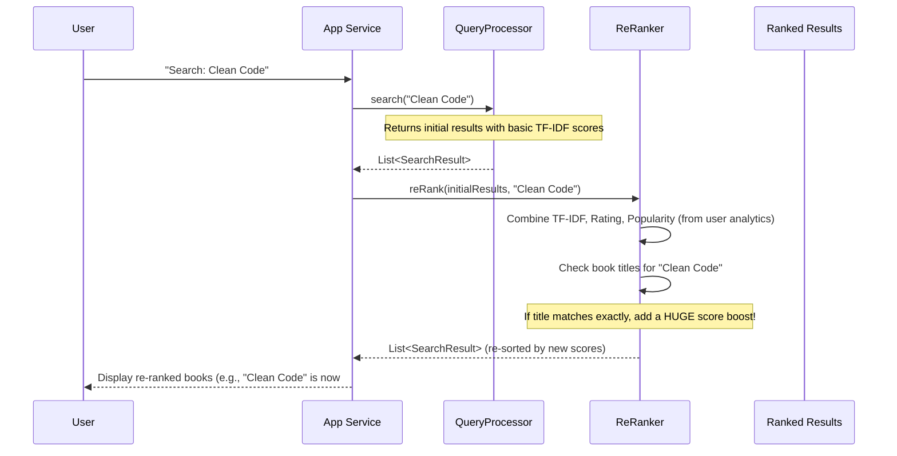
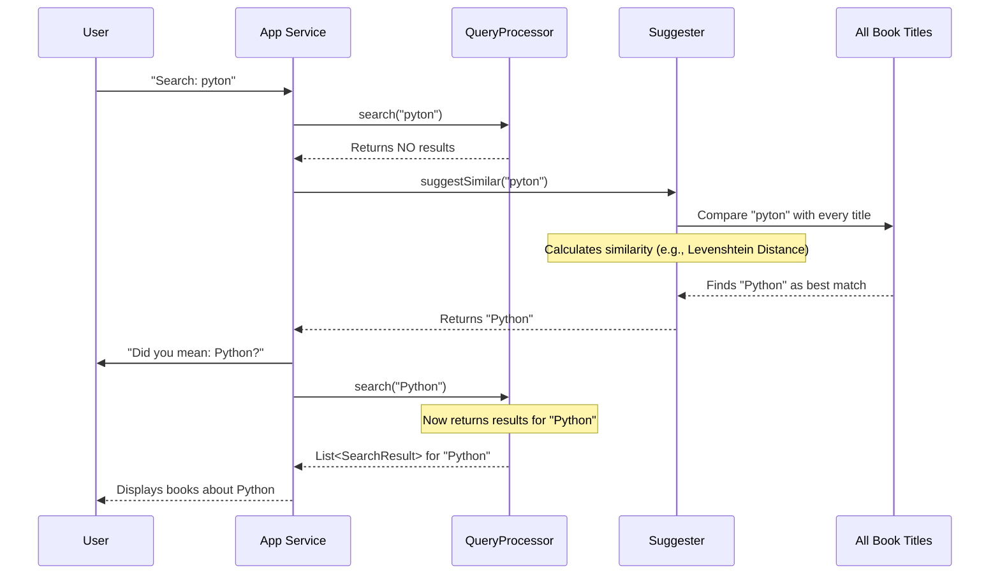
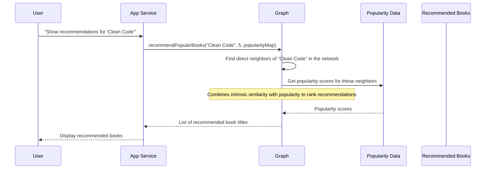

# Chapter 7: Intelligent Search Enhancements

Welcome back, digital librarian! In our last chapter, [Offline Search Indexing](06_offline_search_indexing_.md), we learned how DevShelf builds its super-fast "secret catalog" (the inverted index and TF-IDF scores). This preparation makes the [Core Search Engine](04_core_search_engine_.md) incredibly quick at finding relevant books based on keywords.

But imagine you're talking to a really good human librarian. They don't just find books based on keywords; they understand what you *really* mean, suggest alternatives if you made a typo, and even recommend other great books you might like. This is where **Intelligent Search Enhancements** comes in.

This chapter is about adding that "savvy librarian" intelligence to DevShelf. It takes the basic search results and makes them more intuitive, personalized, and helpful, transforming your search experience from merely functional to truly smart.

### The Problem: Basic Search Needs a Brain Boost

The [Core Search Engine](04_core_search_engine_.md) is fantastic at matching keywords, but it has some limitations:
*   **Misspellings:** What if you type "pyton" instead of "Python"? The basic search might find nothing.
*   **Simple Ranking:** If many books match, how do we decide which one is truly "best"? Is it just the number of keyword matches, or should we also consider how popular a book is, or its star rating?
*   **Discovery:** Once you find a book you love, how can DevShelf help you discover *other similar books* that you didn't even know to search for?

Our "Intelligent Search Enhancements" layer solves these problems by adding smart logic on top of the core search.

**Our central use case:** You type "python maching learning" (notice the typo "maching" instead of "machine") into DevShelf. We want DevShelf to:
1.  **Suggest** the correct spelling: "Did you mean: Python Machine Learning?"
2.  **Re-rank** the results for "Python Machine Learning" to show the most popular and highly-rated books first, giving a special boost to books whose titles exactly match the query.
3.  If you click on one of these books, **recommend** other related and currently trending machine learning books.

Let's explore the key components that give DevShelf this intelligence!

### Key Enhancements from Our Savvy Librarian

DevShelf's savvy librarian uses three main tools to make your search experience smarter:

1.  **Re-Ranker**: Improves initial search results by blending multiple factors like ratings and popularity.
2.  **Suggester**: Offers "Did you mean?" suggestions for misspelled queries.
3.  **Graph** (for Recommendations): Recommends related books based on similarities and current trends.

Let's look at each one.

### 1. Making Search Results Smarter: The `ReRanker`

Even after the [Core Search Engine](04_core_search_engine_.md) gives us initial results based on keywords, the order might not be the most helpful. The `ReRanker` is like a special filter that re-sorts the books based on a combination of factors, not just how many times your keywords appear.

It considers:
*   **Initial Relevance Score (TF-IDF)**: How well keywords match (from the [Core Search Engine](04_core_search_engine_.md)).
*   **Book's Rating**: How good users rated the book (from our [Book (Domain Model)](02_book__domain_model__.md)).
*   **Popularity**: How many times users have clicked this book (data collected by [User Behavior Analytics](08_user_behavior_analytics_.md)).
*   **Exact Title Match**: A special boost if the book's title exactly matches or closely relates to your search query.

#### How `ReRanker` Works (High-Level)

When you search, the `QueryProcessor` (our basic search engine) finds an initial list of books. The `ReRanker` then takes this list and for each book, calculates a new "final score" by combining all these factors. Books with higher final scores move to the top!

#### Example: Boosting "Clean Code"

If you search for "clean code", a book actually titled "Clean Code" should definitely appear at the top. Even if another book mentions "clean" and "code" many times in its description, an exact title match is usually what you're looking for. The `ReRanker` gives a big boost to exact title matches.

#### Under the Hood: The `ReRanker` in Action

The `ReRanker` is used by DevShelf's main application logic (like `DevShelfService` for the GUI or `BookSearchEngine` for the CLI) right after the `QueryProcessor` returns its initial results.



#### The `ReRanker` Class: Calculating the Master Score

The `ReRanker` class (`src/main/java/features/search/ReRanker.java`) has a method called `reRank` that does this calculation. Notice the `W_...` values, which are "weights" that determine how much each factor (TF-IDF, rating, popularity) contributes. The `EXACT_TITLE_BOOST` and similar values add extra points for good title matches.

```java
public List<SearchResult> reRank(List<SearchResult> tfIdfResults, String query) {
    List<SearchResult> reRankedResults = new ArrayList<>();
    String cleanQuery = query.trim().toLowerCase();

    for (SearchResult oldResult : tfIdfResults) {
        Book book = bookMap.get(oldResult.getDocId()); // Get book details
        if (book == null) continue;

        double tfIdfScore = oldResult.getScore();
        double normalizedRating = book.getRating() / 5.0; // Scale rating 0-1
        double popularityScore = popularityMap.getOrDefault(book.getBookId(), 0.0);

        // Calculate the base score
        double finalScore = (W_TFIDF * tfIdfScore) +
                            (W_RATING * normalizedRating) +
                            (W_POPULARITY * popularityScore);

        // Apply tiered title boosts
        if (book.getTitle() != null) {
            String title = book.getTitle().toLowerCase();
            if (title.equals(cleanQuery)) { finalScore += EXACT_TITLE_BOOST; }
            else if (title.startsWith(cleanQuery)) { finalScore += STARTS_WITH_BOOST; }
            else if (title.contains(cleanQuery)) { finalScore += CONTAINS_BOOST; }
        }
        reRankedResults.add(new SearchResult(book.getBookId(), finalScore));
    }
    Collections.sort(reRankedResults); // Sort by this new finalScore
    return reRankedResults;
}
```
This code combines different aspects of a book (keyword relevance, star rating, how often users click it – from [User Behavior Analytics](08_user_behavior_analytics_.md)) and then adds a significant boost if the book's title is a strong match to your query. The results are then sorted by these new `finalScore`s.

### 2. "Did You Mean?" Suggestions: The `Suggester`

Have you ever quickly typed something and made a typo, only for a search engine to helpfully suggest the correct spelling? That's what DevShelf's `Suggester` does! It's like the librarian gently correcting your spelling.

#### How `Suggester` Works (High-Level)

If the [Core Search Engine](04_core_search_engine_.md) returns very few or no results for your original query, DevShelf will ask the `Suggester` to step in. The `Suggester` compares your misspelled query to all known book titles, looking for titles that are "very similar" even with a few errors. It uses a clever algorithm called **Levenshtein Distance** to measure how many changes (like adding, deleting, or changing a letter) are needed to turn one word into another. A smaller distance means higher similarity.

#### Example: Searching "pyton"

If you type "pyton" (intending "Python"), the normal search might not find much. The `Suggester` will compare "pyton" to "Python", "C++", "Java", etc. It will find that "pyton" is very close to "Python" (only one letter change needed!). It will then suggest "Python" as a possible correction.

#### Under the Hood: `Suggester` in Action

The `Suggester` is called by `DevShelfService` (GUI) or `BookSearchEngine` (CLI) when the initial search yields empty results.



#### The `Suggester` Class: Finding Close Matches

The `Suggester` class (`src/main/java/features/search/Suggester.java`) contains the `suggestSimilar` method. It iterates through all stored book titles, preprocesses them (cleans them up), and then calculates a combined similarity score (using global string similarity and word-level similarity) against your query.

```java
public String suggestSimilar(String query) {
    if (query == null || query.trim().isEmpty()) return null;

    String cleanedQuery = preprocess(query); // Clean up query first
    if (cleanedQuery.isEmpty()) return null;

    double bestScore = 0.0;
    String bestMatch = null;

    for (String title : allTitles) { // Loop through ALL book titles
        if (title == null || title.trim().isEmpty()) continue;

        String cleanedTitle = preprocess(title);
        if (cleanedTitle.isEmpty()) continue;

        // Calculate similarity using global (Levenshtein) and word-level methods
        double globalSim = calculateSimilarity(cleanedQuery, cleanedTitle);
        double wordSim = wordLevelSimilarity(cleanedQuery, cleanedTitle);
        double finalScore = 0.65 * wordSim + 0.35 * globalSim; // Combine scores

        if (finalScore > bestScore) {
            bestScore = finalScore;
            bestMatch = title;
        }
    }
    // Only suggest if the match is good enough (score >= 0.6)
    return (bestMatch != null && bestScore >= 0.6) ? bestMatch : null;
}
```
The `preprocess` method cleans text (similar to [Text Preprocessing](05_text_preprocessing_.md)), `calculateSimilarity` uses the Levenshtein distance, and `wordLevelSimilarity` compares words within the query and title. These are combined to find the best suggestion.

### 3. Recommending Related Books: The `Graph`

Once you've found a book you like, DevShelf can suggest other books that are related. This is like the librarian saying, "Oh, you liked this? Then you might be interested in these other books too!"

#### How `Graph` Works (High-Level)

The `Graph` component builds a "network" of books. Imagine each book as a "node" (a circle) in this network, and lines (called "edges") connect books that are similar. The strength of the connection (the similarity score) depends on shared attributes like authors, programming languages, categories, and tags (from our [Book (Domain Model)](02_book__domain_model__.md)).

When you ask for recommendations for a specific book, the `Graph` looks at its immediate neighbors in this network. It then combines this similarity with popularity data (from [User Behavior Analytics](08_user_behavior_analytics_.md)) to recommend the *most popular* of those related books first.

#### Example: Recommendations for "Clean Code"

If you're viewing "Clean Code", the `Graph` might see that:
*   "The Pragmatic Programmer" shares common "Software Engineering" tags.
*   "Effective Java" is by a well-known author in the same general domain and is often clicked by people interested in "Clean Code."

The `Graph` would then recommend these, prioritizing "The Pragmatic Programmer" if it's currently more popular than "Effective Java."

#### Under the Hood: `Graph` Building and Recommendations

The `Graph` class (`src/main/java/features/recommendation/Graph.java`) is built once when the application starts, using all the available [Book (Domain Model)](02_book__domain_model__.md) objects. It calculates a similarity score between every pair of books.

```java
// Inside Graph class
public double calculateSimilarityScore(Book b1, Book b2) {
    if (b1 == null || b2 == null) return 0.0;
    double score = 0.0;
    // Add points for matching attributes
    if (equalsIgnoreCase(b1.getAuthor(), b2.getAuthor())) score += 1.0;
    if (equalsIgnoreCase(b1.getProgLang(), b2.getProgLang())) score += 0.9;

    // Check for overlapping tags
    Set<String> tags1 = normalizeTags(b1.getTag());
    Set<String> tags2 = normalizeTags(b2.getTag());
    Set<String> intersection = new HashSet<>(tags1);
    intersection.retainAll(tags2);
    Set<String> union = new HashSet<>(tags1);
    union.addAll(tags2);
    if (!union.isEmpty()) score += (intersection.size() / (double) union.size()) * 0.5;

    if (equalsIgnoreCase(b1.getCategory(), b2.getCategory()) && score < 0.9) {
        score += 0.2;
    }
    return score >= 0.3 ? score : 0.0;
}
```
This method compares various attributes of two books and gives them a score. For example, two books by the same author get a strong boost.

When you ask for recommendations for a specific book:



The `recommendPopularBooks` method in the `Graph` class takes a book's title and the `popularityMap` (from [User Behavior Analytics](08_user_behavior_analytics_.md)). It finds books related to the input title and then sorts them by a `finalScore` which is a blend of their intrinsic similarity and their current popularity.

```java
// Inside Graph class
public List<String> recommendPopularBooks(String bookTitle, int limit, Map<Integer, Double> popularityMap) {
    String key = normalize(bookTitle); // Clean input title
    Map<String, Double> relatedBooks = adjList.getOrDefault(key, Collections.emptyMap());
    List<String> result = new ArrayList<>(relatedBooks.keySet());

    final double ALPHA = 0.7; // How much emphasis on relevance vs. popularity (70% relevance, 30% popularity)

    // Sort related books by a combined score of similarity AND popularity
    result.sort((a, b) -> {
        double relA = relatedBooks.getOrDefault(a, 0.0); // Similarity to original book
        double relB = relatedBooks.getOrDefault(b, 0.0);

        // Get popularity score from the map
        double popA = popularityMap != null
                ? popularityMap.getOrDefault(titleToId.getOrDefault(a, -1), 0.0)
                : 0.0;
        double popB = popularityMap != null
                ? popularityMap.getOrDefault(titleToId.getOrDefault(b, -1), 0.0)
                : 0.0;

        // Combine relevance and popularity for final recommendation score
        double scoreA = ALPHA * relA + (1 - ALPHA) * popA;
        double scoreB = ALPHA * relB + (1 - ALPHA) * popB;

        return Double.compare(scoreB, scoreA); // Sort highest score first
    });
    return result.subList(0, Math.min(limit, result.size())); // Return top N
}
```

### The Savvy Librarian in Action: Putting It All Together

Let's revisit our central use case: searching for "python maching learning". Here’s how DevShelf's intelligent enhancements work together:

| Step                               | Component Involved | What Happens                                                                     | User Experience                                       |
| :--------------------------------- | :----------------- | :------------------------------------------------------------------------------- | :---------------------------------------------------- |
| **1. Initial Search**              | `QueryProcessor`   | Tries to find books for "python maching learning", finds few or none.               | "No results found for 'python maching learning'."     |
| **2. Suggestion**                  | `Suggester`        | Compares "maching learning" to titles, finds it's very close to "machine learning". | "Did you mean: Python Machine Learning?"              |
| **3. Re-Search with Suggestion**   | `QueryProcessor`   | Runs search for "Python Machine Learning". Finds many books.                     | (System automatically searches for the suggestion)    |
| **4. Enhance Search Results**      | `ReRanker`         | Takes results for "Python Machine Learning", boosts exact title matches, and pushes up popular/highly-rated books. | Top results are the best, most relevant, and popular "Python Machine Learning" books. |
| **5. Get Recommendations**         | `Graph`            | If you click a "Python ML" book, it finds related books (e.g., "Deep Learning", "Data Science Handbook") and prioritizes those that are currently popular. | "If you liked this, you might also like: Deep Learning, Data Science Handbook..." |

This collaborative effort makes DevShelf truly intelligent and user-friendly!

### Conclusion

In this chapter, we explored **Intelligent Search Enhancements**, the savvy layer that refines DevShelf's core search. We learned how:
*   The `ReRanker` takes raw search results and makes them smarter by combining initial relevance, book ratings, user popularity (from [User Behavior Analytics](08_user_behavior_analytics_.md)), and powerful title boosting.
*   The `Suggester` acts as our helpful librarian, correcting misspelled queries with "Did you mean?" suggestions using advanced similarity algorithms.
*   The `Graph` builds a network of related books based on shared attributes and, combined with popularity data, provides personalized and trending recommendations.

Together, these components transform DevShelf from a basic search tool into a truly smart digital librarian, making your search experience much more intuitive, helpful, and enjoyable!

Next, we'll dive into the crucial role of tracking user behavior, which provides the valuable "popularity data" that fuels many of these intelligent features.

[Next Chapter: User Behavior Analytics](08_user_behavior_analytics_.md)
