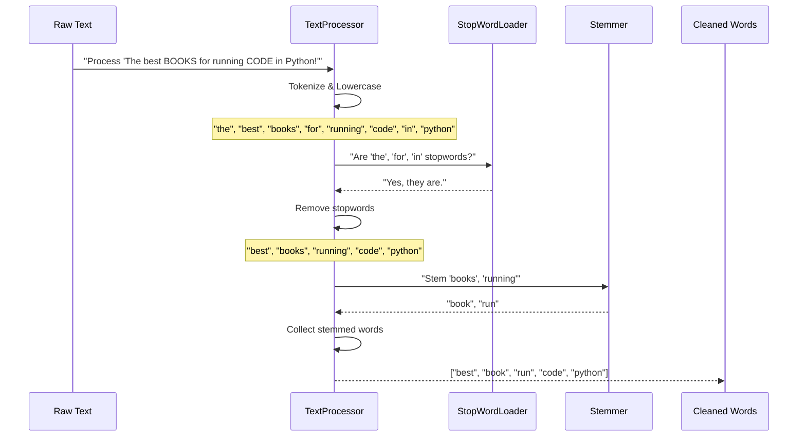

Welcome back to DevShelf! In our last chapter, [Search Enhancement & Recommendations](07_search_enhancement___recommendations_.md), we saw how DevShelf becomes a "savvy librarian," offering intelligent suggestions and smart recommendations to improve your search experience. But all that intelligence relies on a fundamental, behind-the-scenes hero: making sure all text is clean and consistent.

Imagine asking a librarian for "books on running," and they can only find books that specifically contain the word "running." They might miss great books that use "ran," "runs," or "jogging"! Or what if you typed "Python books," but a book's description said "PYTHON programming guide"? Without some clever pre-processing, these wouldn't match perfectly.

This is the problem that **Text Normalization Utilities** solve. It's like having a meticulous editor who pre-processes *all* text in the library – every book description and every search query you type – to make it uniform and easy for the search engine to understand.

#### The Problem Our Utilities Solve

Text comes in all shapes and sizes. Sometimes it's all uppercase, sometimes it has punctuation, and often it contains very common words that don't help us find specific books. If DevShelf tries to match "Python" (capital P) from your query with "python" (lowercase p) in a book description, it won't work perfectly unless both are standardized.

**Our central use case:** You search for "How to write **Clean Code** in **Java**". DevShelf needs to understand that you're looking for books on "clean," "code," and "java," regardless of capitalization, common words like "to" or "how," or even if the book says "java programs" instead of just "java." This utility ensures your query matches the book's content accurately.

### The Text Processor: Our Digital Editor

The main tool for text normalization in DevShelf is the `TextProcessor`. Think of it as our digital editor. Its job is to take any raw text (from book descriptions, titles, or your search query) and put it through a series of cleaning steps.

When you give the `TextProcessor` some text, it does four main things:

1.  **Tokenization**: Breaks down a sentence into individual "words" or "tokens."
2.  **Lowercasing**: Converts all text to lowercase.
3.  **Stop Word Removal**: Filters out common, uninformative words.
4.  **Stemming**: Reduces words to their basic "root" form.

#### How `TextProcessor` is Used

The `TextProcessor` is a foundational utility. It's used by critical components like the `IndexBuilder` (from [Search Index Management](04_search_index_management_.md)) to process book content *before* indexing, and by the `QueryProcessor` (from [Core Search Engine](05_core_search_engine_.md)) to clean up your search queries.

Let's see a simple example of how you'd use it:

```java
// Assuming 'textProcessor' is ready to use
String rawText = "The best BOOKS for running CODE in Python!";
List<String> cleanedWords = textProcessor.process(rawText);
System.out.println(cleanedWords);
```

**Output:**
```
[best, book, run, code, python]
```

As you can see, the original sentence `"The best BOOKS for running CODE in Python!"` has been transformed into a concise list of important, standardized words: `["best", "book", "run", "code", "python"]`. "The," "for," "in" are gone (stop words), "BOOKS" became "book" (lowercasing, stemming), and "running" became "run" (stemming).

### Under the Hood: The `TextProcessor`'s Workflow

Let's visualize the `TextProcessor` at work when it cleans a piece of text:



#### The `TextProcessor` Class: The Orchestrator

The `TextProcessor` class ties together all the individual cleaning steps. It takes a `Set` of stopwords (common words to ignore) and uses a `Stemmer` (a tool to find root words) when it's created.

**`src/main/java/utils/TextProcessor.java` (Simplified Constructor)**
```java
package utils;

import org.tartarus.snowball.ext.englishStemmer;
import java.util.Set;

public class TextProcessor {

   private final Set<String> stopWords;           // Our list of uninformative words
   private final englishStemmer stemmer = new englishStemmer(); // Our root-word finder

   // When TextProcessor is created, it needs the list of stop words
   public TextProcessor(Set<String> stopWords) {
       this.stopWords = stopWords;
   }

   // ... process method ...
}
```
The constructor makes sure our `TextProcessor` is equipped with the necessary tools (`stopWords` and `stemmer`) to do its job effectively.

#### The `process` Method: Step-by-Step Cleaning

This is the core method that performs all the normalization steps.

**`src/main/java/utils/TextProcessor.java` (Simplified `process` method)**
```java
// Inside TextProcessor class
public List<String> process(String text) {

    if (text == null || text.isBlank()) {
        return Collections.emptyList(); // Handle empty or null text
    }

    // 1. Tokenization and Lowercasing
    // Splits text by anything that's not a letter/number/apostrophe
    String[] rawTokens = text.toLowerCase().split("[^a-zA-Z0-9']+");
    List<String> tokens = Arrays.asList(rawTokens);

    // 2. Stop Word Removal
    List<String> filteredTokens = new ArrayList<>();
    for(String token : tokens) {
        if (token.isEmpty()) continue; // Skip empty strings from splitting
        if(!stopWords.contains(token)) { // If it's NOT a stop word
            filteredTokens.add(token);
        }
    }

    // 3. Stemming
    List<String> stemmedTokens = new ArrayList<>();
    for (String token : filteredTokens) {
        stemmer.setCurrent(token); // Give the stemmer the word
        stemmer.stem();            // Ask it to find the root
        stemmedTokens.add(stemmer.getCurrent()); // Get the root word
    }

    return stemmedTokens;
}
```
Let's break down these steps:

1.  **Tokenization & Lowercasing**:
    *   `text.toLowerCase()`: Converts the entire text to lowercase. "BOOKS" becomes "books", "Python" becomes "python".
    *   `.split("[^a-zA-Z0-9']+")`: This is a "regular expression" that tells Java to break the sentence into words wherever it finds characters that are *not* letters (a-z, A-Z), numbers (0-9), or apostrophes ('). So, "running CODE!" becomes ["running", "code"].

2.  **Stop Word Removal**:
    *   It loops through all the `tokens` (words) found in the previous step.
    *   `!stopWords.contains(token)`: It checks if the current word is present in our `stopWords` list. If it's *not* a stop word (meaning it's an important word), it's added to `filteredTokens`.
    *   This is how words like "the," "for," "is" are removed, as they generally don't help in understanding the core topic.

3.  **Stemming**:
    *   It takes each word from `filteredTokens` and hands it to our `stemmer`.
    *   `stemmer.setCurrent(token)`: Loads the word into the stemmer.
    *   `stemmer.stem()`: This is the magic! The stemmer uses linguistic rules to find the root form. "running" becomes "run," "developers" becomes "develop," "algorithms" becomes "algorithm."
    *   `stemmedTokens.add(stemmer.getCurrent())`: The root word is then added to our final list.

#### Loading Stop Words: `StopWordLoader`

But where do the `stopWords` come from? DevShelf has a special list of common English words in a file called `stopword.txt`. The `StopWordLoader`'s job is to read this file and provide the `TextProcessor` with the set of words to ignore.

**`src/main/resources/data/stopword.txt` (Snippet)**
```
"a","an","the","and","or","but","if","then","else","on","in","at","by","for","with","about","against",
"between","into","through","during","before","after","above","below","to","from","up","down","of","is",
"are","was","were","be","been","being","as","that","this","these","those","it","its","I","you","he","she","they"
```
Each of these words will be considered "unimportant" by our `TextProcessor`.

**`src/main/java/utils/StopWordLoader.java` (Simplified `loadStopWords` method)**
```java
package utils;

import java.io.BufferedReader;
import java.io.FileReader;
import java.io.IOException;
import java.util.HashSet;
import java.util.Set;

public class StopWordLoader {

    // This method can be called directly without creating an object
    public static Set<String> loadStopWords(String filePath) {
       Set<String> stopWords = new HashSet<>();
       try(BufferedReader reader = new BufferedReader(new FileReader(filePath))) {
           String line;
           while( (line = reader.readLine()) != null ) {
               String word = line.trim().toLowerCase();
               if(!word.isEmpty()) {
                   stopWords.add(word); // Add each word from the file to our set
               }
           }
       } catch (IOException e) {
           System.err.println("Error loading stopwords file: " + e.getMessage());
       }
       return stopWords;
    }
}
```
The `loadStopWords` method simply reads each line from the `stopword.txt` file, cleans it up a bit (removes extra spaces, makes it lowercase), and adds it to a `HashSet`. A `HashSet` is perfect for fast "contains" checks later.

#### The `Stemmer` Class: Finding Root Words

The `Stemmer` class (`src/main/java/utils/Stemmer.java`) in DevShelf acts as a convenient wrapper for an existing powerful library called "Snowball Stemmer." This library knows the complex rules of English grammar to reduce words to their base form.

For instance, if you give it "programming," it will return "program." If you give it "configured," it will return "configur." This ensures that a search for "program" will match books containing "programming," "programs," "programmer," or "programmed."

### Why Text Normalization is So Important

Text normalization is a silent hero in our search engine. Without it, DevShelf's search capabilities would be severely limited:

| Feature                   | WITHOUT Text Normalization                                   | WITH Text Normalization                                                |
| :------------------------ | :----------------------------------------------------------- | :--------------------------------------------------------------------- |
| **Search Accuracy**       | Misses matches due to capitalization, punctuation, or different word endings. | Finds more relevant matches by standardizing all text.                 |
| **Search Efficiency**     | The index (from [Search Index Management](04_search_index_management_.md)) would be much larger (e.g., storing "Run", "Runs", "Running" as separate terms). | Smaller index (only stores "run"), leading to faster lookups.         |
| **User Experience**       | Frustrating, as users expect "Java" to match "java" and "develop" to match "developer". | Intuitive, forgiving search that "understands" what the user means. |
| **Relevance Scoring**     | Scores might be skewed by common words or inconsistent spellings. | Clearer, more precise relevance scores.                                |

This table clearly shows why this seemingly simple step is absolutely crucial for DevShelf to function as an intelligent and user-friendly digital library.

### Conclusion

In this chapter, we explored **Text Normalization Utilities**, the essential behind-the-scenes processes that make all our text clean, consistent, and easy for the search engine to understand. We learned that:
*   The `TextProcessor` is our digital editor, performing **tokenization, lowercasing, stop word removal, and stemming** on all text inputs.
*   It relies on a `Set` of `stopWords` loaded by the `StopWordLoader` from `stopword.txt` to filter out uninformative words.
*   It uses a `Stemmer` to reduce words to their root form, allowing searches to match variations of words.
*   This consistency is vital for the search engine (the [Core Search Engine](05_core_search_engine_.md)) to accurately match queries with book content and generate relevant results.

By ensuring all text is normalized, DevShelf provides a much more accurate, efficient, and user-friendly search experience, forming the bedrock for all its intelligent features.

This marks the end of our tutorial chapters for DevShelfGUI. We hope you've enjoyed this journey through the application's architecture and learned a lot about how a modern search engine works!