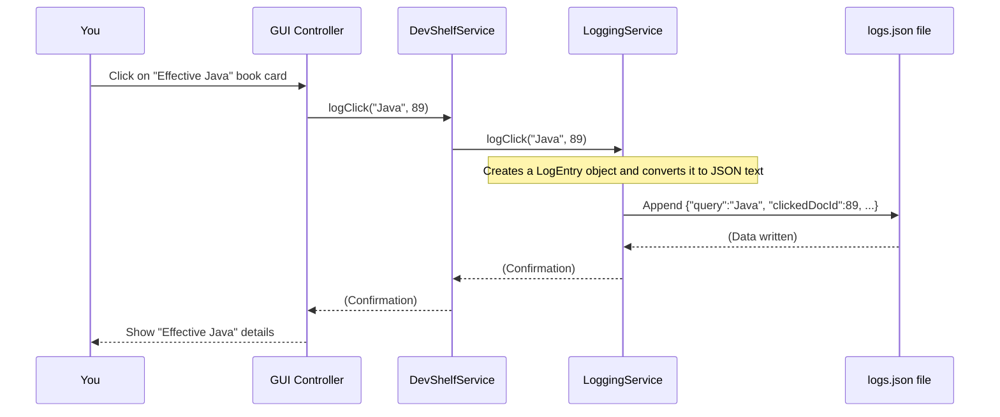

# Chapter 8: User Behavior Analytics

Welcome back, digital librarian! In our last chapter, [Intelligent Search Enhancements](07_intelligent_search_enhancements_.md), we made DevShelf smarter by adding helpful suggestions, boosting important books, and providing personalized recommendations. We learned that for these enhancements, DevShelf needs to know things like a book's "popularity." But where does this popularity information come from?

This is where **User Behavior Analytics** comes in. Think of it as DevShelf's "hidden assistant." This assistant quietly watches how users interact with the application, learning which books are truly trending or frequently clicked. This feedback makes DevShelf smarter and more helpful over time.

### What Problem Does Our "Hidden Assistant" Solve?

Imagine DevShelf only relied on static information like book ratings or how many times a keyword appears. It would be good, but it wouldn't be truly dynamic. What if:
*   A new book is released, and everyone starts clicking on it, even if it doesn't have many ratings yet?
*   An older book with high ratings suddenly becomes less relevant to current trends?

Without tracking user actions, DevShelf would miss these important real-world signals.

The problem User Behavior Analytics solves is this: **How can DevShelf adapt and learn from real user actions to prioritize books that are currently popular or trending, rather than just relying on static data?**

**Our central use case:** A user searches for "Java," sees a list of books, and then clicks on "Effective Java." DevShelf needs to **record this click**, and later, use these click records to figure out which "Java" books (or any books) are currently the most popular, influencing future search results and recommendations.

Let's dive into how DevShelf's hidden assistant makes this possible!

### Key Concepts of User Behavior Analytics

User Behavior Analytics in DevShelf involves two main steps:

1.  **Real-time Tracking of Clicks (The "Logger"):** DevShelf constantly records every time a user clicks on a book, saving these actions as simple log entries. This happens as you use the application.
2.  **Offline Analysis of Logs (The "Analyst"):** Periodically, a separate program analyzes all these collected log entries. It counts up all the clicks for each book and calculates a "popularity score" based on how frequently each book is clicked.
3.  **Feedback Loop (The "Enhancer"):** These calculated popularity scores are then fed back into DevShelf. Features like the [ReRanker](07_intelligent_search_enhancements_.md) and [Graph](07_intelligent_search_enhancements_.md) use these scores to boost trending books in search results and prioritize them in recommendations.

### Part 1: Tracking User Clicks (The "Logger")

The first step is to record what users are doing. DevShelf has a special service dedicated to logging every time you click on a book.

#### The `LogEntry`: A Single Click Record

Before saving a click, DevShelf creates a `LogEntry` object. This is a small digital record, like a single line in our assistant's notebook, that captures the essential details of a user's interaction.

**`src/main/java/domain/LogEntry.java` (Simplified)**
```java
package domain;

import lombok.Getter; // Automatically creates 'get' methods
import java.time.Instant; // To record the exact time

@Getter // This annotation from Lombok creates public 'get' methods for each field
public class LogEntry {
    private String query;         // What the user searched for (e.g., "java")
    private int clickedDocId;     // The unique ID of the book they clicked (e.g., 89)
    private String timestamp;     // When the click happened (e.g., "2025-11-07T...")

    // This special method helps create a new LogEntry
    public LogEntry(String query, int clickedDocId) {
        this.query = query;
        this.clickedDocId = clickedDocId;
        this.timestamp = Instant.now().toString(); // Records the current time automatically
    }
}
```
Each `LogEntry` clearly captures the essential details of a user's interaction with a book.

#### The `LoggingService`: DevShelf's Notebook

The `LoggingService` is like the hidden assistant's notebook. Whenever you click a book in the search results (or open its details), the application tells the `LoggingService` to make an entry. All these notes are saved into a simple text file named `logs.json`.

**How a Click Gets Logged:**
When you click a book (for instance, to see its full details in the GUI), here's how it flows:


The GUI Controller (which we saw in [User Interface (UI) Presentation](01_user_interface__ui__presentation_.md)) detects your click, tells `DevShelfService` (the GUI's main logic), which then tells the `LoggingService` to record it.

**`src/main/java/utils/LoggingService.java` (Simplified `logClick` method)**
```java
package utils;

import com.fasterxml.jackson.databind.ObjectMapper; // Tool to convert to JSON
import domain.LogEntry;
import java.io.BufferedWriter;
import java.io.FileWriter;
import java.io.IOException;

public class LoggingService {
    private final String logFilePath;
    private final ObjectMapper mapper; // Our JSON tool

    public LoggingService(String logFilePath) {
        this.logFilePath = logFilePath;
        this.mapper = new ObjectMapper();
    }

    public void logClick(String query, int clickedDocId) {
        LogEntry entry = new LogEntry(query, clickedDocId); // 1. Create the LogEntry

        String jsonLogLine;
        try {
            jsonLogLine = mapper.writeValueAsString(entry); // 2. Convert to JSON text
        } catch (IOException e) {
            System.err.println("Failed to convert LogEntry to JSON.");
            return;
        }

        // 3. Write JSON text to the logs.json file (append to end)
        try (BufferedWriter writer = new BufferedWriter(new FileWriter(logFilePath, true))) {
            writer.write(jsonLogLine);
            writer.newLine(); // Add a new line for the next entry
            writer.flush();   // Make sure it's written to disk immediately
        } catch (IOException e) {
            System.err.println("Failed to write log line to file.");
            e.printStackTrace();
        }
    }
}
```
The `logClick` method creates a `LogEntry`, converts it into a JSON string, and then appends this string as a new line to the `logs.json` file. This means `logs.json` grows larger with every user click!

#### What the `logs.json` File Looks Like
`logs.json` is a file where each line is a separate click event:

**`src/main/resources/logs/logs.json` (Snippet)**
```json
{"query":"clean","clickedDocId":58,"timestamp":"2025-11-07T06:55:52.677729400Z"}
{"query":"clean","clickedDocId":58,"timestamp":"2025-11-07T06:55:56.033080Z"}
{"query":"develop","clickedDocId":108,"timestamp":"2025-11-07T18:59:05.735673500Z"}
{"query":"The Pragmatic Programmer","clickedDocId":2,"timestamp":"2025-11-14T14:09:05.605164500Z"}
{"query":"The Pragmatic Programmer","clickedDocId":2,"timestamp":"2025-11-14T14:09:08.471192900Z"}
```
You can see that book `ID 58` was clicked twice after a "clean" search, and book `ID 2` ("The Pragmatic Programmer") was clicked several times. This raw data is exactly what our next component needs!

### Part 2: Understanding Popularity (The "Analyst")

Gathering raw click data is useful, but we need to *process* it to get meaningful insights. This is where the analytics part comes in.

#### The `LogAnalyzerMain`: Our Offline Popularity Calculator

Similar to `IndexerMain` (which built our search index in [Offline Search Indexing](06_offline_search_indexing_.md)), `LogAnalyzerMain` is another **offline tool**. This means you run it separately, usually when the main DevShelf application isn't running, to process the accumulated `logs.json` file.

Its job is to:
1.  Read every `LogEntry` from `logs.json`.
2.  Count how many times each unique book (`clickedDocId`) was clicked.
3.  Calculate a "popularity score" for each book based on its click count.
4.  Save these popularity scores into a new file: `popularity.json`.

This `popularity.json` file will then be loaded by the main DevShelf application (just like `index_data.json`) to influence search results and recommendations.

**How to Run the `LogAnalyzerMain`:**
You would run `LogAnalyzerMain` directly from your development environment. It doesn't have a visual interface; it just prints messages as it processes the logs.

**`src/main/java/core/LogAnalyzerMain.java` (Simplified `analyze` method)**
```java
package core;

import com.fasterxml.jackson.databind.ObjectMapper; // JSON helper
import domain.LogEntry;
import java.io.BufferedReader;
import java.io.File;
import java.io.FileReader;
import java.io.IOException;
import java.util.HashMap;
import java.util.Map;
import utils.StorageUtils; // Helper to find where files are saved

public class LogAnalyzerMain {
    public static void main(String[] args)  {
        analyze(); // Call the method to start analysis
    }

    public static void analyze() {
        System.out.println("--- Starting Log Analyzer ---");
        String logsPath = StorageUtils.getAppDataDir() + File.separator + "logs.json";
        String popularityOutPath = StorageUtils.getAppDataDir() + File.separator + "popularity.json";

        ObjectMapper mapper = new ObjectMapper(); // Our JSON tool
        Map<Integer, Integer> clickCounts = new HashMap<>(); // Store: <BookID, ClickCount>

        File logFile = new File(logsPath);
        if (!logFile.exists()) {
            System.out.println("❌ No logs found at " + logsPath);
            System.out.println("Run DevShelf GUI and click some books first to generate logs!");
            return;
        }

        try (BufferedReader reader = new BufferedReader(new FileReader(logFile))) {
            String line;
            while ((line = reader.readLine()) != null) {
                if (line.trim().isEmpty()) continue;
                LogEntry entry = mapper.readValue(line, LogEntry.class); // Read each click entry
                int docId = entry.getClickedDocId();
                clickCounts.put(docId, clickCounts.getOrDefault(docId, 0) + 1); // Count clicks for this book
            }
        } catch (IOException e) {
            System.err.println("Error reading log file: " + e.getMessage());
            return;
        }

        // --- Calculate raw popularity scores (using a logarithm to soften very high counts) ---
        Map<Integer, Double> popularityScores = new HashMap<>();
        double maxScore = 0.0;
        for (Integer docId : clickCounts.keySet()) {
            double score = Math.log10(1 + clickCounts.get(docId)); // E.g., 9 clicks -> log10(10) = 1.0
            popularityScores.put(docId, score);
            if (score > maxScore) maxScore = score; // Find the highest score for normalization
        }

        // --- Normalize all scores between 0 and 1 (most popular book gets 1.0) ---
        if (maxScore > 0) {
            for (Integer docId : popularityScores.keySet()) {
                double normalizedScore = popularityScores.get(docId) / maxScore;
                popularityScores.put(docId, normalizedScore);
            }
        }

        // --- Save the final popularity map to popularity.json ---
        try {
            mapper.writerWithDefaultPrettyPrinter()
                  .writeValue(new File(popularityOutPath), popularityScores);
            System.out.println("--- Log Analyzer Finished ---");
        } catch (IOException e) {
            System.err.println("Error writing popularity file: " + e.getMessage());
        }
    }
}
```
This process:
1.  Reads each line from `logs.json`.
2.  Converts the JSON line back into a `LogEntry` object.
3.  Increments a counter for the `clickedDocId` (book ID).
4.  After reading all logs, it calculates a raw score using `Math.log10(1 + clicks)`. This "logarithm" helps to smooth out the scores; for example, 100 clicks isn't *100 times* better than 1 click, but still significantly better. This prevents super popular books from totally dominating everything else.
5.  Finally, it normalizes these scores so they all fall between `0.0` and `1.0`. The most popular book will have a score of `1.0`, making them easy to use in calculations.
6.  The result is then saved to `popularity.json`.

#### What the `popularity.json` File Looks Like
`popularity.json` contains a map where each book ID is linked to its calculated popularity score:

**`src/main/resources/logs/popularity.json` (Snippet)**
```json
{
  "194" : 0.227670248696953,
  "2" : 1.0,           // This is the most popular book (score 1.0)
  "3" : 0.3608488067145302,
  "6" : 0.5286339468194481,
  "135" : 0.7876096569652562,
  "72" : 0.5286339468194481,
  "9" : 0.5778851182977677,
  "58" : 0.8668214419824227, // Second most popular book
  // ... many more books and their scores ...
}
```
Now, DevShelf has a clear, up-to-date understanding of which books are most frequently clicked by its users.

### Part 3: Using Popularity to Improve DevShelf (The "Enhancer")

The collected and analyzed popularity scores are not just for show! They are directly fed back into DevShelf to make your experience better.

#### 1. Boosting Search Results: The `ReRanker`
In [Intelligent Search Enhancements](07_intelligent_search_enhancements_.md), we learned that the `ReRanker` sorts initial search results by combining factors like keyword relevance, ratings, and *popularity*. The `ReRanker` loads the `popularity.json` file when DevShelf starts.

**`src/main/java/features/search/ReRanker.java` (Simplified Constructor)**
```java
package features.search;

import com.fasterxml.jackson.core.type.TypeReference;
import com.fasterxml.jackson.databind.ObjectMapper;
import domain.Book;
import java.io.File;
import java.io.IOException;
import java.util.HashMap;
import java.util.Map;

public class ReRanker {
    private final Map<Integer, Book> bookMap;
    private final Map<Integer, Double> popularityMap; // This will hold our popularity scores!

    // Weights to decide how much each factor contributes to the final score
    private static final double W_TFIDF = 0.7;
    private static final double W_POPULARITY = 0.20; // How popular the book is!
    private static final double W_RATING = 0.10;

    public ReRanker(Map<Integer, Book> bookMap, String popularityFilePath) {
        this.bookMap = bookMap;
        this.popularityMap = loadPopularity(popularityFilePath); // Load the popularity scores!
    }

    private Map<Integer, Double> loadPopularity(String path) {
        ObjectMapper mapper = new ObjectMapper();
        try {
            // This reads the popularity.json file into our map
            return mapper.readValue(new File(path), new TypeReference<Map<Integer, Double>>() {});
        } catch (IOException e) {
            System.err.println("Error loading popularity file: " + e.getMessage());
            return new HashMap<>(); // Return empty if loading fails
        }
    }
    // ... reRank method (see snippet below) ...
}
```
When `ReRanker.reRank` is called, it combines the initial search score (`tfIdfScore`), the book's rating, and now also the `popularityScore` to calculate a `finalScore`:

**`src/main/java/features/search/ReRanker.java` (Snippet from `reRank` method)**
```java
// Inside ReRanker class
public List<SearchResult> reRank(List<SearchResult> tfIdfResults, String query) {
    List<SearchResult> reRankedResults = new ArrayList<>();

    for (SearchResult oldResult : tfIdfResults) {
        int docId = oldResult.getDocId();
        Book book = bookMap.get(docId); // Get the book details (from Chapter 2)

        double tfIdfScore = oldResult.getScore();
        double normalizedRating = book.getRating() / 5.0; // Scale rating from 0 to 1
        double popularityScore = popularityMap.getOrDefault(docId, 0.0); // Get our popularity score!

        // --- The MASTER FORMULA now includes popularity! ---
        double finalScore = (W_TFIDF * tfIdfScore) +
                            (W_RATING * normalizedRating) +
                            (W_POPULARITY * popularityScore); // Add popularity weight

        // ... (title boosts and other re-ranking logic from Chapter 7) ...

        reRankedResults.add(new SearchResult(docId, finalScore));
    }
    Collections.sort(reRankedResults); // Sort by this new finalScore
    return reRankedResults;
}
```
By adding `W_POPULARITY * popularityScore` to the `finalScore`, DevShelf now ensures that books that are currently trending (have higher popularity scores) appear higher in the search results, even if their initial keyword match wasn't the absolute highest.

#### 2. Providing Trending Recommendations: The `Graph`
The `Graph` component (from [Intelligent Search Enhancements](07_intelligent_search_enhancements_.md)) also uses this popularity data to provide smarter recommendations. When suggesting books related to a specific title, it can now prioritize those related books that are also highly popular.

**`src/main/java/features/recommendation/Graph.java` (Snippet from `recommendPopularBooks` method)**
```java
package features.recommendation;

import domain.Book;
import java.util.*;

public class Graph {

    // ... graph building logic (from Chapter 7) ...

    public List<String> recommendPopularBooks(String bookTitle, int limit, Map<Integer, Double> popularityMap) {
        String key = normalize(bookTitle); // Clean the input book title
        Map<String, Double> relatedBooks = adjList.getOrDefault(key, Collections.emptyMap());
        List<String> result = new ArrayList<>(relatedBooks.keySet());

        final double ALPHA = 0.7; // How much emphasis on relevance vs. popularity (70% relevance, 30% popularity)

        // Sort the related books based on a combined score
        result.sort((a, b) -> {
            double relA = relatedBooks.getOrDefault(a, 0.0); // Relevance score for book A
            double relB = relatedBooks.getOrDefault(b, 0.0); // Relevance score for book B

            // Get popularity scores from the map
            double popA = popularityMap != null
                    ? popularityMap.getOrDefault(titleToId.getOrDefault(a, -1), 0.0)
                    : 0.0;
            double popB = popularityMap != null
                    ? popularityMap.getOrDefault(titleToId.getOrDefault(b, -1), 0.0)
                    : 0.0;

            // Combine relevance and popularity to get a final recommendation score
            double scoreA = ALPHA * relA + (1 - ALPHA) * popA;
            double scoreB = ALPHA * relB + (1 - ALPHA) * popB;

            return Double.compare(scoreB, scoreA); // Sort from highest score to lowest
        });

        return result.subList(0, Math.min(limit, result.size())); // Return top recommendations
    }
}
```
Here, the `recommendPopularBooks` method takes the `popularityMap` as an input. It calculates a `scoreA` and `scoreB` for two books `A` and `B` by blending their intrinsic "relevance" (how strongly they are related to the original book) with their `popularity` score. This means that if two books are equally related, the more popular one will be recommended first!

### Summary of User Behavior Analytics Components

| Component          | Role                                                      | When it Runs                                | Data Processed/Produced                 | Used by                                |
| :----------------- | :-------------------------------------------------------- | :------------------------------------------ | :-------------------------------------- | :------------------------------------- |
| `LoggingService`   | Records user clicks on books.                             | **Real-time** (during application use)      | `LogEntry` objects -> `logs.json`       | `DevShelfService` (called by UI)       |
| `LogAnalyzerMain`  | Processes raw click logs to calculate popularity scores.  | **Offline** (run separately, e.g., nightly) | `logs.json` -> `popularity.json`        | No direct user, prepares data for others |
| `LogEntry`         | A single data record of a user's click.                   | Created by `LoggingService`                 | Stores `query`, `clickedDocId`, `timestamp` | `LoggingService`, `LogAnalyzerMain`    |
| `popularity.json`  | Stores calculated popularity scores for each book.        | Output of `LogAnalyzerMain`                 | Map of `BookID` to `PopularityScore`    | `ReRanker`, `Graph`                    |

### Conclusion

In this chapter, we explored **User Behavior Analytics**, DevShelf's hidden assistant that helps it learn from your actions. We discovered:
*   The `LoggingService` actively records your clicks on books, saving them as `LogEntry` objects in the `logs.json` file.
*   The `LogAnalyzerMain` is an offline tool that processes these raw `logs.json` files, counting clicks and calculating a normalized popularity score for each book, which is then saved to `popularity.json`.
*   These crucial `popularity.json` scores are then used by other parts of DevShelf, like the `ReRanker` to boost trending books in search results and the `Graph` to provide popularity-aware recommendations.

This dynamic feedback loop ensures that DevShelf isn't just a static library but an intelligent system that adapts to what users are actually interested in, making your next search even more relevant and exciting!

This concludes our journey through the DevShelf project! We've explored every major component, from the user interface and core data models to powerful search engines, text processing, intelligent enhancements, and how DevShelf learns from user behavior. You now have a comprehensive understanding of how this digital library works its magic!

---
